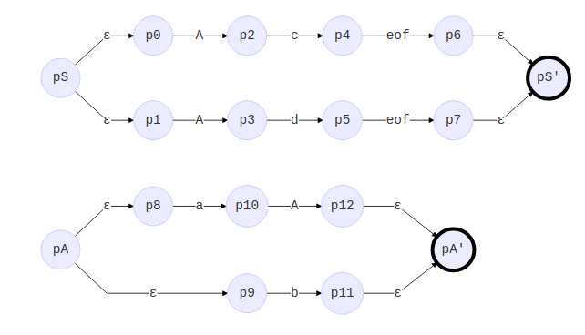
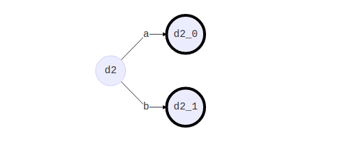
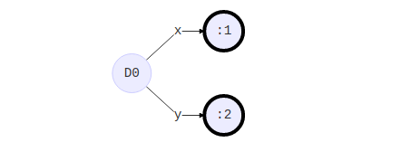
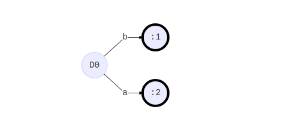
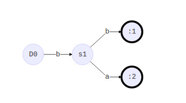

# 问题1-3

## Q1 

### Reference

[ANTLR 4 进阶](https://liangshuang.name/2017/08/20/antlr/)

### Answer

- 容许直接的左递归，不允许间接左递归
- 最左边的优先级最高，会类似并行地处理左递归，直到某个分支完成匹配，再终止其他的分支匹配

> ANTLR 4通过透明的将左递归替换为一个判定循环（predicated loop）而允许在**LL**语法描述中使用左递归。它能够处理直接的左递归，但是不能处理间接的左递归。间接的左递归在一般的语法描述中非常少见。

- 第一种`*`优先级高于`+`; ANTLR会优先选择位置更靠前的备选分支来隐式的解决这类歧义

- ANTLR对于多个备选分支只会生成同一个处理方法，这样就需要在目标代码中自行做判断，增加了代码的复杂度。对于这种情况，可以使用标注功能让ANTLR为每一个分支单独生成处理方法：

  ```
  Exp : Exp '*' Exp # Mult  // 生成enterMult与exitMult方法
        | Exp '+' Exp # Add // 生成enterAdd与exitAdd方法
        | IntConst # IntConst // 生成enterIntConst与exitIntConst方法
        ;
  ```

  在上边的例子中，如果不做标注，则ANTLR只会生成`enterExpr`与`exitExpr`方法，需要在方法内手动判断分支。

  > ANTLR 4开始会生成监听器（Listener）与访问者（Visitor），将语法定义与目标代码完全的解耦。监听器可以被动的接受语法分析树遍历的事件，对于每一个语法节点，都会生成进入`enterSomeNodeName`与退出`exitSomeNodeName`两个方法。访问者机制生成对语法节点的访问方法`visitSomeNodeName`，在访问方法中需要手动调用`visit`方法来对子节点进行遍历，使用访问者模式可以控制语法树的遍历，略过某些的分枝。ANTLR默认只生成监听器，生成访问者类需要在生成时添加`-visitor`选项。

- 不支持的左递归

```
a: s a|Int
s: a s|number
```

原因：直接的左递归已经可以覆盖大部分的情况。而太复杂的左递归会严重影响效率

## Q2

[reference](https://pfmiles.github.io/blog/concept-and-implementation-of-ll-star/)

- 1. 核心逻辑：超前查看不确定个数的token, 而LL(1)只能超前查看一个. 并且更够使用语法和语义predicates
- 2. 

证明为LL-regular文法对不同的推导
$$
S \Rightarrow ^* wA \alpha \Rightarrow waA \alpha \Rightarrow^* wa^+ bu \Rightarrow wx\\
S \Rightarrow^*wA \alpha \Rightarrow wb\alpha \Rightarrow^*wbu \Rightarrow wy
$$
其中
$$
x=a^+bu \\
y=bu
$$
如果有$x \equiv y \ (mod \ R)$ 即$x,y \in R_i$其中$R_i$是$R$的一个$regular\ partition\ block$

即$a^+bu \equiv bu\ (mod\ R)$, 不可能，故而上述推导只能是同时取$A \to aA\ |\ b $其中的一个分支

ATN

```mermaid
graph LR
pS((pS))
pA((pA))
p0((p0)) 
p1((p1))
p2((p2))
p3((p3))
p4((p4))
p5((p5))
p6((p6))
p7((p7))
p8((p8))
p9((p9))
p10((p10))
p11((p11))
p12((p12))
pS'((pS'))
pA'((pA'))

pS--ε-->p0
p0--A-->p2
p2--c-->p4
p4--eof-->p6
p6--ε-->pS'

pS--ε-->p1
p1--A-->p3
p3--d-->p5
p5--eof-->p7
p7--ε-->pS'


pA--ε-->p8
p8--a-->p10
p10--A-->p12
p12--ε-->pA'

pA--ε-->p9
p9--b-->p11
p11--ε-->pA'

style pS' stroke:#000,stroke-width:4px;
style pA' stroke:#000,stroke-width:4px;
```

如果不是使用`typora`图形见最下方附录，以下图形同样，不再重复。


转化为lookahead DFA

由于S的两个分支开头均是由A开始的左递归，无法通过不定长的lookahead判断采取哪一个分支，算法会提前终止，无法形成DFA，需要其他的predicate方式

而A的DFA如下

```mermaid
graph LR
d2((d2))
d2_0((d2_0))
d2_1((d2_1))
d2--a-->d2_0
d2--b-->d2_1
style d2_0 stroke:#000,stroke-width:4px;
style d2_1 stroke:#000,stroke-width:4px;
```

## Q3

- ALL(\*)的核心逻辑及其与LL(\*)的区别

> ALL(\*)改进了传统LL(\*)的前瞻算法。其在碰到多个可选分支的时候，会为每一个分支运行一个子解析器，每一个子解析器都有自己的DFA（deterministic finite automata，确定性有限态机器），这些子解析器以伪并行（pseudo-parallel）的方式探索所有可能的路径，当某一个子解析器完成匹配之后，它走过的路径就会被选定，而其他的子解析器会被杀死，本次决策完成。

Prediction DFA for decision S

```mermaid
graph LR

D0((D0))
f1((:1))
f2((:2))
D0-- x-->f1
D0-- y-->f2
style f1 stroke:#000,stroke-width:4px;
style f2 stroke:#000,stroke-width:4px;
```

对A的判断取决于call stack, 

当前一个为B时

```mermaid
graph LR

D0((D0))
f1((:1))
f2((:2))
D0-- b-->f1
D0-- a-->f2
style f1 stroke:#000,stroke-width:4px;
style f2 stroke:#000,stroke-width:4px;
```

当前一个为C时

```mermaid
graph LR

D0((D0))
s1((s1))
f1((:1))
f2((:2))
D0-- b-->s1
s1--b-->f1
s1--a-->f2
style f1 stroke:#000,stroke-width:4px;
style f2 stroke:#000,stroke-width:4px;
```

输入为"xba"的分析过程

第一个符号为x，S选择分支1

进入B, 并且需要判断A的分支，由下一个符号为b，判断使用分支1

最后一个符号a符合B，完成


## 附录

如果不是`typora`以上图像依次为

LL(\*)  ATN



LL(\*) Lookahead



ALL(\*) prediction for S



ALL(\*) prediction for A 

当call stack为B



当call stack 为C

s