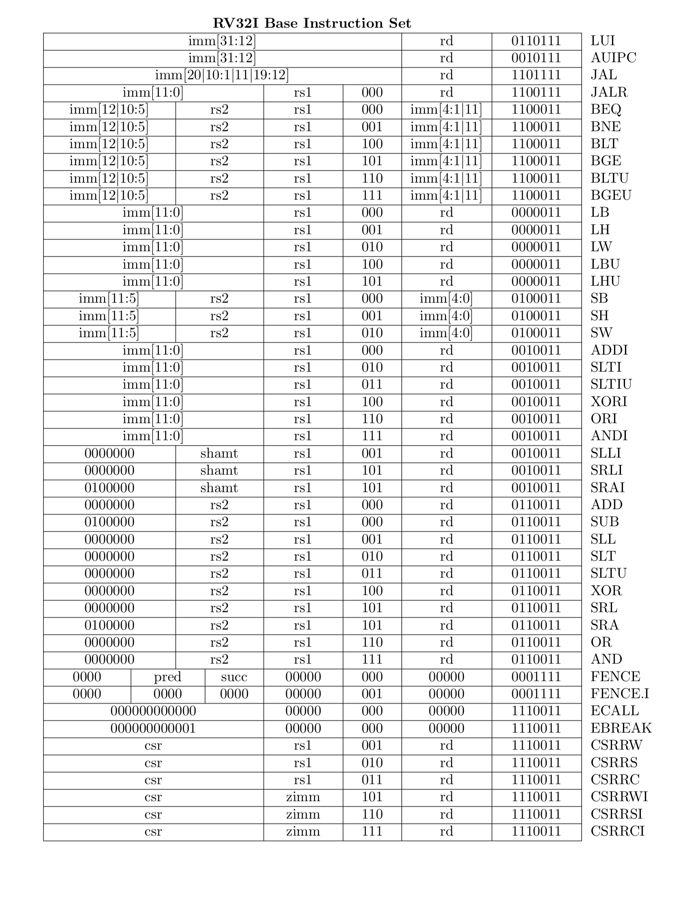
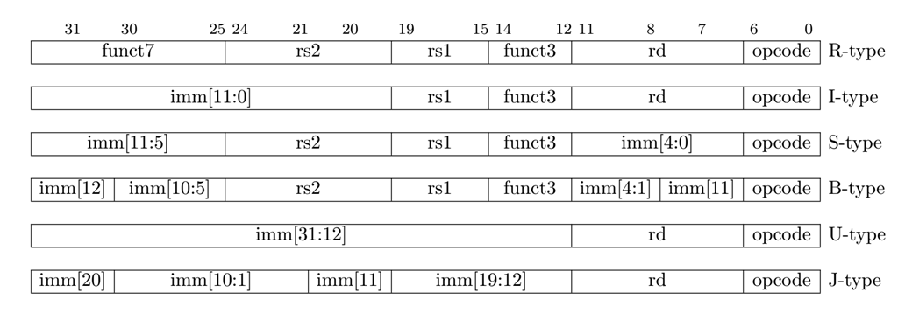
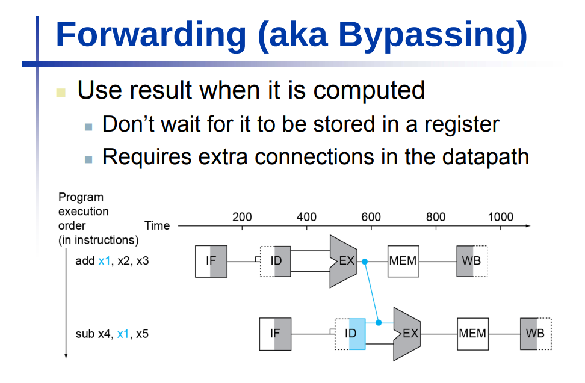
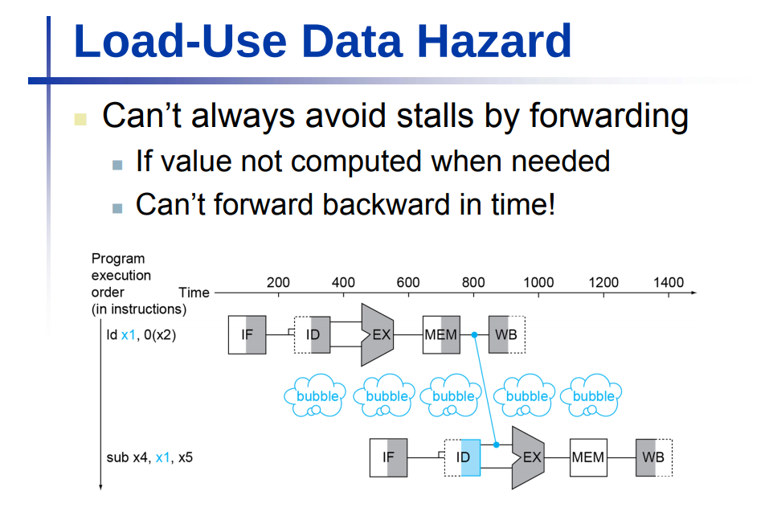
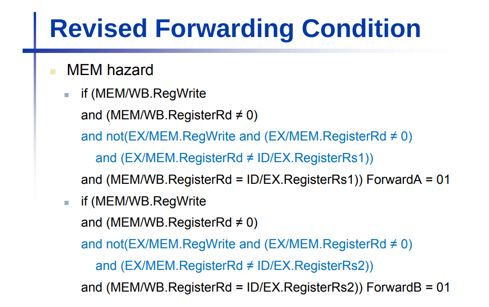

# RISC-V 32流水线CPU的verilog实现

## 实验任务

设计一个32位流水线RISC-V微处理器，具体要求如下

### 运行指令

下面详细解析各个指令的含义，便于后续的查询。

运行指令包括：RISC-V 32bit 整型指令集（除去 FENCE,FENCE.I,CSR,ECALL 和 EBREAK 指令）共37条指令

首先，RV32I指令格式为

imm表示指令中的立即数，比如imm[11:0]，表示一个12位的立即数，它的高20位会符号位扩展，imm[31:12]表示一个32位的立即数，它的低12位会补0。

下图是各种指令格式扩展后的32位立即数。

与mips相比，格式有如下的变化

要实现的指令可以分成如下几个种类，详细的内容请查看`Instr.xls`文件

#### Load和Store指令

Load和store指令在寄存器和存储器之间传输数值。Load指令编码为I类格式，而store指 令编码为S类格式。

**有效字节地址**是通过将寄存器`rs1`与**符号扩展**的12位偏移量相加而获得的。 

Load指令将存储器中的一个值复制到寄存器rd中。Store指令将寄存器rs2中的值复制到存储 器中。 

`LW`指令将一个32位数值从存储器复制到`rd`中。

`LH`指令从存储器中读取一个16位数值， 然后将其进行**符号扩展**到32位，再保存到`rd`中。

`LHU`指令存储器中读取一个16位数值，然后 将其进行**零扩展**到32位，再保存到`rd`中。

对于8位数值，`LB`和`LBU`指令的定义与前面类似。

`SW`、 `SH`、`SB`指令分别将从`rs2`低位开始的32位、16位、8位数值保存到存储器中

注意，装入目的寄存器如果为x0，将会产生一个异常。

#### 整数计算指令

(算术，逻辑指令，比较指令以及移位指令)

计算指令在寄存器和寄存器之间，或者在寄存器和立即数之间进行算术或逻辑运算。指令格式为I，R或者U型。整数计算指令不会产生异常。我们能够通过`ADDI x0, x0, 0`来模拟`NOP`指令，该指令除了改变`pc`值外，不会改变其它任何用户状态。

##### 整数寄存器-立即数指令

`ADDI`将**符号扩展**的12位立即数加到寄存器`rs1`上。算术溢出被忽略，而结果就是运算结果的低XLEN位。`ADDI rd,rs1,0`用于实现`MV rd,rs1`汇编语言伪指令。

 `SLTI`（set less than immediate）将数值`1`放到寄存器`rd`中，如果寄存器`rs1`小于**符号扩展**的立即数（比较时，两者都作为**有符号数**），否则将`0`写入`rd`。`SLTIU`与之相似，但是将两者作 为**无符号数**进行比较（也就是说，立即数被首先**符号扩展**为XLEN位，然后被作为一个**无符号数**）。注意，`SLTIU rd,rs1,1`将设置`rd`为`1`，如果`rs1`等于`0`，否则将`rd`设置为`0`（汇编语言伪指 令`SEQZ rd,rs`）。

 `ANDI`、`ORI`、`XORI`是逻辑操作，在寄存器`rs1`和**符号扩展**的12位立即数上执行**按位**AND、 OR、XOR操作，并把结果写入`rd`。注意，`XORI rd,rs1,-1`在`rs1`上执行一个按位取反操作（汇编 语言伪指令`NOT rd,rs`）。

被移位常数次，被编码为I类格式的特例。被移位的操作数放在`rs1`中，移位的次数被编 码到I立即数字段的低5位。右移类型被编码到I立即数的一位高位。`SLLI`是逻辑左移（0被移 入低位）；`SRLI`是逻辑右移（0被移入高位）；`SRAI`是算术右移（原来的符号位被复制到空出的 高位中）。

`LUI`（load upper immediate）用于构建32位常数，并使用U类格式。`LUI`将U立即数放到目标寄存器`rd`的高20位，将`rd`的低12位填0。

 `AUIPC`（add upper immediate to pc）用于构建pc相对地址，并使用U类格式。`AUIPC`从20 位U立即数构建一个32位偏移量，将其低12位填0，然后将这个偏移量加到pc上，最后将结 果写入寄存器rd。

##### 整数寄存器-寄存器操作

RV32I定义了几种算术R类操作。所有操作都是读取`rs1`和`rs2`寄存器作为源操作数，并把 结果写入到寄存器`rd`中。`funct7`和`funct3`字段选择了操作的类型

`ADD`和`SUB`分别执行加法和减法。溢出被忽略，并且结果的低XLEN位被写入目标寄存器 `rd`。`SLT`和`SLTU`分别执行**符号数**和**无符号数**的比较，如果`rs1<rs2`，则将`1`写入`rd`，否则写入`0`。
注意， `SLTU rd,x0,rs2`，如果`rs2`不等于0（ 译者注：在RISC-V中， `x0`寄存器永远是0），则把1写入`rd`，否则将0写入`rd`（汇编语言伪指令`SNEZ rd,rs`）。 `AND`、 `OR`、 `XOR`执行按位逻辑操作。`SLL`、 `SRL`、 `SRA`分别执行逻辑左移、逻辑右移、算术右移，被移位的操作数是寄存器`rs1`，移位次数是寄存器`rs2`的低5位。

##### NOP 指令

NOP指令并不改变任何用户可见的状态，除了使得pc向前推进。 NOP被编码为`ADDI x0,x0,0`。

#### 控制指令

包括无条件跳转指令和条件跳转指令

##### 无条件跳转

跳转并连接（ `JAL`）指令使用了UJ类格式，此处J立即数编码了一个2的倍数的有符号偏移量。这个偏移量被**符号扩展**，加到pc上，形成跳转目标地址，跳转范围因此达到±1MB。`JAL`将**跳转指令后面指令**的地址（ `pc+4`）保存到寄存器`rd`中。标准软件调用约定使用`x1`来作为返回地址寄存器。
普通的无条件跳转指令（汇编语言伪指令J）被编码为`rd=x0`的`JAL`指令。（ 译者注： x0是只读寄存器，无法写入）

间接跳转指令`JALR`（ jump and link register）使用I类编码。通过将12位**有符号**I类立即数加上`rs1`，然后将结果的最低位设置为0，作为目标地址。**跳转指令后面指令的地址**（ pc+4）保存到寄存器`rd`中。如果不需要结果，则可以把x0作为目标寄存器

JAL指令和JALR指令会产生一个非对齐指令取指异常， 如果目标地址没有对齐到4字节边界。

##### 条件分支

所有分支指令使用SB类指令格式。 12位B立即数编码了以2字节倍数的有符号偏移量，并被加到当前pc上，生成目标地址。条件分支范围是±4KB。

分支指令比较两个寄存器。 `BEQ`和`BNE`将跳转，如果`rs1`和`rs2`相等或者不相等。 `BLT`和`BLTU`将跳转，如果`rs1`小于`rs2`，分别使用**有符号数**和**无符号数**进行比较。 `BGE`和`BGEU`将跳转，如果`rs1`大于等于`｀rs2`，分别使用**有符号数**和**无符号数**进行比较。注意， `BGT`、 `BGTU`、 `BLE`和`BLEU`可以通过将`BLT`、 `BLTU`、 `BGE`、 `BGEU`的操作数对调来实现。

## 实验原理

## Ref

RISC-V指令集手册（卷1-用户级指令集）-中文版

