## 一：人工智能概述/ Introduction and Agents

### 1 Intro

#### What is AI?

- Thinking humanly
  - Turing Test 图灵测试
- Acting humanly
  - Cognitive modeling 认知模型
- Thinking rationally
  - laws of thought

- Acting rationally
  - **rational agent**

### 2 Agents

#### 2.1 Agent 和环境

Agent通过传感器和执行器与环境进行交互

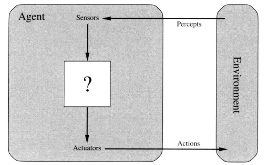

#### 2.2 好的行为：理性的概念

性能度量：对环境状态的任何给定序列进行评估

理性的判断依赖于：

1. 定义成功标准的性能度量
2. Agent对环境的先验知识
3. Agent可以完成的行动
4. Agent截止到此时的感知序列

理性Agent的定义

> 对每一个可能的感知序列，根据已知的感知序列提供的证据和Agent具有的先验知识，理性Agent应该选择能使其性能度量最大化的行动。

全知者、学习和自主性

#### 2.3 环境的性质

任务环境(PEAS描述)：**P**erformance, **E**nvironment, **A**ctuators, **S**ensors

- Fully observable (vs. partially observable)
- Deterministic (vs. stochastic)
- Episodic (vs. sequential)
- Static (vs. dynamic)
- Discrete (vs. continuous)
- Single agent (vs. multiagent)

#### 2.4 Agent的结构

Agent ＝ 体系结构＋程序

**Simple Reflex Agents**

仅根据当前环境状态确定动作


**Reflex Agents with State**

保存历史信息


**Goal-Based Agents**

加上一个目标


**Utility-Based Agents**

使用效用函数


**Learning Agents**


## 二：问题求解/Search

### 3 Problem solving search

#### 3.1 问题求解Agent

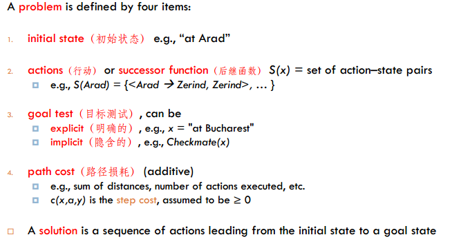

#### 3.3 通过搜索求解 

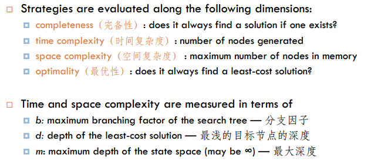

#### 3.4 无信息搜索策略

- **Breadth- first search** (广度优先搜索)

  

- **Uniform- cost search** (代价一致搜索)

  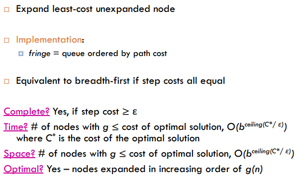

- **Depth- first search** (深度优先搜索)

  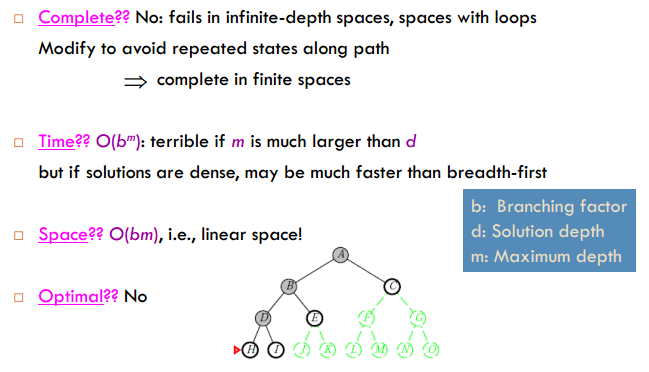

- **Depth- limited search** (深度有限搜索)

  

- **Iterative deepening search** (迭代深入深度优先搜索)

  由 Depth- limited search演化而成每轮**增加**深度限制

  

  

**Summary of algorithms**

| Criterion | Breadth-First | Uniform-Cost                         | Depth-First | Depth-Limited | Iterative Deepening |
| --------- | ------------- | ------------------------------------ | ----------- | ------------- | ------------------- |
| Complete? | Yes           | Yes                                  | No          | No            | Yes                 |
| Time      | $O(b^{d+1})$  | $O(b^{\lceil C^* /\epsilon \rceil})$ | $O(b^m)$    | $O(b^l)$      | $O(b^d)$            |
| Space     | $O(b^{d+1})$  | $O(b^{\lceil C^* /\epsilon \rceil})$ | $O(bm)$     | $O(bl)$       | $O(bd)$             |
| Optimal?  | Yes           | Yes                                  | No          | No            | Yes                 |

> b: Branching Factor; d: Solution depth; m: Maximum depth 

### 4 Informed search

- **Best- first search** (最佳优先搜索)

  使用一个评价函数$f(n)$，输入为每个节点，然后按照优先顺序访问。

  - **Greedy best- first search**

    - Evaluation function $f(n)=h(n)$( heuristic function 启发函数) =  （ 节点n到目标节点的最低耗散路径的耗散估计值）

      - $h(n)$ 与问题相关; 当n是目标的时候$h (n ) = 0 $ 
      - E.g., $h_{SLD}( n )$ = 直线距离

    - 试图扩展离目标节点最近的点

    - 特征

      - Complete: No; 可能困在loop中; 如果能检查重复节点的话，就是complete

      - Time: $O(b^m)$ 好的启发函数能有较大的性能提升

      - Space: $O(b^m)$ 所有的节点都要在内存里

      - Optimal: No

        只考虑了下一步点到goal的距离，而没有考虑这一步到下一步的代价。(所以可以结合Uniform-Cost)

        

  - **A* search**

    针对Best-first search的缺点，结合Uniform-cost

    **Uniform- cost** orders by path cost, or backward cost $g(n)$
    **Greedy-search** orders by goal proximity, or forward cost $h(n)$
    **A*** Search orders by the sum: $f(n) = g(n) + h(n)$

    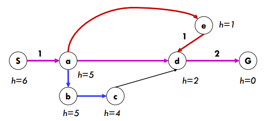

    - Evaluation function $f( n) = g (n) + h (n)$

      - $g (n)$ = 到达节点n的耗散
      - $h (n)$ =  启发函数：从节点n到目标节点的最低耗散路径的耗散估计值
      - $f ( n) $= 经过节点n的最低耗散的估计函数

    - A* search uses an admissible heuristic 可采纳启发式

      i.e., $h (n) ≤ h ^*( n)$ 其中 $h ^*( n)$ 是从n到目标的真实代价 (也要求$h (n) ≥ 0 $, 所以对于任何目标有$h (G) = 0$ )
      E.g.,$ h_{SLD}( n)$ 从来不会高估真实距离

    - 特征

      - Complete: Yes
      - Time: 对于任何启发函数都是效率最优的，但仍是指数级的
      - Space: 保存所有节点
      - Optimal: Yes

- **Heuristics**

  **Admissible Heuristics**: if for every node n,$h(n) ≤ h^*(n)$, where $h^*(n)$ is the true cost to reach the goal state from n.

  **Consistent Heuristics**: if for every node n, every successor n' of n generated by any action a, $h(n) ≤ c(n,a,n') + h(n')$

  **Dominance**: 

  

  **Relaxation**: 

  

- **Local search algorithms** (局部搜索算法)

  原因:　A*算法所需的储存状态的内存空间太大，对于大问题不适用。

  - **Hill-climbing search** (爬山法搜索)

    每次都选择下一步最好的状态。可能是局部最大值。

    

    Hill-Climbing with Random Restarts:

    ```
    When stuck, pick a random new starting state and re-run hill-climbing from there
    Repeat this k times
    Return the best of the k local optima
    ```

  - **Simulated annealing search** (模拟退火搜索)

    与爬山算法最大的区别是，允许一些不好的moves, 但是会逐渐降低这种概率。

  - **Local beam search** (局部剪枝搜索)

    开始随机k个状态搜索，每次选择后继，然后从后继中选择k个状态作为最优的。

  - **Genetic algorithms** (遗传算法)

    自然选择，每个后继都由两个parent状态结合而成，从k个随机的状态开始，每个状态都由一个有限的字母表排列的string表示，有一个Evaluation Function(fitness function 适应度函数)，越高就越好。产生下一代的方式有，selection, crossover, mutation

    

    

    

### 5 CSP(Constraint Satisfaction Problem)

#### 5.1 CSP examples

地图染色问题，相邻的区域颜色不同。

#### 5.2 Backtracking search for CSPs

带回溯的DFS

#### 5.3 Problem structure and problem decomposition


#### 5.4 Local search for CSPs


### 6 Game playing

#### 6.1 Games

Types of games

|                       |        Deterministic        |         Stochastic (chance)         |
| --------------------- | :-------------------------: | :---------------------------------: |
| perfect information   | chess, checkers,GO,othello  |         Backgammon,monopoly         |
| imperfect information | battleships,blind tictactoe | bridge, poker, scrabble,nuclear war |

#### 6.2 Perfect play（最优策略）

##### minimax decisions


假设对方会采取最优的行动，所以max每次都选择某个行为a,而a是可能的结果中最小值最大的。

- **Complete**?? Only if tree is finite (chess has specific rules for this).
  a finite strategy can exist even in an infinite tree!
- **Optimal**?? Yes, against an optimal opponent. Otherwise??
- **Time complexity**?? $O(b^m)$
- **Space complexity**?? $O(bm)$ (depth-first exploration)

##### α-β pruning（剪枝）

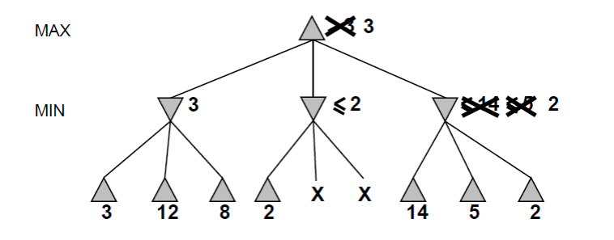

#### 6.3 Resource limits and approximate evaluation

Standard approach: Depth-limited search

- Use C UTOFF- T EST ( 截断测试) instead of T ERMINAL- T EST（终止测试）

   e.g., depth limit (perhaps add quiescence search 静态搜索) 

- Use E VAL instead of U TILITY


  用可以估计棋局效用值的启发式评价函数EVAL取代效用函数
  	 i.e., evaluation function that estimates desirability of position 

**Evaluation functions**


关于Evaluation Function

- 估计当前的棋盘好坏
- 线性的Evaluation Function是关于Features的加权和，越重要的Feature, 权重越大
- 建立一个Evaluation Function需要
  - 使用专家知识抽取好的feature
  - 选择或者学习好的权重
- 重要的不是值，而是序

Dealing with Limited Time

- 使用迭代加深搜索(Iterative Deepening Search, IDS)
- 每次都增加深度，使用$\alpha-\beta$剪枝方法深度受限搜索

#### 6.4 Games of chance（包含几率因素的游戏）

使用概率期望


#### 6.5 Games of imperfect information


## 三：知识与推理/Logic

- State- based models: search problems, games
  - Applications: routing finding, game playing, etc.
  - Think in terms of states, actions, and costs
- Variable- based models: CSPs, Bayesian networks
  - Applications: scheduling, medical diagnosis, etc.
  - Think in terms of variables and potentials
- Logic- based models: propositional logic, first- order logic
  - Applications: theorem proving, verification, reasoning
  - Think in terms of logical formulas and inference rules

### 7 Logical agents

- 逻辑智能体：基于知识的智能体
- 知识和推理的重要性
  - 部分可观察的环境
  - 自然语言理解
  - 基于知识的智能体的灵活性
- Two goals of logic
  - **Represent** knowledge about the world
  - **Reason** with that knowledge

#### 7.1 Knowledge- based agents

- Knowledge base（知识库） = set of sentences in a formal language 

- 将新语句添加到知识库——

  Declarative approach to building an agent (or other system): 

  TELL （告诉）it what it needs to know 

- 查询目前所知内容——

  Then it can A SK（询问） itself what to do — answers should follow from the KB
  Agents can be viewed at the knowledge level（知识层）
  	 i.e., what they know, regardless of how implemented 

  Or at the implementation level（实现层）
  	i.e., data structures in KB and algorithms that manipulate them

  

#### 7.2 Wumpus world

关于基于知识的智能体运转的例子


- Observable?? No — only local perception
- Deterministic?? Yes — outcomes exactly specified
- Episodic?? No — sequential at the level of actions
- Static?? Yes — Wumpus and Pits do not move
- Discrete?? Yes
- Single-agent?? Yes — Wumpus is essentially a natural feature

#### 7.3 Logic in general — models and entailment

（蕴涵）

**Logics** are **formal languages** for representing information such that conclusions can be drawn 

**Syntax**（语法） define the **sentences** in the language 

**Semantics** （语义）define the ”**meaning**” of sentences; 

​	i.e., define truth of a sentence in a world 语义定义了每个语句关于每个可能世界的真值


Entailment(蕴涵) : 一个语句逻辑上跟随另一个语句而出现

Knowledge base KB entails sentence $\alpha$ if and only if $\alpha$ is true in all worlds where KB is true（在KB为真的每个界中， 也为真）


#### 7.4 Propositional (Boolean) logic 

命题逻辑

##### Propositional logic: Syntax语法


##### Propositional logic: Semantics语义


##### Truth tables for connectives 5种逻辑连接符的真值表


#### 7.5 Equivalence, validity, satisfiability

等价、合法性和可满足性

##### Logical equivalence


##### Validity and satisfiability 合法性与可满足性


#### 7.6 Inference rules and theorem proving

##### forward chaining 前向链接 

从知识库中的已知事实（正文字）开始。如果蕴涵的所有前提已知，那么把它的 结论加到已知事实集。持续这一过程，直到询问q被添加或者直到无法 进行更进一步的推理


##### backward chaining

反向链接


**Forward vs. backward chaining**

FC is data-driven（数据驱动）, cf. automatic, unconscious processing, 

e.g., object recognition, routine decisions May do lots of work that is irrelevant to the goal 

BC is goal-driven（目标指导）, appropriate for problem-solving, 

e.g., Where are my keys? How do I get into a PhD program? 

Complexity of BC can be much less than linear in size of KB

##### resolution

归结

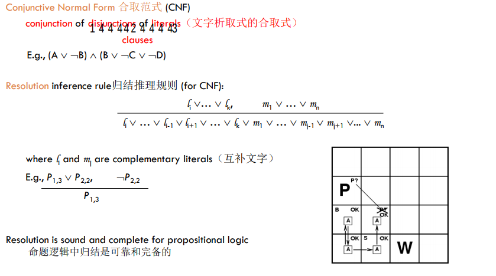

###### Conversion to CNF


###### Resolution algorithm


### 8 First-Order Logic 

#### 8.1 Why FOL? 

##### Pros of propositional logic


##### Cons of propositional logic


#### 8.2 Syntax and semantics of FOL 

采用命题逻辑的基础—陈述式、上下文无关和合成语义，并 借用自然语言的思想。

Whereas **propositional logic** assumes the world contains **facts**, **first-order logic** (like natural language) assumes the world contains

- Objects（对象）: people, houses, numbers, colors, baseball games, wars, … 
- Relations（关系）: red, round, prime…, brother of, bigger than, part of, comes between, … 
- Functions（函数）: father of, best friend, one more than, plus, …

| 语言                         | 本体论约定（世界中存在的） | 认识论约定 （智能体对事实所相信的内容） |
| ---------------------------- | -------------------------- | --------------------------------------- |
| 命题逻辑 Propositional logic | 事实                       | 真/假/未知                              |
| 一阶逻辑 First-order logic   | 事实、对象、关系           | 真/假/未知                              |
| 时序逻辑 Temporal logic      | 事实、对象、关系、时间     | 真/假/未知                              |
| 概率逻辑 Probability theory  | 事实                       | 信度∈[0,1]                              |

##### Basic elements


##### Atomic sentences


##### Complex sentences


##### Truth in first-order logic


##### Truth example

Consider the interpretation in which 

Richard → Richard the Lionheart 

John → the evil King John 

Brother → the brotherhood relation 

Under this interpretation, Brother(Richard, John) is true just in case Richard the Lionheart and the evil King John are in the brotherhood relation in the model

##### Models for FOL: Lots!


##### Universal quantification

（全称量词）


**A common mistake to avoid**


##### Existential quantification

（存在量词）


**Another common mistake to avoid**


##### Properties of quantifiers


##### Equality

（等式）


#### 8.3 Using FOL 


#### 8.4 Knowledge engineering in FOL

1. Identify the task 确定任务
2. Assemble the relevant knowledge 搜集相关知识 
3. Decide on a vocabulary of predicates, functions, and constants 确定谓词、函数和常量的词汇表 
4. Encode general knowledge about the domain 对域的通用知识进行编码 
5. Encode a description of the specific problem instance 对特定问题实例的描述进行编码 
6. Pose queries to the inference procedure and get answers 把查询提交给推理过程并获取答案 
7. Debug the knowledge base 调试知识库

##### The electronic circuits domain


### 9 Inference in FOL

> Inference in first-order logic 一阶逻辑中的推理

命题逻辑只是对事物的存在进行限定，而一阶逻辑对于对象和关系的存 在进行限定，因而获得更强的表达能力。

#### 9.1 Reducing first-order inference to propositional inference 

##### Universal instantiation (UI) 

全称实例化


##### Existential instantiation (EI) 

存在实例化


UI can be applied several times to add new sentences; the new KB is logically equivalent to the old 全称实例化可以多次应用从而获得许多不同的结果 

EI can be applied once to replace the existential sentence; the new KB is not equivalent to the old, but is satisfiable iff the old KB was satisfiable 存在实例化可以应用一次，然后取代存在量化语句； 新知识库逻辑上并不等价于旧知识库，但只有在原始知识库可满足时，新 的知识库才是可满足的。

##### Reduction to propositional inference

简化到命题逻辑推理


Claim: Every FOL KB can be propositionalized so as to preserve entailment 每一个一阶逻辑知识库都可以命题化使得蕴含关系得以保持 

Claim: A ground sentence is entailed by new KB iff entailed by original KB 

Idea: propositionalize KB and query, apply resolution, return result 

Problem: with function symbols, there are infinitely many（无限 多个） ground terms（基项）, 

​	 e.g., Father(Father(Father(John)))


##### Problems with propositionalization


#### 9.2 Unification（合一） 


#### 9.3 Generalized Modus Ponens 

（一般化分离规则GMP)


**Semi-decidability （半可判定）**

First-order logic (even restricted to only Horn clauses) is semi-decidable. 

- If KB entails f, algorithms exist to prove f in finite time. 
- If KB does not entail f, no algorithm can show this in finite time.

**Soundness of GMP**


**Completeness of GMP**

GMP: incomplete for FOL 

- Not every sentence can be converted to Horn form 

GMP: complete for FOL KB of definite clauses 

#### 9.4 Forward and backward chaining 

**Forward Chain**


**Backward Chain**


#### 9.5 Resolution

Conversion to CNF


### 10

## 四：不确定知识与推理/Uncertainty 

### 13 Uncertainty

#### 13.1 Uncertainty

#### 13.2 Probability

#### 13.3 Syntax and Semantics 

Prior probability（先验概率）:在没有任何其它信息存在的情况下关于命题的信度

Chain Rule
$$
\begin{aligned}
P(X_1,\cdots,X_n) =\prod_{i=1}^n P(X_i|X_1,\cdots,X_{i-1})
\end{aligned}
$$

#### 13.4 Inference 

#### 13.5 Independence and Bayes‘ Rule 

Conditionally Independent: A and B are conditionally independent given C
$$
\begin{aligned}
&P(A|B,C) =P(A|C) \\
&P(B|A,C)=P(B|C)\\
&P(A,B|C)=P(A|C)P(B|C)
\end{aligned}
$$

Bayes' Rule
$$
P(ab)=P(a|b)P(b)=P(b|a)P(a)	\\
\Longrightarrow P(a|b)=\frac{P(b|a)P(a)}{P(b)}
$$
or
$$
P(Y|X)=\frac{P(X|Y)P(Y)}{P(X)}=\alpha P(X|Y)P(Y)
$$
or
$$
P(\text{Cause}|\text{Effect})=\frac{P(\text{Effect}|\text{Cause})P(\text{Cause})}{P(\text{Effect})}
$$
Naive Bayes model
$$
P(\text{Casue},\text{Effect}_1,...,\text{Effect}_n)=P(\text{Cause})\prod_i P(\text{Effect}_i | \text{Cause})
$$

### 14 Bayesian networks

#### 14.1 Graphical models 


#### 14.2 Bayesian networks

##### Syntax

a set of nodes, one per variable 

a directed（有向）, acyclic（无环） graph (link ≈ "direct influences") 

a conditional distribution for each node given its parents: P (Xi | Parents (Xi ))

##### Semantics 

###### Global semantics

全联合概率分布可以表示为贝叶斯网络中的条件概率分布的乘积
$$
P(x_1,\cdots,x_n)=\prod_{i=1}^n P(x_i|\text{parents}(X_i))
$$

###### Local semantics

给定父节点，一个节点与它的非后代节点是条件独立的

Theorem: Local semantics $\Leftrightarrow$ global semantics

###### Causal Chains


###### Common Cause

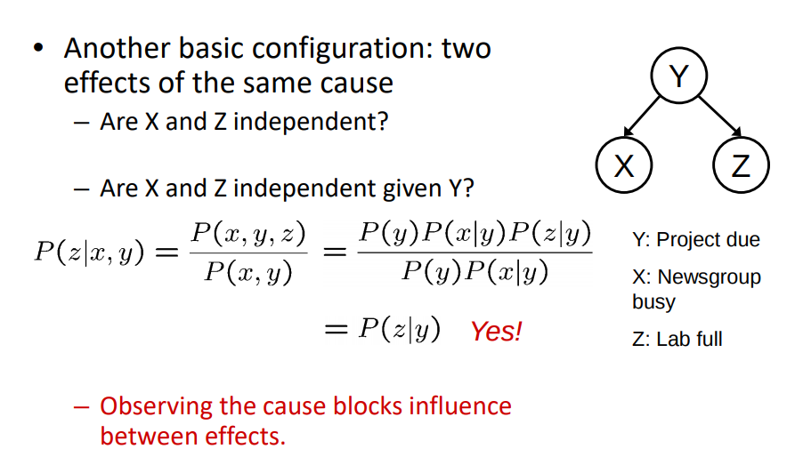

###### Common Effect

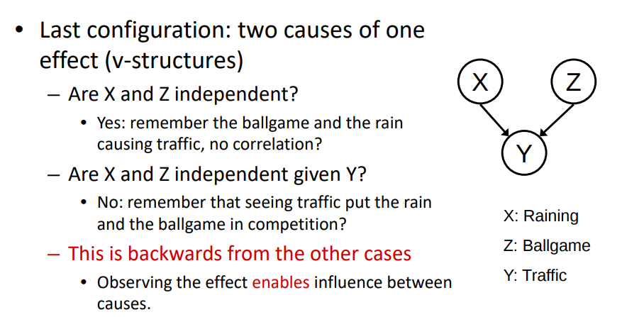

要求网络的拓扑结构确实反映了合适的父节点集对每个变量 的那些直接影响。 添加节点的正确次序是首先添加“根本原因”节点，然后加 入受它们直接影响的变量，以此类推。


#### 14.3 Inference in Bayesian networks


### 15

### 16

### 17

## 五：学习/Learning

### 18 Learning 1&2

#### Decision Trees

 熵(entropy)度量随机变量的不确定性，熵越大，不确定性越大
$$
H(X)=-\sum_{i=1}^np_i \log p_i	\\
0\le H(X) \le \log n
$$
条件熵，给定$X$时随机变量$Y$的不确定性
$$
H(Y|X)=\sum_{i=1}^n p_i H(Y|X=x_i)	\\
p_i=P(X=x_i)
$$


信息增益
$$
g(D,A)=H(D)-H(D|A)
$$
信息增益的算法

设训练集为$D$，　$|D|$表示样本容量，设有$K$个类$C_k$，设特征$A$有$n$个不同的取值$\{a_1,a_2,\cdots,a_n\}$, 将样本划分为$n$个子集$D_1,D_2,\cdots, D_n$. 子集$D_i$中属于类$C_k$的样本为$D_{ik}$

计算数据集$D$的经验熵$H(D)$
$$
H(D)=-\sum_{k=1}^K\frac{|C_k|}{|D|}\log_2 \frac{|C_k|}{|D|}
$$
计算特征$A$对于数据集$D$的经验条件熵$H(D|A)$
$$
H(D|A)=\sum_{i=1}^n \frac{|D_i|}{|D|} H(D_i)
=-\sum_{i=1}^n \frac{|D_i|}{|D|} \sum_{k=1}^K \frac{|D_{ik}|}{|D_i|}\log_2 \frac{|D_{ik}|}{|D_i|}
$$
计算信息增益
$$
g(D,A)=H(D)-H(D|A)
$$
选择信息增益最大的那个

#### Linear predictions

$$
h(\mathbf{x})=\text{sign}(\mathbf{w}^\top \mathbf{x}+b)
$$

$$
\begin{aligned}
& L_{0/1}(h(\mathbf{x}),y)=
\begin{cases}
0 &\text{if }h(\mathbf{x})=y	\\
1 &\text{if }h(\mathbf{x})\ne y
\end{cases}
\\
&L_2(h(\mathbf{x}),y)=(y-\mathbf{w}^\top \mathbf{x} -b)^2=(1-y(\mathbf{w}^\top \mathbf{x}+b))^2	\\
&L_1(h(\mathbf{x}),y)=|y-\mathbf{w}^\top \mathbf{x} -b|=|1-y(\mathbf{w}^\top \mathbf{x}+b)| \\
&L_{\text{hinge}}(h(\mathbf{x},y))=(y-\mathbf{w}^\top \mathbf{x} -b)_+
\end{aligned}
$$

对$L_2$的公式推导
$$
\mathbf{X}=
\begin{bmatrix}
1 & x_{11} & \cdots & x_{1d} \\
\vdots & \vdots & \ddots & \vdots \\
1 & x_{N1} & \cdots & x_{Nd}
\end{bmatrix}
,\
\mathbf{y}=
\begin{bmatrix}
y_1\\
\vdots \\
y_N
\end{bmatrix}
,\
\mathbf{w}=
\begin{bmatrix}
b \\
\vdots \\
w_d
\end{bmatrix}
$$
而
$$
\begin{aligned}
& \mathbf{w}^*=\min_{\mathbf{w}}L=\min_{\mathbf{w}} \sum_{i} (\mathbf{y}-\mathbf{X}\mathbf{w})_i^2
=\min_{\mathbf{w}}(\mathbf{X}\mathbf{w}-\mathbf{y})^\top (\mathbf{X}\mathbf{w}-\mathbf{y})	\\
& \frac{\partial L}{\partial \mathbf{w}} =2(\mathbf{X}\mathbf{w}-\mathbf{y})^\top \mathbf{X}=0 \\
& \mathbf{X}^\top  \mathbf{X} \mathbf{w}- \mathbf{X}^\top  \mathbf{y}=0 \\
&  \mathbf{w}^* = ( \mathbf{X}^\top  \mathbf{X})^{-1} \mathbf{X}^\top  \mathbf{y} 	\\
\end{aligned}
$$

其中微分的规则为
$$
\begin{aligned}
&d(\mathbf{Ax+b})^T\mathbf{C}(\mathbf{Dx+e})=((\mathbf{Ax+b})^T \mathbf{CD}+(\mathbf{Dx+e})^T\mathbf{C}^T\mathbf{A})d\mathbf{x}	\\
& d(\mathbf{Ax+b})^T(\mathbf{Ax+b})=2(\mathbf{Ax+b})^T\mathbf{A}d\mathbf{x}\\
& d(\mathbf{x}^T \mathbf{a})=d(\mathbf{a}^T\mathbf{x})=\mathbf{a}^T d \mathbf{x}
\end{aligned}
$$
另外，其中$X^+=(X^\top X)^{-1}X^\top$称为$X$的伪逆，Moore-Penrose pseudoinverse
$$
\hat{y}=\text{sign} \left(\mathbf{w}^* 
\begin{bmatrix}
1 \\
\mathbf{x}_0
\end{bmatrix}
\right)
=
\text{sign} \left(\mathbf{y}^\top \mathbf{X^{+}}^{\top}	
\begin{bmatrix}
1 \\
\mathbf{x}_0
\end{bmatrix}
\right)
$$
General linear classification

Basis (nonlinear) functions （基函数）
$$
f(\mathbf{x},\mathbf{w})=b+w_1\phi_1(\mathbf{x})+w_2\phi_2(\mathbf{x})+\cdots+w_m\phi_m(\mathbf{x})
$$
Prediction Errors

Training errors (apparent errors) — 训练误差 

Test errors — 测试误差 

Generalization errors — 泛化误差 (未知记录上的期望误差)


### 19

### 20 Support vector machines

间隔最大化；求解凸二次规划；


线性可分支持向量机（训练数据线性可分，硬间隔最大化）

线性支持向量机（近似线性可分，软间隔最大化）

非线性支持向量机（线性不可分，使用核技巧＋软间隔最大化）


#### 线性支持向量机

利用间隔最大化求最优分离超平面，解唯一

求解凸二次规划问题得到分离超平面
$$
\mathbf{w}^* \mathbf{x}+\mathbf{b}=0
$$

##### 两种间隔

###### 函数间隔

$$
\hat{\gamma}_i=y_i(wx_i+b)
$$

定义训练数据与超平面间隔为最小的那个
$$
\hat{\gamma}=\min_{i=1,\cdots, N}\hat{\gamma}_i
$$
观察到，当成比例增大$w$和$b$时，超平面没有变化，但是间隔却成比例变化，增加一些约束（$L_2$范数）
$$
||w||=1
$$
这时间隔变成几何间隔

###### 几何间隔

$$
\gamma_i=y_i\left(\frac{w}{||w||}x_i+\frac{b}{||w||}	\right)
$$

同样
$$
\gamma=\min_{i=1,\cdots,N}\gamma_i
$$
函数间隔与几何间隔的关系
$$
\gamma_i=\frac{\hat\gamma_i}{||w||}\\
\gamma=\frac{\hat\gamma}{||w||}
$$

##### 间隔最大化

###### 最大间隔分离超平面

$$
\begin{aligned}
& \max_{w,b}\gamma \\
& \text{s.t. }y_i\left(\frac{w}{||w||}x_i + \frac{b}{||w||}	\right)\ge \gamma ,i=1,2,\cdots,N
\end{aligned}
$$

考虑到几何间隔与函数间隔的关系
$$
\begin{aligned}
& \max_{w,b}\frac{\hat \gamma }{||w||}\\
& \text{s.t. }y_i\left(w x_i + b 	\right)\ge \hat\gamma ,i=1,2,\cdots,N
\end{aligned}
$$
函数间隔$\hat\gamma$对问题没有影响，只要成比例改变$w,b$就可以任意改变$\hat\gamma$, 所以把它固定$\hat\gamma=1$, 从而问题就变成了最大化$\frac{1}{||w||}$, 而这个和$\frac{1}{2}||w||^2$等价，从而得到下面的最优化问题
$$
\begin{aligned}
& \min_{w,b}\frac{1}{2}||w||^2 \\
& \text{s.t. }y_i\left(wx_i + b	\right)-1\ge 0 ,i=1,2,\cdots,N
\end{aligned}
$$
这是一个凸二次规划问题
$$
\begin{aligned}
&\min_w f(w) \\
 \text{s.t. }&g_i(w)\le 0, i=1,2,\cdots,k	\\
   &h_i(w)=0,i=1,2,\cdots,l
\end{aligned}
$$
其中，目标函数$f(w)$和约束函数$g_i(w)$为$\mathbb{R}^n$上的连续可微的凸函数，约束函数$h_i(w)$为$\mathbb{R}^n$上的仿射函数($f(x)=ax+b,a\in\mathbb{R}^n,b\in\mathbb{R},x\in\mathbb{R}^n$)

###### 最大间隔分离超平面的存在唯一性

因为假定数据线性可分，所以一定存在这样的一个超平面。

唯一性的证明见《统计学习方法》p101

##### 对偶算法

优化问题
$$
\min_{w,b}w^\top w\\
\text{ s.t. } 1-y_i(w^\top x_i +b)\le 0, \forall i
$$
The Lagrangian
$$
\begin{align}
L(w,b,\alpha)=& \frac{1}{2}w^\top w -\sum_{i=1}^n \alpha_i [y_i (w^\top x_i +b )-1]\\
=& \frac{1}{2}w^\top w+ \sum_{i=1}^n \alpha_i [1-y_i (w^\top x_i +b)]
\end{align}
$$
考虑一下约束
$$
\begin{align}
\max_{\alpha_i \ge 0}\alpha_i[1-y_i(w^\top x_i +b)] &=0 \quad \text{if }w,b\text{ satisfies primal constraints}\\
&= \infty \quad \text{otherwise}
\end{align}
$$
从而
$$
\begin{align}
\max_{\alpha \ge 0}L(w,b,\alpha) &=\frac{1}{2}w^\top w \quad \text{if }w,b\text{ satisfies primal constraints}\\
&= \infty \quad \text{otherwise}
\end{align}
$$
所以问题可以重新描述为
$$
\min_{w,b}\max_{\alpha \ge 0}L(w,b,\alpha) 
$$
其对偶问题为
$$
\max_{\alpha \ge 0}\min_{w,b}L(w,b,\alpha)
$$
先关于$w,b$对$L$最小化
$$
\begin{align}
&\frac{\partial L}{\partial w}(w,b,\alpha)= w^\top -\sum_{i=1}^n \alpha_i y_i x_i^\top =0	\\
&\frac{\partial L}{\partial b}(w,b,\alpha)=-\sum_{i=1}^n \alpha_i y_i =0
\end{align}
$$
第一个公式意味着
$$
w=\sum_{i=1}^n \alpha_i y_i x_i
$$
将这几个公式带入$L$得到
$$
L(w,b,\alpha)=\sum_{i=1}^n \alpha_i -\frac{1}{2}\sum_{i,j=1}^n \alpha_i\alpha_j y_i y_j (x_i^\top x_j)
$$

所以现在问题变成
$$
\max_\alpha \sum_{i=1}^n \alpha_i -\frac{1}{2}\sum_{i,j=1}^n \alpha_i\alpha_j y_i y_j (x_i^\top x_j) \\
\text{s.t. }\alpha_i \ge 0, \forall i\\
\sum_{i=1}^n \alpha_i y_i =0
$$

$$
w=\sum_{i=1}^n \alpha_i y_i x_i	\\
b=y_i -w^\top x_i, \text{ for any i that }\alpha_i \ne 0
$$

而kernel 为$x_i^\top x_j$

由于
$$
\begin{align}
\max_{\alpha_i \ge 0}\alpha_i[1-y_i(w^\top x_i +b)] &=0 \quad y_i(w^\top x_i +b)\ge 1	\\
&= \infty \quad \text{otherwise}
\end{align}　
$$
所以当$x_i$不是支持向量时，$\alpha^* =0$

所以$w$的值由不为$0$的$\alpha$决定
$$
w=\sum_{i=1}^n \alpha_i y_i x_i=\sum_{i\in SV}\alpha_i y_i x_i
$$

##### 软间隔

硬间隔
$$
\min_{w,b}w^\top w\quad \text{s.t. }y_i (w^\top x_i +b )\ge 1,\forall i 
$$
软间隔
$$
\min_{w,b}\frac{1}{2}w^\top w+C\sum_i \xi_i \quad \text{s.t. }y_i (w^\top x_i +b )\ge 1-\xi_i ,\xi \ge 0 ,\forall i
$$

- $x_i=0$ 表示$x_i$没有错误
- $C$越大，表示对错误的容忍度越高

相应的约束问题为
$$
\max_{\alpha }\sum_{i=1}^n \alpha_i -\frac{1}{2}\sum_{i,j=1}^n \alpha_i \alpha_j y_i y_j (x_i^\top x_j)\\
\text{s.t. }0\le \alpha_i \le C ,\forall i\\
\sum_{i=1}^n \alpha_i y_i =0
$$


微分规则
$$
\begin{aligned}
&d(\mathbf{Ax+b})^T\mathbf{C}(\mathbf{Dx+e})=((\mathbf{Ax+b})^T \mathbf{CD}+(\mathbf{Dx+e})^T\mathbf{C}^T\mathbf{A})d\mathbf{x}	\\
& d(\mathbf{Ax+b})^T(\mathbf{Ax+b})=2(\mathbf{Ax+b})^T\mathbf{A}d\mathbf{x}\\
& d(\mathbf{x}^T \mathbf{a})=d(\mathbf{a}^T\mathbf{x})=\mathbf{a}^T d \mathbf{x}
\end{aligned}
$$


### 21 Unsupervised learning

#### PCA

Principle Component Analysis
$$
P\in \mathbb{R}^{d\times m}: x\in \mathbb{R}^d \to y=P^\top x \in \mathbb{R}^m \quad (m\ll d)
$$
给定样本$\{x_1,x_2,\cdots,x_n\}\in \mathbb{R^d}$

先投影到一维空间$u_1\in \mathbb{R}^d: u_1^\top u_1 =1$
$$
\{u_1^\top x_1,u_1^\top x_2,\cdots, u_1^\top x_n	\}
$$

最佳的直线$u_1$,就是最大化投影数据variance
$$
\frac{1}{n}\sum_{i=1}^n (u_1^\top x_i -u_1^\top \bar{x})^2 =u_1^\top S u_1	\\
\text{where }\bar{x}=\frac{1}{n}\sum_{i=1}^n x_i\quad S=\frac{1}{n}\sum_{i=1}^n (x_i -\bar x)(x_i -\bar x)^\top
$$
形式化也就是
$$
\max_{u_1}u_1^\top S u_1 \quad \text{s.t. }u_1^\top u_1=1
$$
令$\lambda$ 为Lagrangian Multiplier
$$
L=u_1^\top S u_1 +\lambda_1 (1-u_1^\top u_1)
$$

满足的是等式的约束，求导取０
$$
\begin{align}
L &= u_1^\top S u_1 + \lambda_1 (1-u_1^\top u_1)	\\
\frac{\partial L}{\partial u_1 } &= Su_1 -\lambda_1 u_1 =0 \\
Su_1&=\lambda_1 u_1	\\
\end{align}
$$
从而$u_1$为$S$最大特征值$\lambda_1$对应的特征向量。

而下一个主成分，应该是，第二大的特征值对应的特征向量，而且与$u_1$垂直，即
$$
\max_{u_2} u_2^\top S u_2\\
\text{ s.t. }u_2^\top u_2 =1, u_1^\top u_2=0
$$
从而最终的步骤为

计算Covariance matrix S $S=\frac{1}{n}\sum_[i=1]^n (x_i-\bar x)(x_i -\bar x)^\top$

或者先中心化，然后计算$S=XX^\top$

找最大的$m$个特征向量$\{u_i \}_{i=1}^m$

得到投影矩阵$P=[u_1\ u_2\ \cdots\ u_m  ]\in \mathbb{R}^{d\times m}$

所以投影方式为$x\in \mathbb{R}^d \to P^\top x \in \mathbb{R}^m$


而重构方式为$PP^\top x$, 但是会丢失数据

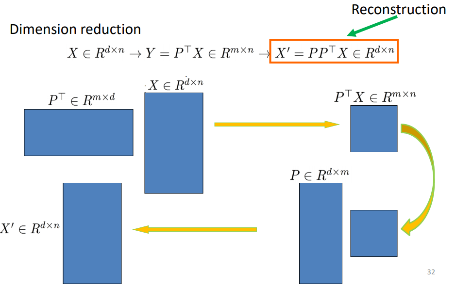


理论分析如下
$$
\begin{align}
\arg \min_{P\in \mathbb{R}^{d\times m}} ||X-X'||^2 
&=\arg \min_{P\in \mathbb{R}^{d\times m}}  ||X- PP^\top X||^2	\\
&= \arg \max_{P\in \mathbb{R}^{d\times m}}  \text{trace}(X^\top PP^\top X) \\
&= \arg \max_{P\in \mathbb{R}^{d\times m}}  \text{trace} (P^\top XX^\top P)	\\
&= \arg \max_{P\in \mathbb{R}^{d\times m}}  \text{trace} (P^\top S P)	\\
\text{s.t. }P^\top P=I_m
\end{align}
$$


