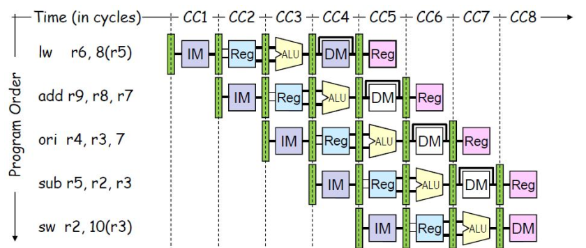
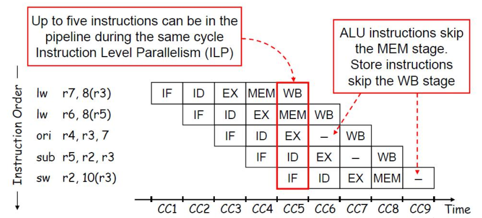
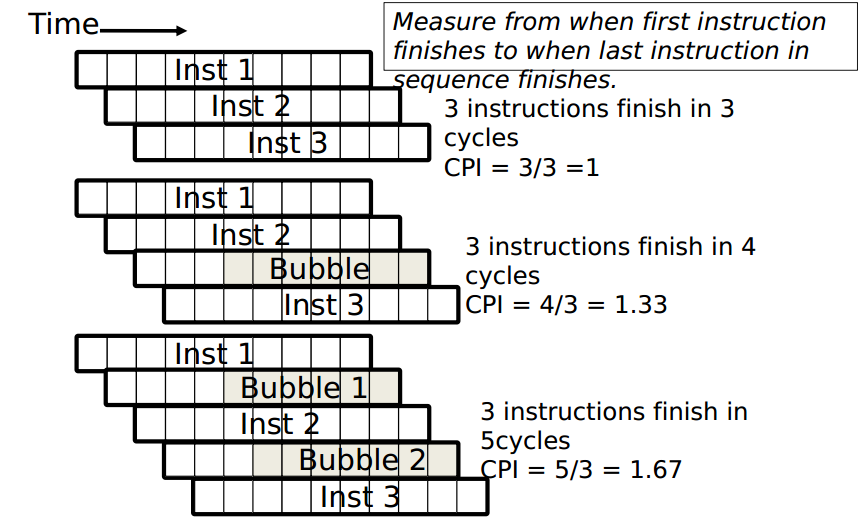
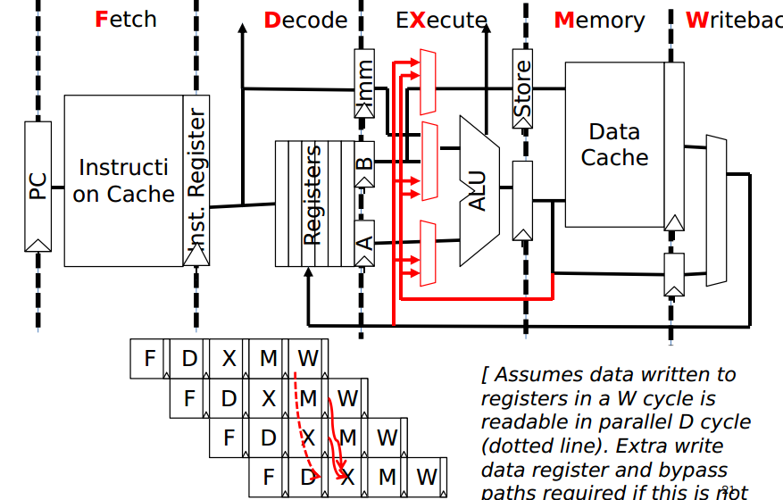
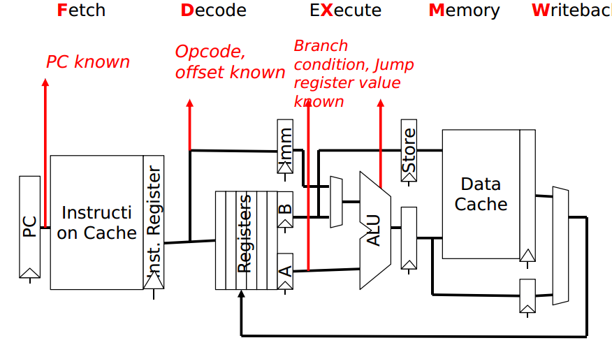

## 1 Introduction

现代计算机系统的抽象层次


课程主要内容

- 简单机器设计（Chapter 1, Appendix A, Appendix C ） 
  - ISAs, Iron Law, simple pipelines
- 存储系统( Chapter 2， Appendix B) 
  - DRAM, caches, virtual memory systems
- 指令级并行( Chapter 3) 
  - score-boarding, out-of-order issue
- 数据级并行( Chapter 4) 
  - vector machines, VLIW machines, multithreaded machines
- 线程级并行( Chapter 5) 
  - memory models, cache coherence, synchronization
- 面向特定领域的处理器体系结构（DSA）


**Great ideas in Computer Architecture**

1. Design for Moore's Law
2. Abstraction to Simplify Design: Abstraction via Layers of Representation
3. Make the Common Case Fast
4. Dependability via Redundancy
5. Memory Hierarchy
6. Performance via Parallelism/Pipelining/Prediction

### 1.2 定量分析技术基础

#### 性能的含义

- 以时间度量性能

  - Response Time
    - 从任务开始到任务完成所经历的时间
    - 通常由最终用户观察和测量
    - 也称Wall -Clock Time or Elapsed Time – Response Time = CPU Time + Waiting Time( I/O, scheduling, etc.)
  - CPU Execution Time
    - 指令执行程序（指令序列）所花费的时间
    - 不包括等待I /O或 系统调度的开销
    - 可以用秒( msec, µsec, …) , 或 
    - 可以用相对值（CPU的时钟周期数 ( clock cycles)）

- 以吞吐率度量性能

  - Throughput = 单位时间完成的任务数
    任务数/小 时、事务数/分 钟、10 Mbits/s
  - 缩短任务执行时间可提高吞吐率（throughput） 
    - Example: 使用更快的处理器
    - 执行单个任务时间少 ⇒ 单位时间所完成的任务数增加
  - 硬件并行可提高吞吐率和响应时间( response time) 
    - Example: 采用多处理器结构
    - 多个任务可并行执行, 单个任务的执行时间没有减少
    - 减少等待时间可缩短响应时间

- 相对性能

  - 某程序运行在X系统上
    $$
    \text{performance}(x)=\frac{1}{\text{execution_time}(x)}
    $$

  - X性能是Y的n倍 是指
    $$
    n=\frac{\text{performance}(x)}{\text{performance}(y)}
    $$
    

#### CPU性能度量

Response time ( lapsed time): 包括完成一个任务所需要的所有时间

> - User CPU Time (90.7)
> - System CPU Time (12.9)
> - Elapsed Time (2:39)

CPU 性能公式- CPI


不同指令类型具有不同的CPI


**Amdahl's Law**

假设可改进部分E在原来的计算时间所占的比例为F, 而部件加速比为S, 任务的其他部分不受影响，则
$$
\text{Speedup}=\frac{1}{(1-F)+\frac{F}{S}}
$$
重要结论( 性能提高的递减原则) : 如果只针对整个任务的一部分进行优化，那么所获得的加速比不大于$\frac{1}{1-F}$

**Gustafson–Barsi’s Law(古斯塔夫森定律)**


#### 计算机系统性能度量

**基本评估方法－市场评估方法**


**基本评估方法－benchmark测试**

五种类型的测试程序（预测的精度逐级下降）

- 真实程序：这是最可靠的方法。
- 修改过的程序：通过修改或改编真实程序来构造基准程序模块。原因 ：增强移植性或集中测试某种特定的系统性能
- 核心程序( Kernels) ： 由从真实程序中提取的较短但很关键的代码构成 。Livermore Loops及 LINPACK是 其中使用比较广泛的例子。
- 小测试程序（toy programs) ： 一般在1 0 行 以内。　
- 合成测试程序( Synthetic benchmarks)： 首先对大量的应用程序中的操作进行统计，得到各种操作比例，再按这个比例人造出测试程序。Whetsone与 Dhrystone是 最流行的合成测试程序。

**性能的综合评价**

算术平均或加权的算术平均
$$
\sum \frac{T_i}{n}\quad \sum \frac{W_i \times T_i}{n}
$$
规格化执行时间，采用几何平均
$$
\sqrt[n]{\prod_{i=1}^n \text{Execution_time_ratio}_i}
$$


几何平均的两个重要特性


## 2 ISA

> 软 件子系统与硬件子系统的关键界面

用户级ISA和 特权级ISA

重要的系统界面（System Interface）

- ISA界面（Instruction Set Architecture）
- ABI界面（Application Binary Interface）

ISA： 用户级ISA+特权级ISA

- 用户级ISA 适用于操作系统和应用程序
- 特权级ISA 适用于硬件资源的管理（操作系统）


- ISA的功能设计
  - 任务： 确定硬件支持哪些操作
  - 方法： 统计的方法
  - 两种类型： CISC和RISC
- CISC（Complex Instruction Set Computer）
  - 目标： 强化指令功能， 减少运行的指令条数， 提高系统性能
  - 方法： 面向目标程序的优化， 面向高级语言和编译器的优化
- RISC（Reduced Instruction Set Computer）
  - 目标： 通过简化指令系统， 用高效的方法实现最常用的指令
  - 方法： 充分发挥流水线的效率， 降低（优化）CPI

### CISC计算机ISA的功能设计

- 目标： 强化指令功能， 减少指令条数， 以提高系统性能
- 基本优化方法

1. 面向目标程序的优化是提高计算机系统性能最直接方法

   - 优化目标

     - 缩短程序的长度
     - 缩短程序的执行时间

   - 优化方法

     - 统计分析目标程序执行情况， 找出使用频度高， 执行时间长的指令或指令串
     - 优化使用频度高的指令
     - 用新的指令代替使用频度高的指令串

   - 1) 增强运算型指令的功能
     如`Sin(x), Cos(x), SQRT(X)`， 甚至多项式计算如用一条三地址指令完成
     `P(X) = C(0)+C(1)X+C(2)X2+C(3)X3+…..`

     2) 增强数据传送类指令的功能: 主要是指数据块传送指令

     - R-R, R-M, M-M之间的数据块传送可有效的支持向量和矩阵运算， 如IBM370
     - R-Stack之间设置数据块传送指令， 能够在程序调用和程序中断时， 快速保存和恢复程序现场， 如 VAX-11

     3) 增强程序控制指令的功能

     在CISC中， 一般均设置了多种程序控制指令， 正常仅需要转移指令和子程序控制指令

2. 面向高级语言和编译程序改进指令系统
    优化目标： 主要是缩小HL-ML之间的差距
    优化方法：

  - 1) 增强面向HL和Compiler支持的指令功能

    - 统计分析源程序中各种语句的使用频度和执行时间
    - 增强相关指令的功能， 优化使用频度高、 执行时间长的语句
    - 增加专门指令， 以缩短目标程序长度， 减少目标程序执行时间， 缩短编译时间

    2) 高级语言计算机系统
    缩小HL和ML的差别时， 走到极端， 就是把HL和ML合二为一， 即所谓的高级语言计算机。 在这种机器中， 高级语言不需要经过编译， 直接由机器硬件来执行。 如LISP机， PROLOG机
    3) 支持操作系统的优化实现－些特权指令
    任何一种计算机系统通常需要操作系统， 而OS又必须用指令系统来实现， 指令系统对OS的支持主要有

    - 处理器工作状态和访问方式的转换
    - 进程的管理和切换
    - 存储管理和信息保护
    - 进程同步和互斥， 信号量的管理等

### RISC指令集结构的功能设计


## 3 Pipeline

1. **流水线的基本概念**

   - 一个任务可以分解为k 个子任务

     - K个子任务在 K 个不同阶段（使用不同的资源）运行
     - 每个子任务执行需要1个单位时间
     - 整个任务的执行时间为 K倍单位时间

   - 流水线执行模式是重叠执行模式

     - K个流水段并行执行K个不同任务

     - 每个单位时间进入/离开流水线一个任务

       

2. **同步流水线**

   - 流水段之间采用时钟控制的寄存器（clocked registers)

   - 时钟上升沿到达时…所有寄存器同时保存前一流水段的结果

   - 流水段是组合逻辑电路

   - 流水线设计中希望各段相对平衡

     

3. **流水线的性能**

   - 设 $\tau_i$= time delay in stage $S_i$

   - 时钟周期 $\tau= \max(\tau_i )$ 为最长的流水段延迟

   - 时钟频率 $f = 1/\tau = 1/\max(\tau_i )$

   - 流水线可以在$k+n-1$个时钟周期内完成$n$个任务

     - 完成第一个任务需要 k个时钟周期
     - 其他n-1个任务需要n-1个时钟周期完成

   - K-段流水线的理想加速比（相对于串行执行）

     

4. **典型的RISC 5段流水线**

   - 5个流水段， 每段的延迟为1个cycle

   - IF: 取值阶段 选择地址： 下一条指令地址、 转移地址

   - ID: 译码阶段: 确定控制信号 并从寄存器文件中读取寄存器值

   - EX: 执行

     - Load 、 Store： 计算有效地址
     - Branch： 计算转移地址并确定转移方向

   - MEM: 存储器访问（仅Load和Store)

   - WB: 结果写回

     

5. **流水线的可视化表示**

   - 多条指令执行多个时钟周期

     - 指令按程序序从上到下排列

     - 图中展示了每一时钟周期资源的使用情况

     - 不同指令相邻阶段之间没有干扰

       

6. **流水线技术要点**

   - 流水线技术并不能提高单个任务的执行效率， 它可以提高整个系统的吞吐率
   - 流水线中的瓶颈——最慢的那一段
   - 多个任务同时执行， 但使用不同的资源
   - 其潜在的加速比＝流水线的级数
   - 流水段所需时间不均衡将降低加速比
   - 流水线存在装入时间和排空时间， 使得加速比降低
   - 由于存在相关问题， 会导致流水线停顿

7. **指令流时序**

   - 时序图展示： 每个时钟周期指令所使用的流水段情况

   - 指令流在采用5段流水线执行模式的执行情况

     

8. **单周期、 多周期、 流水线控制性能比较**

   

9. **流水线的相关（Hazards)**

   - 结构相关： 流水线中一条指令可能需要另一条指令使用的资源
   - 数据和控制相关： 一条指令可能依赖于先前的指令生成的内容
     - 数据相关： 依赖先前指令产生的结果（数据）值
     - 控制相关： 依赖关系是如何确定下一条指令地址(branches, exceptions)
   - 处理相关的一般方法是插入bubble， 导致CPI>1 (单发射理想CPI）

10. **Pipeline CPI Examples**

  

11. **消减结构相关**

    - 当两条指令同时需要相同的硬件资源时， 就会发生结构相关（冲突）
      - 方法1： 通过将新指令延迟到前一条指令执行完（释放资源后）执行
      - 方法2： 增加新的资源
        - E.g., 如果两条指令同时需要操作存储器， 可以通过增加到两个存储器操作端口来避免结构冲突
    - 经典的 RISC 5-段整型数流水线通过设计可以没有结构相关
      - 很多RISC实现在多周期操作时存在结构相关
        - 例如多周期操作的multipliers, dividers, floating-pointunits等， 由于没有多个寄存器文件写端口 导致 结构冲突

12. **三种基本的数据相关**

    - 写后读相关(Read After Write (RAW))
      - 由于实际的数据交换需求而引起的
    - 读后写相关（Write After Read (WAR)
      - 编译器编写者称之为“anti-dependence”（反相关）， 是由于重复使用寄存器名“x1”引起的.
    - 写后写相关（Write After Write (WAW)）
      - 编译器编写者称之为“output dependence” ， 也是由于重复使用寄存器名 “x1”引起的.
      - 在后面的复杂的流水线中我们将会看到 WAR 和WAW 相关

13. **消减数据相关的三种策略**

    - 连锁机制（Interlock）: 在issue阶段保持当前相关指令， 等待相关解除
    - 设置旁路定向路径（Bypass or Forwarding): 只要结果可用， 通过旁路尽快传递数据
    - 投机（Speculate）: 猜测一个值继续， 如果猜测错了再更正

14. **Interlocking Versus Bypassing**

    

15. **Example Bypass Path**

    

16. **Fully Bypassed Data Path**

    

17. **针对数据相关的值猜测执行**

    - 不等待产生结果的指令产生值， 直接猜测一个值继续
    - 这种技术， 仅在某些情况下可以使用:
      - 分支预测
      - 堆栈指针更新
      - 存储器地址消除歧义（Memory address disambiguation）

18. **采用软件方法避免数据相关**

    

19. **Control Hazards**

    如何计算下一条指令地址（next PC）

    - 无条件直接转移

      - Opcode, PC, and offset

    - 基于基址寄存器的无条件转移

      - Opcode, Register value, and offset

    - 条件转移

      - Opcode, Register (for condition), PC and offset

    -  其他指令

      － Opcode and PC ( and have to know it’s not one of above )

20. **Control flow information in pipeline**

    

21. **Pipelining for Unconditional PC-Relative Jumps**

    

22. **Pipelining for Conditional Branches**

    

23. **解决控制相关的方法**

    - Stall 直到分支方向确定
    - 预测分支失败
      - 直接执行后继指令
      - 如果分支实际情况为分支成功，则撤销流水线中的指令对流水线状态的更新
      - 要保证：分支结果出来之前不会改变处理机的状态，以便一旦猜错时，处理机能够回退到原先的状态。
    - 预测分支成功
      - 前提：先知道分支目标地址，后知道分支是否成功
    - 延迟转移技术

24. **多周期操作的处理**

    - 问题

      - 浮点操作在1～2个cycles完成是不现实的，一般要花费 较长时间  
      - 在MIPS中如何处理 

    - 在1到2个cycles时间内完成的处理方法 

      - 采用较慢的时钟源，或 
      - 在FP部件中延迟其EX段 

    - 现假设FP指令与整数指令采用相同的流水线，那么 

      - EX 段需要循环多次来完成FP操作，循环次数取决于 操作类型 
      - 有多个FP功能部件，如果发射出的指令导致结构或数 据相关，需暂停

    - 对MIPS的扩充：四个功能部件 

      - Integer 部件处理：Loads, Store, Integer ALU操作 和Branch 

      - FP/Integer 乘法部件：处理浮点数和整数乘法 

      - FP加法器：处理FP加，减和类型转换 

      - FP/Integer除法部件：处理浮点数和整数除法 

      - 这些功能部件未流水化

        


## 4 Memory

### 存储层次结构

通过优化存储系统的组织来使得针对典型应用平均访存时间最短

#### 基本解决方法： 多级层次结构


#### 存储层次的性能参数


#### 常见的存储层次的组织

- Registers <=> Memory

  由编译器完成调度

- cache <=> memory

  由硬件完成调度

- memory <=> disks

   由硬件和操作系统（虚拟管理）
    由程序员完成调度

### Cache基本知识

- 小而快（SRAM）的存储技术

   存储正在访问的部分指令和数据

- 用于减少平均访存时间

  - 通过保持最近访问的数据在处理器附近来挖掘时间局部性
  - 通过以块为单位在不同层次移动数据来挖掘空间局部性

- 主要目标：

  - 提高访存速度
  - 降低存储系统成本

#### 映象规则

- 当要把一个块从主存调入Cache时， 如何放置问题

- 三种方式

  - 全相联方式： 即所调入的块可以放在cache中的**任何位置**

  - 直接映象方式： 主存中每一块只能存放在cache中的**唯一位置**，一般， 主存块地址i 与cache中块地址j 的关系为：

    ​	j ＝ i mod (M)  ， M为cache中的块数

  - 组相联映象： 主存中每一块可以被放置在Cache中唯一的**一个组中的任意一个位置**， 组由若干块构成， 若一组由n块构成， 我们称N路组相联

    - 组间直接映象
    - 组内全相联
    - 若cache中有G组， 则主存中的第i 块的组号K
    - K = i mod (G),

    

    

#### 查找方法


- 原则： 所有可能的标记并行查找， cache的速度至关重要， 即并行查找
- 并行查找的方法
  - 用相联存储器实现， 按内容检索
  - 用单体多字存储器和比较器实现
- 显然相联度 N越大， 实现查找的机制就越复杂， 代价就越高
- 无论直接映象还是组相联， 查找时， 只需比较 tag， index无需参加比较

#### 替换算法

- 主存中块数一般比cache中的块多， 可能出现该块所对应的一组或一个Cache块已全部被占用的情况， 这时需强制腾出其中的某一块， 以接纳新调入的块， 替换哪一块， 这是替换算法要解决的问题：
  - 直接映象， 因为只有一块， 别无选择
  - 组相联和全相联有多种选择
- 替换方法
  - 随机法（Random)， 随机选择一块替换
    - 优点： 简单， 易于实现
    - 缺点： 没有考虑Cache块的使用历史， 反映程序的局部性较差， 失效率较高
  - FIFO－选择最早调入的块
    - 优点： 简单
    - 虽然利用了同一组中各块进入Cache的顺序， 但还是反映程序局部性不够， 因为最先进入的块， 很可能是经常使用的块
  - 最近最少使用法（LRU) (Least Recently Used)
    - 优点： 较好的利用了程序的局部性， 失效率较低
    - 缺点： 比较复杂, 硬件实现较困难

#### 写策略

- 写直达法（Write through)
  - 优点： 易于实现， 容易保持不同层次间的一致性
  - 缺点： 速度较慢
- 写回法
  - 优点： 速度快， 减少访存次数
  - 缺点： 一致性问题
- 当发生写失效时的两种策略
  - 按写分配法(Write allocate)： 写失效时， 先把所写单元所在块调入Cache， 然后再进行写入， 也称写时取（Fetch on Write)方法
  - 不按写分配法（no-write allocate): 写失效时， 直接写入下一级存储器， 而不将相应块调入Cache， 也称绕写法（Write around)
  - 原则上以上两种方法都可以应用于写直达法和写回法， 一般情况下
    -  Write Back 用Write allocate
    -  Write through 用no-write allocate

### 基本的Cache优化方法

### 高级的Cache优化方法

### 存储器技术与优化

#### Cache 性能分析

CPU time = (CPU execution clock cycles + Memory stall clock cycles) x clock cycle time 

Memory stall clock cycles = (Reads x Read miss rate x Read miss penalty + Writes x Write miss rate x Write miss penalty) 

Memory stall clock cycles = Memory accesses x Miss rate x Miss penalty 

Different measure: AMAT 

Average Memory Access time (AMAT) = Hit Time + (Miss Rate x Miss Penalty) 

Note: memory hit time is included in execution cycles

#### 性能分析举例


### 虚拟存储器－基本原理


## 5 ILP

### 5.1 指令级并行的基本概念及挑战

ILP: 无关的指令重叠执行 

流水线的平均CPI 

Pipeline CPI = Ideal Pipeline CPI + Struct Stalls + RAW Stalls + WAR Stalls + WAW Stalls + Control Stalls + Memory Stalls 

本章研究：减少停顿（stalls)数的方法和技术 

基本途径 

- 软件方法： 
  - Gcc: 17%控制类指令，5 instructions + 1 branch； 
  - 在基本块上，得到更多的并行性 
  - 挖掘循环级并行 
- 硬件方法 
  - 动态调度方法 
- 以MIPS的浮点数操作为例

本章遵循的指令延时(当使用结果的指令为BRANCH指令时除外)

| 产生结果的指令 | 使用结果的指令    | 所需延时 |
| -------------- | ----------------- | -------- |
| FP ALU op      | Another FP ALU op | 3        |
| FP ALU op      | Store double      | 2        |
| Load double    | FP ALU op         | 1        |
| Load double    | Store double      | 0        |
| Integer op     | Integer op        | 0        |

### 5.2 基本块内的指令级并行

基本块的定义： 

- 直线型代码，无分支；单入口；程序由分支语句连接 基本块构成 

循环级并行 

- for (i = 1; i <= 1000; i++) x(i) = x(i) + s; 
- 计算x(i)时没有数据相关；可以并行产生1000个数据； 
- 问题：在生成代码时会有Branch指令－控制相关 
- 预测比较容易，但我们必须有预测方案 
- 向量处理机模型 
  - load vectors x and y (up to some machine dependent max) 
  - then do result-vec = xvec + yvec in a single instruction

### 5.3 硬件方案: 指令级并行

为什么要使用硬件调度方案? 

- 在编译时无法确定的相关，可以通过硬件调度来优化 
- 编译器简单 
- 代码在不同组织结构的机器上，同样可以有效的运行 

**基本思想**: 允许 stall后的指令继续向前流动

```asm
DIVD F0,F2,F4 #耗时长
ADDD F10,F0,F8 #依赖于F0
SUBD F12,F8,F14 #与上面的不相关
```

 允许乱序执行（out-of-order execution）=> out-of-order completion

#### 硬件方案之一: 记分牌


##### 记分牌技术要点

 Out-of-order execution 将ID 段分为: 

- Issue—译码，检测结构相关 
- Read operands—等待到无数据相关时，读操作数 

集中相关检查，互锁机制解决相关 ; 顺序发射，乱序执行，乱序完成

 WAR的一般解决方案 

- 对操作排队 
- 仅在读操作数阶段读寄存器

对WAW而言, 检测到相关后，停止发射前一条指令， 直到前一条指令完成 

要提高效率，需要有多条指令进入执行阶段=>必须有 多个执行部件或执行部件是流水化的 

记分牌保存相关操作和状态 

记分牌用四段代替ID, EX, WB 三段


##### 记分牌控制的四阶段

1. Issue—指令译码，检测结构相关

   如果当前指令所使用的功能部件空闲，并且没有其他活动 的指令使用相同的目的寄存器（WAW), 记分牌发射该指令到 功能部件，并更新记分牌内部数据，如果有结构相关或WAW 相关，则该指令的发射暂停，并且也不发射后继指令，直到 相关解除. 

2.  Read operands—没有数据相关时，读操作数 

   如果先前已发射的正在运行的指令不对当前指令的源操作数 寄存器进行写操作，或者一个正在工作的功能部件已经完成 了对该寄存器的写操作，则该操作数有效。操作数有效时， 记分牌控制功能部件读操作数，准备执行。 

   记分牌在这一步动态地解决了RAW相关，指令可能会乱序执行。

3. Execution—取到操作数后执行 (EX) 

   接收到操作数后，功能部件开始执行. 当计算出结果 后，它通知记分牌，可以结束该条指令的执行. 

4. Write result—finish execution (WB) 

   一旦记分牌得到功能部件执行完毕的信息后，记分牌 检测WAR相关，如果没有WAR相关，就写结果，如果有 WAR 相关，则暂停该条指令。 

##### 记分牌的结构

1. Instruction status—记录正在执行的各条指令所处的状态步 

2. Functional unit status—记录功能部件(FU)的状态。用9个域 记录每个功能部件的9个参量

   Busy—指示该部件是否空闲 

   Op—该部件所完成的操作 

   Fi—其目的寄存器编号 

   Fj, Fk—源寄存器编号 

   Qj, Qk—产生源操作数

   Fj, Fk的功能部件 

   Rj, Rk—标识源操作数

   Fj, Fk是否就绪的标志 

3. Register result status—如果存在功能部件对某一寄存器进行 写操作，指示具体是哪个功能部件对该寄存器进行写操作。 如果没有指令对该寄存器进行写操作，则该域 为Blank

##### 记分牌流水线控制


#### 动态调度方案之二：Tomasulo Algorithm


### 5.1 指令级并行：概念与挑战

#### 什么是指令级并行

#### 数据相关与冒险

#### 控制相关

### 5.2 揭示ILP的基本编译器技术

#### 基本流水线调度和循环展开

#### 循环展开与调度小结

### 5.3 用高级分支预测降低分支成本

#### 竞赛预测器：局部预测器与全局预测器的自适应联合

#### Intel Core i7 分支预测器

### 5.4 用动态调度客服数据冒险

#### 动态调度：思想

#### 使用Tomasulo算法进行动态调度

### 5.5 动态调度：示例和算法

#### Tomasulo算法：细节

#### Tomasulo算法：基于循环的示例

### 5.6 基于硬件的推测

### 5.7 以多发射和静态调度来开发ILP

### 5.8 以动态调度、多发射和推测来开发ILP

### 5.9 用于指令传送和推测的高级技术

#### 提高指令提取带宽

#### 推测：实现问题与扩展

### 5.10 ILP局域性的研究

#### 硬件模型

#### 可实现处理器上ILP的局限性

#### 超越本研究的局限

### 5.11 交叉问题：ILP方法与存储器系统

#### 硬件推测与软件推测

#### 推测执行与存储器系统

### 5.12 多线程：开发线程级并行提高单处理器吞吐量

#### 细粒度多线程在Sun T1上的效果

#### 同时多线程在超标量处理器上的效果


## 6 DLP


## 7 TLP

 