## 1 Intro

课程主要内容


### DBMS的功能

DBMS: Database Management System, 数据库管理系统

- 数据库定义
  - 数据库对象定义：表、索引、约束、用户等

- 数据库操纵
  - 实现对数据库的基本操作：增、删、改、查

- 数据库保护
  - 恢复、并发控制、完整性控制、安全性控制

- 数据库的建立和维护
  - 初始数据的转换和装入、数据备份、数据库的重组织、性能监控和分析等
  - 通常由一些实用程序完成

### DBMS的分类

- 按数据模型	
  - 第1代DBMS 
    - 网状型DBMS
    - 层次型DBMS
  - 第2代DBMS 
    - 关系型DBMS
  - 第3代DBMS* 
    - 对象DBMS
  - 其它DBMS
- 按所支持的用户数
  - 单用户DBMS
  - 多用户DBMS
- 按允许数据库可以分布的站点数
  - 集中式DBMS
  - 分布式DBMS
- 按用途
  - 通用DBMS，如Oracle、Informix等
  - 专用DBMS，如时态数据库、空间数据库、移动数据库等

### DBMS的架构

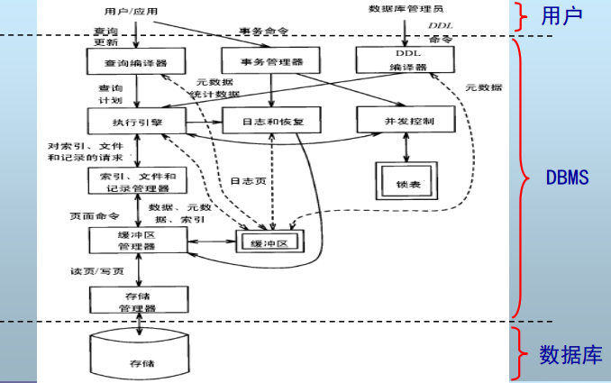

## 2 Database Architecture

### 一、数据库系统体系结构

- 从DBMS的角度看
  - 数据库系统内部的模式结构
- 从数据库系统的最终用户角度看
  - 数据库系统的外部体系结构

### 二、数据库系统的模式结构

> ANSI/SPARC体系结构——三级模式结构＋两级映象

#### 数据库的三级模式结构


> 外模式是单个用户的视图，概念模式是所有用户的公共数据视图，内模式是数据库内部的存储视图 

#### 二级映象和数据独立性


数据的逻辑独立性

> 当概念模式发生改变时，只要修改外模式/模式映象，可保持外模式不变，从而保持用户应用程序不变，保证了数据与用户程序的逻辑独立性

数据的物理独立性

> 当数据库的内部存储结构发生改变时，只要修改模式/内模式映象，可保持概念模式不变，从而保持外模式以及用户程序的不变，保证了数据与程序的物理独立性

### 三、数据库系统外部体系结构

- 客户机/服务器结构(Client/Server: C/S架构)
- 浏览器/服务器结构
  - 客户机统一使用浏览器软件，统一的用户界面
  - 服务器包括Web服务器和数据库服务器
- 分布式结构

## 3 Relational Data Model

### 一、数据模型

> 描述现实世界实体、实体间联系以及数据语义和一致性约束的模型

#### 1、数据模型的分类

- 概念数据模型（概念模型）
  - 按用户的观点对数据进行建模，强调语义表达功能
  - 独立于计算机系统和DBMS
  - 主要用于数据库的概念设计
- 结构数据模型（数据模型）
  - 按计算机系统的观点对数据进行建模，直接面向数据库的逻辑结构
  - 与计算机系统和DBMS相关
  - 有严格的形式化定义，以便于在计算机系统中实现

#### 2、数据抽象的层次


#### 4、数据模型的三要素

- 数据结构: 现实世界实体及实体间联系的表示和实现
- 数据操作: 数据检索和更新的实现
- 数据的完整性约束: 数据及数据间联系应具有的制约和依赖规则

### 二、关系模型概论

关系模型

> 用二维表格结构表示实体集，外码表示实体间联系，三类完整性规则表示数据约束的数据模型

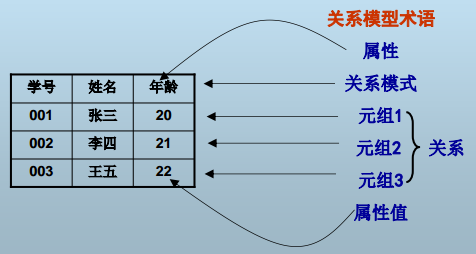

#### 1、一些术语

- 属性(Attribute): 二维表格的每一列称为关系的一个属性，列的数目称为度（degree）
- 元组(Tuple): 每一行称为关系的一个元组，元组的数目称为势（cardinality）
- 域(Domain): 一组具有相同数据类型的值的集合。每个属性有一个域
- 关系(Relation): 元组的集合

#### 2、关系、关系模式与关系数据库

- 关系模式(Relation Schema)
  - 关系的逻辑结构和特征的描述
  - 对应于二维表格的表头
  - 通常由属性集和各属性域表示，不关心域时可省略域 Student(Name, Age, Class)
- 关系
  - 关系模式的实例，即二维表（元组的集合）
- 关系数据库模式(Relational Database Schema)
  - 关系模式的集合
		关系数据库：关系数据库模式的实例	

#### 3、关系模式的形式化定义

- 关系模式可以形式化定义为：

  - R(U,D,dom,F)

    R为关系模式名， U是一个属性集， D是U中属性的值所来自的域，Dom是属性向域的映射集合， F是属性间的依赖关系

- 例： Student关系模式的定义

  - Student(U,D,dom,F)

    U={sno,name,age}
    D={CHAR,INT}
    Dom={dom(sno)=dom(name)=CHAR,dom(age)=INT}
    F={sno→name, sno→age}

- 关系模式通常简写为R(U)，或R(A1,A2,…,An)

#### 4、超码、候选码和主码

- 超码（ Super Key）

  在关系模式中能**唯一标识**一个元组的**属性集**称为关系模式的超码

- **候选码**（ Candidate Key）

  - 不含**多余属性**的超码
  - 包含在任何一个候选码中的属性称为**主属性**（ Primary Attribute）
  - 不包含在任何一个候选码中的属性称为**非主属**性（ Nonprime Attribute）

- 主码（ Primary Key）

  用户选作元组标识的一个候选码称为主码，其余的候选码称为替换码（ Alternate Key）

> Student(Sno, Name, Age, LibraryID)
>
> - 超码(sno,name), (libraryID, name) …
> - **候选码** Sno, LibraryID
> - 主码
>   - 若选sno，则sno为主码， libraryID为替换码
>   - 若选sno，则libraryID 为主码， sno为替换码

#### 5、关系的性质

- 一个关系是一个**规范化**的二维表格
  - 属性值不可分解: 不允许表中有表
  - 元组不可重复: 因此一个关系模式至少存在一个候选码
  - 没有行序，即元组之间无序: 关系是元组的**集合**
  - 没有列序，即属性之间无序: 关系模式是属性的集合

#### 6、关系模型的形式化定义

- 数据结构

  关系：数据库中全部数据及数据间联系都以关系来表示

- 数据操作

  - 关系运算
    - 关系代数
    - 关系演算（元组关系演算、域关系演算）

- 数据的完整性约束

  关系模型的三类完整性规则

#### 7、关系模型的三类完整性规则

关系数据库的数据和操作必须遵循的规则

- 实体完整性(Entity Integrity)

  关系模式R的主码不可为空: 指组成**主码**的**所有属性**均不可取空值

  

- 参照完整性(Referential Integrity)

  - 外码（ Foreign Key）

    - 关系模式R的外码是它的一个属性集FK，满足：

      - 存在带有候选码CK的关系模式S，且
      - R的任一非空FK值都在S的CK中有一个相同的值

    - S称为被参照关系（ Referenced Relation）， R称为参照关系（ Referential Relation）

      

  - 参照关系R的任一个外码值必须

    - 等于被参照关系S中所参照的候选码的**某个值**

    - **或者为空**

      

- 用户自定义完整性(User-Defined Integrity)

  - 针对某一具体数据的约束条件，反映某一具体应用所涉及的数据必须满足的特殊语义

  - 由应用环境决定

    

### 三、关系代数(Relational Algebra)


#### 1、一元操作和二元操作

- 一元操作（ Unary Operation）:只有一个变元的代数操作
  - 如选择、投影
- 二元操作（ Binary Operation）: 具有两个变元的代数操作
  - 如并、交、差、笛卡儿积、联接、除

#### 2、原始的关系代数

- 传统的集合操作
  - 并（ Union） ：返回两个关系中所有元组
  - 交（ Intersection） ：返回两个关系共同的元组
  - 差（ Difference） ：返回属于第一个关系但不属于第二个关系的元组
  - 笛卡儿积（ Cartesian Product） ：返回两个关系的元组的任意组合所得到的元组集合
- 专门的关系操作
  - 选择（ Select） ：返回指定关系中满足给定条件的元组
  - 投影（ Project） ：返回指定关系中去掉若干属性后所得的元组
  - 联接（ Join） ：从两个关系的笛卡儿积中选取属性间满足给定条件的元组
  - 除（ Divide） ：除的结果与第二个关系的笛卡儿积包含在第一个关系中

#### 3、关系代数的封闭性

关系代数的封闭性: 任意关系代数操作的结果仍是一个关系
关系代数的封闭性保证了关系代数操作的**可嵌套性**

#### 4、关系代数表达式的语法

- 数学符号表示
  - 并$∪$ 、交$∩$、差$－$、笛卡儿积$×$
  - 选择$σ$ 、投影$𝜋$ 、联接$∞$ 、除$÷$
- 英语关键字表示
  - 并Union、交Intersect、差Minus、笛卡儿积Times
  - 选择Where…、投影{All But…}、联接Join、除Divedeby

#### 5、原始关系代数操作的语义

##### (1) 并


##### (2) 交


##### (3) 差


##### (4) 笛卡儿积（积）


##### (5) 选择


##### (6) 投影


##### (7) 联接

###### 自然联接 


###### $θ$联接 


###### 等值联接


##### (8) 除


**补充：重命名操作（Rename）**


#### 6、（原始）关系代数的基本运算

- 基本运算有5个
  - 并、差、积、选择、投影、（重命名）
- 其它操作都可以通过这些基本操作来表示
  - 交：
  - 联接（自然联接、 θ联接）：
  - 除：

#### 7、关系代数表达式的定义

- 关系代数中的基本表达式是关系代数表达式，基本表达式由如下之一构成：
  - 数据库中的一个关系
  - 一个常量关系
- 设E1和E2是关系代数表达式，则下面的都是关系代数表达式：
  - $E1∪E2 、E1－E2、E1×E2$
  - $σ_P(E1)$,其中P是E1中属性上的谓词
  - $\pi_S(E1)$,其中S是E1中某些属性的列表
  - $ρ_x(E1)$,其中x是E1结果的新名字

#### 8、关系代数表达式示例


#### 9、附加的关系代数操作

##### 扩展投影(广义投影)(Extended Project)


##### 聚集函数(aggregate)


##### 分组(group)


##### 排序

	

##### 赋值


### 四、数据更新

#### 删除


#### 插入


#### 修改


## 4 SQL

### 一、数据库语言

- 用户如何存取数据库中的数据？需要存取哪些数据？

  - 需存取三类数据 
    - 数据库的存取？
    - 数据库模式的存取？ 
    - 数据库访问控制信息的存取？ 

- 用户与数据库的唯一接口——数据库语言

- DBMS支持用户通过数据库语言进行数据存取

  

- 数据库语言包括三类子语言

  - 数据定义语言（Data Definition Language, DDL）——存取数据库模式
  - 数据操纵语言（Data Manipulation Language， DML）——存取数据库数据
  - 数据库控制语言（Data Control Language，DCL）——存取访问控制信息

### 二、SQL概述

#### １、SQL的发展历程

#### ２、SQL数据库中的术语

基本表（Table） ——关系：简称“表”。 表结构——关系模式
记录（Record） ——元组
字段（列）（Field/Column） ——属性
字段值 ——属性值
字段类型（列类型） ——域
键（Key） ——码
主键（Primary Key） ——主码
外键（Foreign Key） ——外码

#### ３、SQL数据库的三级体系结构

SQL数据库：支持SQL语言的关系数据库


#### ４、SQL的组成


### 三、SQL的数据定义——DDL

#### １、基本表的结构

- 一个基本表的结构包括：
  - 表名 ——对应关系模式名
  - 列 ——对应关系模式的属性
  - 完整性约束 ——对应关系模式的三类完整性

##### （1）列

- 列名

  - 字母开头，可含字母、数字、＃、$、_
  - <=30字符

- 列类型

  - Char(n) 【定长字符串类型】
  - Varchar2(n) 【可变长字符串类型】
  - Number 【数值型】
  - Date 【日期时间型】
  - ……

  

##### （2）完整性约束


#### ２、创建基本表：Create Table


##### （1）定义列

- 完整格式

  `<列名> <列类型> [ DEFAULT <默认值>][[NOT] NULL] [<列约束>]`

  

###### A）默认值

-  当往表中插入一条新记录时，如果某列上有默认值，并且新记录中未指定该列的值，则自动以默认值填充

  

###### B）列约束

- 必须更在每个列定义后定义

- 只对当前列有效

- 可以使用四种类型的约束

- 格式

  `[Constraint <约束名>] <约束类型>`

- 例

  ```plsql
  S# char(n) Constraint PK_Student Primary Key
  S# char(n) Primary Key 
  ```

##### （2）定义约束

- 列约束：在每个列后定义，可以有多个约束子句
  - 但不能定义多个列上的约束
- 表约束：在全部列定义完成后定义，可以有多个约束子句
  - 多个列上的约束必须使用表约束
  - 单列上的约束可以用列约束，也可用表约束
- 四种约束都可以作为列约束或表约束

###### A）列约束和表约束举例


###### B) Primary Key约束

定义主键：不许有空值，也不可重复


###### C)Unique约束

唯一性约束：值不可重复，但可以为空


###### D)Unqiue约束对空值的处理

若约束列中有一列不为空，就实施约束；若约束列都为空，则不实施约束


###### E)Foreign Key约束

外键约束：表中某列值引用其它表的主键列或Unique列，参照完整性含义


###### F)Foreign Key约束示例


###### G)Foreign Key约束的选项

- 级联删除：删除主表中的记录时，同时删除子表中相

  关联的记录:
  `On Delete Cascade`

- 级联设空：删除主表中的记录时，同时将子表中相应

  记录的外键列值设为空:
  `On Delete Set NULL`

  

###### H)Check约束

- 检查约束：自定义某些列上的约束
  - `Constraint CK_S1 Check (Age>15)`
  - `Constraint CK_S2 Check (Sex In (‘M’,’F’))`
  - `Constraint CK_SC Check (Score>=0 and Score<=100)`
  - `Constraint CK_S3 Check (Sname Is Not NULL)`

#### ３、修改基本表：Alter Table

```plsql
Alter Table <表名>
	[Add <列定义>] | 
	[Modify <列定义>] |
	[Rename Column <old> To <new>]|
	[Drop Column <列名>] |
	[Add <表约束>] |
	[Drop Constraint <约束名>] |
 	[Rename To <new_table_name>]
```

##### （1）增加列

```plsql
Alter Table <表名>
	Add <列定义> 
```

 <列定义>与Create Table中相同

```plsql
Alter Table Student(
	Add Class Varchar2（10）
)

Alter Table Student(
	Add Dept Varchar2（10） Constraint UQ_S3 UNIQUE
)
```

##### （2）删除列

```plsql
Alter Table <表名>
	Drop Column <列名>
```

```plsql
Alter Table Student(
	Drop Column age
)
```

##### （3）修改列

```plsql
Alter Table <表名>
	Modify <列定义>
```

<列定义>与Create Table中相同;但列名不能修改

```plsql
Alter Table Student(
	Modify age Integer NOT NULL
)
```

##### （4）重命名列

```plsql
Alter Table <表名>
	Rename Column <old> To <new>
```

```plsql
Alter Table Student(
	Rename Column sex To gender
)
```

##### （5）增加约束

```plsql
Alter Table <表名>
	Add <表约束>
```

**只能增加表约束**
表约束格式与创建表时相同

```plsql
Alter Table Student(
	Add Constraint PK_Student Primary Key(S#)
)
```

##### （6）删除约束

```plsql
Alter Table <表名>
	Drop Constraint <约束名>
```

```plsql
Create Table SC( －－选课表
	S# Varchar2(10) , 
	C# Varchar2(20),
	Score Number(3) ,
	Constraint FK_SC Foreign Key(S#) References Student(S#) On Delete Cascade
)
```

```plsql
Alter Table SC(
	Drop Constraint FK_SC
)
```

##### （7）重命名表

```plsql
Alter Table <表名>
	Rename To <新的表名>
```

```plsql
Create Table SC( －－选课表
	S# Varchar2(10) , 
	C# Varchar2(20),
	Score Number(3) ,
	Constraint FK_SC Foreign Key(S#) References Student(S#) On Delete Cascade
)
```

```plsql
Alter Table SC(
	Rename To course_selection
)
```

#### ４、删除基本表：Drop Table

`Drop Table <表名> [Cascade Constraints]`
`Cascade Constraints`表示删除表时同时删除该表的所有约束

```plsql
Drop Table Student
Drop Table Student Cascade Constraints 
```

### 四、DML——插入/修改/删除记录

- Insert：插入记录
- Delete：删除记录
- Update：修改记录
- Select：查询记录

#### 1、插入新记录到基本表中

```plsql
Insert Into <表名> (列名1，列名2，……，列名n)
	Values（值1，值2，……，值n）
```

```plsql
Create Table Student(
	S# Varchar2(10) Constraint PK Primary Key,
	Sname Varchar2(20),
	Age Number(3),
	Sex Char(1) DEFAULT 'F'
)
```

```plsql
Insert Into Student（S#, Sname, Age, Sex）
	Values（'s001'，'John'，21，'M'）
```

创建临时表

```plsql
Create Global Temporary Table TableA(S# Char(5),age int)
```


##### （1）Insert其它例子

如果插入的值与表的列名精确匹配（顺序，类型），则可以省略列名表

```plsql
Insert Into Student
	Values（'s002'，'Mike'，21，'M'）
```

如果列名没有出现在列表中，则插入记录时该列自动以默认值填充，若没有默认值则设为空

```plsql
Insert Into Student（s#, sname）
	Values（'s003'，'Mary' ）
```

##### （2）日期数据的插入

使用To_Date函数插入日期型

```plsql
Alter Table Student Add birth Date;

Insert Into Student Values('s004'，'Rose', 22, 'F', 
	to_date('11/08/1981', 'dd/mm/yyyy'));

Insert Into Student Values('s005'，'Jack', 22, 'M', 
    to_date('12-08-1981', 'dd-mm-yyyy'));
```

#### 2、修改表中的数据

```plsql
Update <表名>
	Set <列名1>＝<值1>，<列名2>＝<值2>，……
	Where <条件>
```

将符合<条件>的记录的一个或多个列设置新值

##### Update例子

将学生John的性别改为'F'，年龄改为23

```plsql
Update Student
	Set sex＝ 'F' ，age＝23
	Where sname＝ 'John'
```

将所有学生的年龄都减1岁

```plsql
Update Student
	Set age＝age－1
```

#### 3、删除表中的记录

```plsql
Delete From <表名>
	Where <条件>
```

将符合<条件>的记录从表中删除

从数据库中删除学号为s001的学生

```plsql
Delete From Student
Where s# = 's001'
```

从数据库中删除所有的学生

```plsql
Delete From Student
```

### 五、DML：查询数据

#### 1、Select查询结构

```plsql
Select <列名表> －－指定希望查看的列
From <表名列表> －－指定要查询的表
Where <条件> －－指定查询条件
Group By <分组列名表> －－指定要分组的列
Having <条件> －－指定分组的条件
Order By <排序列名表> －－指定如何排序
```

#### 2、Select基本查询

1. 查询全部记录：查询全部的学生信息

   ```plsql
   Select * From Student
   
   --*表示所有列;等同于
   Select s#, sname, age, sex From Student
   ```

2. 查询特定的列：查询所有学生的学号和姓名

   ```plsql
   Select s#, sname From Student
   ```

3. 使用别名：查询所有学生的学号和姓名

   ```plsql
   Select s# as 学号, sname as 姓名 
   From Student
   
   --如果别名包含空格，须使用双引号
   Select s# as "Student Number" 
   From Student
   ```

4. 使用表达式：查询所有学生的学号、姓名和出生年份，返回两列信息，其中一列是“学号：姓名”，另一列是出生年份

   ```plsql
   Select s# || ':' || sname as 学生，2019－age as 出生年份 
   From Student
   ```

- 字符串表达式, 算术表达式, 函数表达式

  ```plsql
  Select sno, to_char(birth, 'mm-dd-yyyy') as birthday From Student
  Select Count(sno) as 学生人数 From Student
  ```

5. 检索特定的记录：查询20岁以上的学生的学号和姓名

   ```plsql
   Select s# as 学号, sname as 姓名 From Student 
   Where age > 20
   ```

   - 无Where子句时返回全部的记录

   - WHERE子句中的关系运算符

     - 算术比较符：>, <, >=, <=, =, <>

     - IN: 查询's001','s003','s006'和's008'四学生的信息

       ```plsql
       Select * From Student
       Where s# IN ('s001','s003','s006','s008')
       ```

     - IS NULL和 IS NOT NULL: 查询缺少年龄数据的学生

       ```plsql
       Select * From Student Where age IS NULL
       ```

     - LIKE: 查询姓名的第一个字母为‘R’的学生

       ```plsql
       Select * From Student Where sname LIKE 'R%'
       ```

       - %：任意长度的字符串

       - _：单个字符

       - 查询姓名的第一个字母为'R’'并且倒数第二个字母为'S'的学生

         ```plsql
         Select * From Student Where sname LIKE 'R%S_'
         ```

     - EXISTS

     - 多个比较式可用NOT、AND和OR连接

       ```plsql
       Select * From Student 
       Where age IS NULL and sname LIKE 'R%
       ```

6. 去除重复记录：查询学生的姓名

   ```plsql
   Select Distinct sname From Student
   ```

   Distinct只对记录有效，不针对某个特定列

   ```plsql
   Select Distinct sname, age From Student
   ```

7. 排序查询结果

   查询所有学生信息并将结果按年龄升序排列

   ```plsql
   Select * From Student Order By age
   ```

   将结果按年龄升序排列,按姓名降序排列

   ```plsql
   Select * From Student
   	Order By age ASC, sname DESC
   ```

   `ASC`表示升序，`DESC`表示降序

8. 使用聚集函数

   - Count(列名)：对一列中的值计数

   - Count(*)：计算记录个数

   - SUM(列名)：求一列值的总和（数值）

   - AVG (列名)：求一列值的平均值

   - MIN (列名)：求一列值的最小值

   - MAX (列名)：求一列值的最大值

   - 聚集函数例子
     求学生的总人数

     ```plsql
     Select count(*) From student
     ```

     求选修了课程的学生人数

     ```plsql
     Select count(distinct s#) From SC
     ```

     求学生的平均年龄

     ```plsql
     Select avg(age) as average_age From student
     ```

     单独使用聚集函数时（Select子句中的列名都是聚集函数形式），表示对所有记录进行聚集

9. 聚集函数和分组操作

   - 聚集函数：MIN, MAX, SUM, AVG, COUNT

   - 聚集函数一般与分组操作一起使用$𝛾_L(R)$

   - 查询男生和女生的平均年龄

     

   - 除聚集函数外的属性必须全部出现在Group By子句中

10. 返回满足特定条件的分组结果

   - 查询不同年龄的学生人数，并返回人数在5人以上的结果

     ```plsql
     Select age, COUNT(*) as students From Student
     Group By age
     Having COUNT(*) > 5
     ```

   - Having子句中必须聚集函数的比较式，而且聚集函数的比较式也**只能**通过Having子句给出

   - Having中的聚集函数可与Select中的不同

   - 查询人数在60以上的各个班级的学生平均年龄

     ```plsql
     Select class, AVG(age) From Student
     Group By class
     Having COUNT(*) > 60
     ```

#### 3、连接查询

一个查询从两个表中联合数据
返回两个表中与联接条件相互匹配的记录，不返回不相匹配的记录


##### （1）连接查询例子

查询学生的学号，姓名和所选课程号

```plsql
Select student.s#, student.sname,sc.c#
From student,sc
Where student.s# = sc.s# --连接条件
```

若存在相同的列名，须用表名做前缀

查询学生的学号，姓名，所选课程号和课程名

```plsql
Select student.s#, student.sname,sc.c#,course.cname
From student,sc,course
Where student.s# = sc.s# and sc.c# = course.c#  --连接条件
```

##### （2）使用表别名

查询姓名为`'sa'`的学生所选的课程号和课程名

```plsql
Select b.c#, c.cname
From student a, sc b, course c
Where a.s#=b.s# and b.c#=c.c# and a.sname='sa'
```

表别名可以在查询中代替原来的表名使用

联接查询与基本查询结合：查询男学生的学号，姓名和所选的课程数，结果按学号升序排列

```plsql
Select a.s#, b.sname, count(b.c#) as c_count
From student a, sc b
Where a.s# = b.s# and a.sex='M'
Group By a.s#, b.sname
Order By student.s#
```

#### 4、嵌套查询

在一个查询语句中嵌套了另一个查询语句;  三种嵌套查询: 无关子查询, 相关子查询, 联机视图.

##### （1）无关子查询

父查询与子查询相互独立，子查询语句不依赖父查询中返回的任何记录，可以独立执行

查询没有选修课程的所有学生的学号和姓名

```plsql
Select s#,sname	
From student
Where s# NOT IN (select distinct s# From sc)
```

子查询返回选修了课程的学生学号集合，它与外层的查询无依赖关系，可以单独执行

无关子查询一般与`IN`一起使用，用于返回一个值列表

##### （2）相关子查询

相关子查询的结果依赖于父查询的返回值 

查询选修了课程的学生学号和姓名

```plsql
Select s#, sname
From student
Where EXISTS (Select * From sc Where sc.s# = student.s#)
```

​	相关子查询不可单独执行，依赖于外层查询

​	EXISTS（子查询）：当子查询返回结果非空时为**真**，否 则为**假**

​	执行分析：对于student的每一行，根据该行的`s#`去`sc`中 查找有无匹配记录

查询选修了全部课程的学生学号和姓名(除操作的实现)

```plsql
Select s#, sname
From student
Where NOT EXISTS
(Select * From course Where NOT EXISTS
(Select * From SC Where s# = student.s# and c#=course.c#))
```


##### （3）联机视图

子查询出现在From子句中作为表使用 

查询选修课程数多于4门的学生学号、姓名和 课程数

```plsql
Select s#, count_c#
From (Select s#, count(c#) as count_c# From sc Group by s#) sc2, student s
Where sc2.s# = s.s# and count_c#>4
```

联机视图可以和其它表一样使用

另一种表达

```plsql
Select s.s#,sname,Count(distinct c#) as c.c#
From Student s,SC
Where s.s# = SC.s#
Group by s.s#,sname
Having Count(distinct c#)>4
```

#### 5、查询结果的连接

很少用，直接select可以解决

##### （1）Union和Union All

查询课程平均成绩在90分以上或者年龄小于20的学 生学号

```plsql
(Select s# From student where age<20)
UNION
(Select s#
 From (	Select s#, AVG(score)
 		From SC
 		Group by s#
 		Having AVG(score)>90) SC2
)
```

UNION操作自动去除重复记录 ——Set Union 

Union All操作不去除重复记录 ——Bag Union

##### （2）Minus操作：差

查询未选修课程的学生学号

```plsql
(Select s# From Student)
Minus
(Select distinct s# From SC)
```

##### （3） Intersect操作

返回两个查询结果的交集 

查询课程平均成绩在90分以上并且年龄小于 20的学生学号

```plsql
(Select s# From student where age<20)
Intersect
(Select s#
 From (	Select s#, AVG(score)
 		From SC
 		Group by s#
 		Having Avg(score)>90) SC2
)
```

#### 6 案例

> 图书（图书号，书名，作者，单价，库存量）
>
> 读者（读者号，姓名，工作单位，地址）
>
> 借阅（图书号，读者号，借期，还期，备注） 

> (1) 检索读者Rose的工作单位和地址；

$\pi_{工作单位,地址}(\sigma_{姓名='Rose'}(读者))$

```sql
select 工作地址,地址
from 读者
where 姓名= 'Rose'
```

> (2) 检索读者Rose所借阅读书（包括已还和未还图书）的图书名和借期；

$\pi_{书名,借期}(\sigma_{姓名='Rose'}(图书\infty 借阅 \infty 读者))$

```sql
select 书名,借期
from 图书,借阅,读者
where 图书.图书号=借阅.图书号 and 读者.读者号=借阅.读者号 and 读者.姓名='Rose'
```

> (3) 检索未借阅图书的读者姓名；

考虑到相同姓名的人,一个借过书,另一个没有

$\pi_{姓名}(读者\infty(\pi_{读者号}(读者)-\pi_{读者号}(借阅)))$

```sql
select 姓名
from 读者
where 读者号 not in (
	select distinct 读者号 from 借阅
	)
```

> (4) 检索Ullman所写的书的书名和单价；

$\pi_{书名,单价}(\sigma_{作者='Ullman'}(图书))$

```sql
select 书名,单价
from 图书
where 作者='Ullman'
```

> (5) 检索读者“李林”借阅未还的图书的图书号和书名；

$\pi_{图书号,书名}(\sigma_{读者.姓名='李林'\ and\ 借阅.还期\ is\ null }(图书\infty 借阅 \infty 读者))$

```sql
select 图书号,书名
from 图书,借阅,读者
where 图书.图书号=借阅.图书号 and 读者.读者号=借阅.读者号 and 读者.姓名='李林' and 借阅.还期 is null
```

> (6) 检索借阅图书数目超过3本的读者姓名。

$\pi_{姓名}(\sigma_{数目>3}(\gamma_{读者号,count(*)\to 数目}(借阅)\infty 读者))$

```sql
select 读者.姓名
from 读者,(select 读者号,count(*)
        	from 借阅
        	group by 读者号
        	having count(*) > 3)Temp
where 读者.读者号=Temp.读者号
```

> 供应商： S (S#, sname, status, city)
> 零件：      P (P#, pname, color, weight, city)
> 工程：       J(J#, jname, city)
> 供应：      SPJ (S#, P#, J#, QTY)   --表示供应商S#为工程J#供应了QTY数量的零件P#

> (1)求每个供应商的供应商号以及该供应商供应的平均零件数量；

$\gamma_{s\#,AVG(QTY)}(SPJ)$

```sql
select S#,AVG(QTY)
from SPJ
group by S#
```

> (2) 求每个工程的工程号以及该工程中所使用的每种零件的零件号以及数量；

$\gamma_{J\#,P\#,SUM(QTY)\to sum\_qty}(SPJ)$

```sql
select J#,P#,sum(QTY)
from SPJ
group by J#,P#
```

> (3) 求供应零件总量在300以上的供应商号和供应商名字；

$\pi_{S\#,sname}(\sigma_{sum\_qty>300}(\gamma_{S\#,SUM(QTY)\to sum\_qty}(SPJ)\infty S))$

```sql
select S#,sname
from SPJ,S
where SPJ.S#=S.S#
group by S#,sname
having SUM(QTY)>300
```

> (4) 增加一个新的工程{‘J00’, ‘Sam’, ‘Hefei’ }到J中，并将每个供应商为工程提供的全部零件都供应给该工程，把相应信息插入到SPJ中；

$J\leftarrow J \cup \{('J00', 'Sam', 'Hefei')\}$

```sql
insert into SPJ
values (‘J00’, ‘Sam’, ‘Hefei’)
```

> (5) 将供应商号为‘S1’的供应商的city改为‘合肥’；


### 六、视图（View）

视图（View）给出了SQL数据库的外模式定义


#### 1、视图的概念

视图是从一个或几个基本表中导出的虚拟表， 其数据没有实际存储，但可以和表一样操作 

视图具有和表一样的逻辑结构定义, 但视图没有相应的存储文件，而每个表都有相应 的存储文件

#### 2、视图的用途

- 逻辑数据独立性： 用户程序与数据库结构 
- 简化了用户眼中的数据，使用户可以集中于所关心的数据上 
- 同一数据库对不同用户提供不同的数据呈现方式
- 安全保护 


#### 3、视图的定义

```plsql
Create View <视图名>（列名1，列名2，…）
AS <查询>
[With Read Only]
```

​	<查询>是一个Select语句，指明视图定义在哪些基 本表上，定义了什么内容的数据 

 	<列名表>定义了视图的逻辑结构，与<查询>中返 回的数据相对应 

​	 若加上With Read Only选项表示所定义的视图是只读视图

例1：定义计算机系的学生视图

cs_view(sno,name,age)

```plsql
Create View cs_view (sno, name, age)
As Select s#,sname,age
 From student
 Where Dept='计算机系'
With Read Only
```

若省略视图的列名表，则自动获得Select查询返回的列名

`cs_view(s#,sname,age)`

```plsql
Create View cs_view
As 	Select s#,sname,age
 	From student
 	Where Dept='计算机系'
With Read Only
```

例2：把每门课程的课程号和平均成绩定义为视图

```plsql
Create View c_view
As 	Select c#, AVG(score) as avg_score
 	From sc
 	Group By c#
```

```plsql
Create View c_view (cno, avg_score)
As 	Select c#, AVG(score)
 	From sc
 	Group By c#
```

在查询中使用了函数时 

若省略列名表，则必须为函数指定别名 

若使用了列名表，则可以不指定函数的别名

#### 4、视图的查询

与基本表的查询相同 

例：查询平均成绩在80分以上的课程名

不使用视图

```plsql
Select a.cname
From Course a, (select c#,avg(score) as
					avg_score From sc Group By c#) SC2
Where a.c#=SC2.c# and SC2.avg_score>80
```

使用前面定义的视图 c_view

```plsql
Select a.cname 
From course a, c_view b
Where a.c#=b.c# and b.avg_score>80
```

#### 5、视图的更新

与表的更新类似 

例：将计算机系学号为’001’的学生的姓名改为’Rose’

```plsql
Update cs_view
Set name=‘Rose’
Where s#=‘001’
```

执行时先转换为student上的更新语句再执行

- 不是所有视图都是可更新的 
  - 基于联接查询的视图不可更新 
  - 使用了函数、表达式、Distinct的视图不可更新 
  - 使用了分组聚集操作的视图不可更新 
- 只有建立在单个表上，而且只是去掉了基本表的某些行和列 ，但保留了主键的视图才是可更新的

#### 6、视图的删除

```plsql
Drop View <视图名>
```

## 5 PL/SQL

### 一、PL/SQL vs. SQL 

- SQL是描述性语言，PL/SQL是过程性语言 

- PL/SQL是Oracle对SQL的一个扩展，是一种**过程化**的程序设计语言 

  - SQL本身并不能建立数据库应用程序 
  - PL/SQL是包含SQL的一种过程性语言，它不仅支持SQL，还支持一些过程性语言特性 

- 其它商用DBMS一般也都提供类似的扩展 

  - Microsoft T-SQL 
  - Informix E-SQL

- 二者均可以在Oracle数据库中运行，可以相互调用

  

### 二、PL/SQL程序的结构

```plsql
DECLARE --变量声明，必须放在首部
...
BEGIN --程序体
...
EXCEPTION 
...
END
```

#### 1、一个例子：返回001学生的姓名

```plsql
DECLARE
	name varchar2(20);
BEGIN
	Select sname Into name From Student Where s#='001'; 
	DBMS_OUTPUT.PUT_LINE('学号001的学生姓名是：' || sname)
EXCEPTION
	When NO_DATA_FOUND Then
		DBMS_OUTPUT.PUT_LINE('学号为001的学生不存在');
	When others Then
		DBMS_OUTPUT.PUT_LINE(‘发生了其它错误’);
END;
```

#### 2、PL/SQL的编程

```plsql
--赋值
:=
Select …… Into <变量> From……
--注释
--
--运行
/
```

### 三、变量声明

必须放在`DECLARE`段`<变量名> <类型>`

如果编写过程或函数，则过程首部将取代 Declare段

```plsql
Create Procedure
...
IS
	变量声明
BEGIN
```

#### 1、变量声明例子

**例1**：一般性声明

```plsql
Declare
	sno Number(3);
	name Varchar2(10);
```

**例2**：声明为正在使用的表中的某个列类型

可以保证代码与数据库结构之间的独立性

```plsql
Declare
	sno student.s#%TYPE;
	name student.sname%TYPE;
```

**例3**：声明一个记录类型

记录类型是由多个相关变量构成的一个单元, 通过定义记录类型，可以保存表中的记录

```plsql
TYPE <记录名> IS RECORD （
	变量1 类型1，
	变量2 类型2，
	...
）
```

通过`记录类型变量.成员名`访问内部成员

```plsql
DECLARE
	TYPE stu IS RECORD(
 	s# varchar2(10),
 	name varchar2(10),
 	age number
	);
	val stu; --声明了一个记录类型的变量val
BEGIN
	Select * Into val From Student Where s#='001';
	DBMS_OUTPUT.PUT_LINE('学号001的学生姓名是：' || val.name);
END;
```

**例4**：声明为一个表的行类型

```plsql
Declare
	stu Student%ROWTYPE;
```

Stu被声明为与student表相匹配的记录类型， student表的列自动称为stu的成员

```plsql
Stu.s#
Stu.sname
Stu.age
```

### 四、分支控制语句

```plsql
IF <表达式> THEN
	<语句>
ELSEIF <表达式> THEN
	<语句>
	...
ELSE
	<语句>
END IF;
```

```plsql
IF x＝5 THEN
	DBMS_OUTPUT.PUT_LINE('x=5');
END IF;
```

### 五、循环语句

#### 1、WHILE循环

```plsql
While <表达式>
Loop
	<语句>
End Loop;
```

```plsql
Declare
	x Number;
	total Number;
Begin
	x:=1;
	total:=0;
    While x<=100 Loop
        total:=total+x;
        x:=x+1;
    End Loop
END ;
```

#### 2、FOR循环

```plsql
For <计数变量> In [Reverse] <开始值>..<结束值>
Loop
	<语句>
End Loop；
```

循环体每执行一次 计数变量自动加1 ;若有Reverse，则每 次循环计数变量自动减1

```plsql
Declare
	x Number;
	total Number;
Begin
    total:=0;
    For x In 1..100 Loop
    	total:=total+x;
    End Loop
END ;
```

#### 3、LOOP循环

```plsql
Loop
	<语句>
End Loop
```

无内部控制结构的循环结构，循环执行其 中的<语句> 

必须在循环体中显式地结束循环 

Exit和Exit When两种方式退出循环

```plsql
Declare
    x Number:=1;
    total Number:=0;
Begin
    Loop
    	If x<=100 Then
            total:=total+x;
            x:=x+1;
        Else
        	Exit;
        End If
    End Loop
END ;
```

```plsql
Declare
    x Number:=1;
    total Number:=0;
Begin
    Loop
        total:=total+x;
        x:=x+1;
    	Exit When x>100
    End Loop
END ;
```

### 六、处理异常

可以捕捉程序运行中出现的错误或意外情况， 并加以处理

```plsql
Exception
    When <错误名1> OR <错误名2>... Then
    	<错误处理语句>
    When <错误名1> OR <错误名2>... Then
    	<错误处理语句>
    When Others Then
    	<错误处理语句>
```

#### 1、例子：返回001学生的姓名

```plsql
DECLARE
	name varchar2(20);
BEGIN
    Select sname Into name From Student Where s#='001';
    DBMS_OUTPUT.PUT_LINE('学号001的学生姓名是：' || sname)
EXCEPTION
    When NO_DATA_FOUND Then
    	DBMS_OUTPUT.PUT_LINE('学号为001的学生不存在');
    When others Then
    	DBMS_OUTPUT.PUT_LINE('发生了其它错误');
END;
```

#### 2、系统定义的标准异常（共20种）

`NO_DATA_FOUND` 执行Select…Into语句却没有找到匹配记录 

`TOO_MANY_ROWS` 执行Select…Into语句却返回了多行记录  

`VALUE_ERROR` 变量赋值错误，可能是类型不匹配，或者是值太大或太长 

`ZERO_DIVIDE` 除零错误 

`TIMEOUT_ON_RESOURCE` 资源等待超时

#### 3、人工生成异常

直接生成异常

```plsql
Raise_application_error
```

声明并触发一个自定义异常

```plsql
Raise
Raise_application_error
```

##### (1) 直接生成异常

Raise_application_error (自定义错误号-20000~-20999，错误信息)

```plsql
--插入一个新学生‘001’
DECLARE
	sno varchar2(20);
BEGIN
    Select s# Into sno From Student Where s#=‘001’;
    If SQL%FOUND Then
    	raise_application_error(-20001, '学生已存在');
    Else
    	Insert Into student(s#) values('001');
    End If
END;
```

##### (2)声明并触发一个自定义异常

```plsql
--插入一个新学生‘001’
DECLARE
	sno varchar2(20);
	exp Exception; --声明一个Exception变量
BEGIN
	Select s# Into sno From Student Where s#='001';
    If SQL%FOUND Then --全局变量
        raise exp; --生成一个异常
    Else
    	Insert Into student(s#) values('001');
    End If
EXCEPTION
    When exp Then --Raise_application_error返回一个异常
    	raise_application_error(-20001, '学生已存在');
    When others Then --PUT_LINE直接输出异常信息
    	DBMS_OUTPUT.PUT_LINE('发生了其它错误');
END;
```

#### 4、两个系统参数

```plsql
DECLARE
...
BEGIN
...
EXCEPTION
    When NO_DATA_FOUND Then
    	DBMS_OUTPUT.PUT_LINE('数据不存在');
    When others Then --SQLCODE 代表标准异常的错误号; SQLERRM 代表标准异常的错误描述
    	DBMS_OUTPUT.PUT_LINE('错误号：' || SQLCODE || '错误描述：' ||SQLERRM);
END;
```

### 七、游标

#### 1、游标概念

**动机**:

PL/SQL是过程性语言，每次只能处理 单个记录；而SQL是描述性语言，每次可以处理多行记录。

问题： PL/SQL如何支持多行记录的操作？

**解决方法**：游标 

游标是客户机或数据库服务器上开辟的 一块内存，用于存放SQL返回的结果 

游标可以协调PL/SQL与SQL之间的数 据处理矛盾 

PL/SQL中可以通过游标来过程化存取 SQL返回的结果


#### 2、游标操作

> 声明一个游标 ==> 打开游标 ==>读取游标中的记录 ==> 关闭游标

##### （1）声明游标

```plsql
Declare
	Cursor <名称> IS <Select语句>
```

声明中的SQL语句在声明时并不执行，只是给 出了游标对应的数据定义

```plsql
--声明一个游标，用于存放所有学生记录
DECLARE
	Cursor cs_stu IS select * from student;
```

##### （2）打开游标

```plsql
Open <游标名>
```

打开游标时，`SELECT`语句被执行，其结果放入了游标中

```plsql
--声明一个游标，用于存放所有学生记录
DECLARE
	Cursor cs_stu IS select * from student;
BEGIN
	Open cs_stu;
```

##### （3）读取游标中的记录

```plsql
Fetch <游标名> Into <变量表或记录变量>
```

打开游标后，游标指向了第一条记录 

Fetch后指向下一条记录 

若要读取游标中的数 据，一般需使用一个循环

```plsql
--返回所有学生记录
DECLARE
	Cursor cs_stu IS select * from student;
	stu student%ROWTYPE;
BEGIN
	Open cs_stu;
	Fetch cs_stu Into stu;
	While cs_stu%FOUND Loop
 		DBMS_OUTPUT.PUT_LINE(...);
 		Fetch cs_stu Into stu;
 	End Loop;
 ...
```

##### （4）关闭游标

```plsql
Close <游标名>
```

```plsql
--返回所有学生记录的学号和姓名
DECLARE
     Cursor cs_stu IS select s#,sname from student;
     sno student.s#%TYPE;
     name student.sname%TYPE;
BEGIN
     Open cs_stu;
     Loop
         Fetch cs_stu Into sno,name;
         Exit When cs_stu%NOTFOUND;
         DBMS_OUTPUT.PUT_LINE(...);
     End Loop;
     Close cs_stu;
END;
```

#### 3、游标属性

PL/SQL使用游标属性判断游标的当前状态 

- `Cursor%FOUND`: 布尔型，当前FETCH返回一行时为真 
- `Cursor%NOTFOUND`: 布尔型，当前FETCH没有返回一行时为真 
- `Cursor%ISOPEN` : 布尔型，若游标已经打开则为真 
- `Cursor%ROWCOUNT` 数值型，显示**目前为止**已从游标中取出的记录数

#### 4、使用游标FOR循环

由于游标总是使用循环处理，因此可以简化这种处理过程 

游标FOR循环：简化了游标操作

自动声明一个与游标中的数据记录类型一 致的变量，并自动打 开游标，读取游标， 并在读完后自动关闭 游标

```plsql
--返回所有学生记录
DECLARE
	Cursor cs_s IS select * from student;
BEGIN
	For s IN cs_s Loop --自动声明s、打开游标、读取数据并关闭游标
 		DBMS_OUTPUT.PUT_LINE(...);
 	End Loop;
END; 
```

#### 5、带参游标

```plsql
Declare
	Cursor <名称>（参数表） IS <Select语句>
```

```plsql
--返回给定年龄的学生记录
DECLARE
 	Cursor cs_s(val Number(3)) IS select * from student where DeptID=val;
BEGIN
    For s IN cs_s(11) Loop
    	DBMS_OUTPUT.PUT_LINE(...);
    End Loop;
END; 
```

### 八、PL/SQL的输入输出

输出: 使用`DBMS_OUTPUT`包

```plsql
PUT_LINE（...）--输出并换行
PUT（...）--输出但不换行
NEWLINE--生成一个新行
```

输入

```plsql
--返回给定年龄的学生记录
DECLARE
	Cursor cs_s IS select * from student where age=&val;
BEGIN
    For s IN cs_s Loop --运行时将提示输入val的值
 	   DBMS_OUTPUT.PUT_LINE(...);
    End Loop;
END; 
```

### 九、存储过程和函数

匿名PL/SQL块 

- 以DECLARE/BEGIN开始，每次运行都要编译， 程序在数据库中不保存 

命名PL/SQL块 

- 可以存储在数据库中，可以随时运行，也可以被 SQL或其它程序调用 
- 存储过程、函数、触发器、包

#### 1、存储过程概念

一类存储在数据库中的PL/SQL程序，可以通 过过程名调用


```plsql
Create or Replace Procedure AddStudent(
    v_s# IN varchar2, v_sname IN varchar2, v_age IN number)
AS
BEGIN
	Insert Into student(s#,sname,age) Values(v_s#,v_sname,v_age);
END; 
```

```plsql
--可在SQL PLUS中直接调用运行
SQL>Execute AddStudent('001','John',21);
```

```plsql
--可在其它PL/SQL程序中使用
BEGIN
...
AddStudent(s,n,a); --s, n, a是变量
...
END;
```

#### 2、存储过程定义

```plsql
Create or Replace Procedure <名称>(
 	参数表
)
AS | IS
	变量定义
BEGIN --与匿名PL/SQL程序格式相同
	PL/SQL代码
 	EXCEPTION
 		错误处理
END；
```

#### 3、参数定义

参数名 `IN | OUT | IN OUT `数据类型［:=默认值］ 

例` name IN varchar2, result OUT number` 

IN参数 输入参数，在程序中不能修改 

OUT参数 输出参数，在程序中只能对其赋值 

IN OUT 既可作为IN参数使用，也可作为OUT参数使用

#### 4、删除存储过程

```plsql
Drop Procedure <存储过程名>
```

#### 5、函数

具有返回值的存储过程

```plsql
Create or Replace Function <名称>(
	参数表
)
RETURN <类型>
AS | IS
	变量定义
BEGIN
	PL/SQL代码
	EXCEPTION
		错误处理
END；
```

例：创建返回一个系的学生总人数的函数

```plsql
Create or Replace Function StudentCount(DeptNo IN varchar2)
	Return Number
AS
	v_count Number:=0;
BEGIN
	select count(s#) Into v_count From Student where dept=deptno;
 	return v_count;
END; 
```

```plsql
--使用函数
Declare
	a number:=0;
BEGIN
	a:=StudentCount('cs');
	DBMS_OUTPUT.PUT_LINE('cs系的学生人数为' || a);
END;
```

#### 6、使用过程和函数的注意点

参数类型 

- 不能指定长度（与变量定义不同） 

  - 变量：`name varchar2(20)` 必须指定长度 
  - 参数：`name IN varchar2` 不能指定长度 

- 可使用`%TYPE`  

参数传递 

- 按位置：`sam(1,2,3,4)` 

- 命名传递：`sam(b=>2,a=>1,d=>4,c=>3)` 与位置无关  

`IN,OUT,IN OUT`参数的使用

#### 总结：存储过程的主要作用

- 增强了SQL语言的功能和灵活性，可以完成复杂的判断和运 算。 
- 可增强数据库的安全性。通过存储过程可以使没有权限的用 户在控制之下间接地存取数据库，从而保证数据的安全。 
- 可增强数据库的完整性。 
- 在运行存储过程前，数据库已对其进行了语法和句法分析， 并给出了优化执行方案。 由于执行SQL语句的大部分工作已 经完成，所以存储过程能以较快的速度执行。 
- 可以降低网络的通信量。 
- 使体现企业规则的运算程序放入数据库服务器中，以便集中 控制。

### 十、触发器（Trigger）

#### 1、触发器的概念

与特定表关联的存储过程。当在该表上执行 DML操作时，可以自动触发该存储过程执行 相应的操作

- 触发操作：Update、Insert、Delete 
- 通过触发器可以定制数据库对应用程序文件的反 应 
- 一个触发器只能属于一个表，一个表可有多个触 发器

#### 2、触发器概念示例

```plsql
Student（s#, sname, age, status） 
Sc( s#, c#, score) 
```

规定当学生有3门课不及格时，将该学生的status标记为‘不 合格’ 

通过SC上的触发器实现：当在SC中插入或更新记录时，自动 检查是否有学生满足不合格条件


#### 3、Oracle触发器的种类


#### 4、触发器的创建

```plsql
Create or Replace Trigger <名称>
	[Before | After | Delete | Insert | Update [Of <列名表>] --定义触发动作
     -- 先触发器还是后触发器
    [OR Before | After | Delete | Insert | Update [Of <列名表>]...]
	ON <表名>
	[For Each Row] --是否定义为行级触发器
		<PL/SQL块>
END;
-- 注意：没有参数。因为触发器是自动执行的，不能向它传参数
```

#### 5、系统变量:old和:new

对于行级触发器，系统变量`:old`和`:new`存储每一行的更新前值（`:old`）和更新后值（` :new`）

可以在触发器程序中需要时访问它们

| 操作 变量 | Insert | Update | Delete     |
| --------- | ------ | ------ | ---------- |
| :old的值  | 空     | 原记录 | 删除的记录 |
| :new的值  | 新记录 | 新记录 | 空         |

#### 6、触发器例子：自动更新学生状态

```plsql
Create or Replace Trigger SetStatus
After Insert Or Update Of score on SC
For Each Row --行级触发器
	Declare
 		a Number:=0;
Begin
	Select count(*) into a From SC where s#:= :new. s# and score<60;
	If a>=3 Then
		Update student Set status='不合格' Where s#= :new. s#;
	Else
		Update student Set status='合格' Where s#= :new. s#;
	End If
End; 
```

#### 7、触发器例子：自动统计学生人数

```plsql
--学校表
University(U#,uname, s_count)
--学生表
Student(U#, s#, sname, age)
```

```plsql
Create or Replace Trigger TotalStudent
After Insert or Delete On Student
Declare
	a Number:=0;
Begin --语句级触发器
	Select count(*) into a From Student ;
	Update University Set s_count=a;
End;
```

#### 8、触发器的触发顺序

1. 语句级先触发器 

2. 对于受语句影响的每一行 

   ① 行级先触发器 

   ② 执行语句 

   ③ 行级后触发器 

3. 语句级后触发器

#### 总结：触发器的主要作用

强化约束：触发器能够实现复杂的约束。 

跟踪变化：触发器可以侦测数据库内的操作， 可以用来实施审计，以及不允许数据库中未经 许可的更新和变化。 

级联运行：触发器可以侦测数据库内的操作， 并自动地级联影响整个数据库的各项内容。


## 6 Schema Design

数据库模式是数据库中全体数据的逻辑结构和 特征的描述


### 一、关系模式的设计问题

关系模式设计不规范会带来一系列的问题 

- 数据冗余 
- 更新异常 
- 插入异常 
- 删除异常

```plsql
示例关系模式 R(Tname, Addr, C#, Cname)
一个教师只有一个地址
一个教师可教多门课程
一门课程只有一个任课教师
因此R的主码是（C#）
```


#### 1、问题（1）：数据冗余

教师T1教了三门课程，他的地址被重复存储 了2次

#### 2、问题（2）：更新异常

如果T1的地址变了，则需要改变3个元组的地 址；若有一个未更改，就会出现数据不一致。 但DBMS无法获知这种不一致

#### 3、问题（3）：插入异常

如果要增加一名教师，但他还未带课，则C# 和Cname为空，但由于C＃是主码，为空违反 了实体完整性，所以这名教师将无法插入到数 据库中

#### 4、问题（4）：删除异常

如果教师T3现在不带课了，则需将T3的元组 删去，但同时也把他的姓名和地址信息删掉了

#### 5、如何解决？

C, T, TC

### 二、函数依赖

#### 1、什么是函数依赖？

函数依赖是指一个关系模式中一个属性集和另 一个属性集间的多对一关系 

例如选课关系SC(S#, C#, Score) 存在由属性集{S#, C#}到属性集{Score}的函数依赖 对于任意给定的S#值和C#值，只有一个Score值与其 对应 反过来，可以存在多个S#值和C#值，它们对应的 Score值相等 

#### 2、基本概念 


关系模式的形式化定义： 

`R(U，D，Dom，F)` R为关系模式名，U是一个属性集，D是U中属性的值所 来自的域，Dom是属性向域的映射集合，F是属性间的 依赖关系 FD是关系模式的一部分

#### 3、平凡FD和不平凡FD 

模式设计的首要问题是确定关系模式的最小函数依赖集 

- 给定一个函数依赖集S，若能找到一个远小于S的函数依赖集T，则DBMS只要实现T就可实现S中的所有函数依赖 

平凡FD和不平凡FD 

$X→Y$，且$Y \subseteq X$，则$X→Y$是平凡FD，否则是不平 凡FD 

平凡FD没有什么实际意义，消除平凡FD是缩 小函数依赖集大小的一个简单方法

#### 4、函数依赖集的闭包 


##### （1）函数依赖的推理规则 


##### （2）码的形式化定义 


#### 5、属性集的闭包 


#### 6、最小函数依赖集 


##### （1）定义 


##### （2）举例


##### （3）求最小函数依赖集 


### 三、模式分解

#### 1、模式分解的概念


#### 2、模式分解的标准

- 具有无损连接 （分解后数据没有丢失）
- 要保持函数依赖 
- 既具有无损连接，又要保持函数依赖

#### 3、无损连接

##### （1）动机


##### （2）概念


##### （3）无损连接的测试

###### 方法1：Chase 


Chase示例


###### 方法2


#### 4、保持函数依赖


##### （1）例子


##### （2）不保持函数依赖带来的问题


### 四、关系模式的范式

#### 1、范式的概念


#### 2、函数依赖图


#### 3、1NF


#### 4、2NF


##### （1）2NF含义


##### （2）2NF例子


##### （3）不满足2NF带来的问题


##### （4）模式分解以满足2NF


#### 5、3NF


##### （1）不满足3NF带来的问题


##### （2）分解2NF到3NF


#### 6、BCNF

Boyce/Codd范式 

2NF和3NF 

- 假设了R只有一个候选码，但一般情况下R可能有多个候选 码，并且不同的候选码之间还可能相互重叠 
- 只考虑了非主属性到码的函数依赖 

BCNF扩充了3NF，可以处理R有多个候选码的情形 

- 进一步考虑了**主属性到码**的函数依赖 
- 进一步考虑了**主属性对非主属性**的函数依赖

##### （1）多候选码的例子

假设供应商的名字是唯一的 

供应关系R(S#,SNAME,P#,QTY)存在两个候选码 

- {S#,P#}和{SNAME, P#} 
- R属于3NF，WHY？


```
{SNAME,P#} --> QTY,{S#,P#} --> QTY, 
S# --> SNAME, SNAME --> S#
```

##### （2）存在的问题

数据冗余：s1的名字Intel重复存储 

更新异常：修改s1的名字时必须修改多个元组 

删除异常：若s2现在不提供任何零件，则须删除 s2的元组，但同时删除了s2的名字 

插入异常：没有提供零件的供应商无法插入

##### （3）解决方法（3NF->BCNF）


##### （4）BCNF定义

如果关系模式R的所有不平凡 的、完全的函数依赖的决定因素（左边的属性 集）都是候选码，则$R\in BCNF$

3NF：不允许非主属性到非码的FD，但允许主属 性到其它属性的FD 

BCNF：不允许主属性、非主属性到非码的FD

##### （5）BCNF例子1

`R(S#,SNAME,STATUS,CITY)` 设Sname唯一


BCNF模式的函数依赖图中，箭头都是从候选 码中引出，所有不平凡FD的左边都是候选码

##### （6）BCNF例子2


### 五、规范化过程总结

- 对1NF模式投影，消除非主属性对码的局部函数依赖，产生2NF 
- 对2NF模式投影，消除非主属性对码的传递函数依赖，产生3NF 
- 对3NF模式投影，消除左边不是候选码的函数依赖，产生BCNF

整个讨论过程只采用了两种操作：投影和自然联接 

- 以投影来分解 
- 以自然联接来重构

若要求模式分解保持函数依赖，则总可以分解 到满足3NF，但不一定满足BCNF, BCNF可以达到无损连接，但不一定保持函数依赖 

若要求保持函数依赖和无损联接，则总可以达 到3NF，但不一定满足BCNF

### 六、模式分解的几个算法

#### 1、算法1：保持函数依赖地分解到3NF


#### 2、无损连接且保持函数依赖地分解到3NF


##### （1）例子1


##### （2）例子2


#### 3、无损连接地分解R到BCNF


## 7 Database Design

### 一、什么是数据库设计

对于给定的应用环境，构造最合适的数据库模式，并利用现成的DBMS，建立数据库及其应 用系统，使之能够有效地存储数据，满足各种用户的需求 

面向特定应用 逻辑设计 物理设计

### 二、数据库设计方法


我们的选择


### 三、数据库设计步骤

需求分析 概念设计 逻辑设计 物理设计 数据库实施 数据库运行与维护


**输入输出**

输入：总体信息需求、处理需求、DBMS特征 

- 总体信息需求：DBS的目标、数据元素的定义、数据在组 织中的使用描述 
- 处理需求：每个应用需要的数据项、数据量以及处理频率 
- DBMS特征：DBMS说明、支持的模式、程序语法 

输出：数据库设计说明书（完整的数据库逻辑结构 和物理结构、应用程序设计说明）

### 四、概念设计（ER模型设计）

产生反映组织信息需求的数据库概念结构，即 概念模型 

- 概念模型独立于数据库逻辑结构、DBMS以及计 算机系统 
- 概念模型以一组ER图形式表示 

概念设计侧重于数据内容的分析和抽象，以用 户的观点描述应用中的实体以及实体间的联系


#### 1、ER模型的概念

ER模型(EntityRelationship Model)

ER模型要素 

- 实体 Entity 包含实体属性 
- 实体与实体间的联系 Relationship 包含联系类型和联系属性

##### （1）实体与联系

**实体**（Entity） 现实世界中可标识的对象 如学生、学校、发票、教室、系、班级…… 物理存在的实体（教室、学生）、代表抽象概念的实体（ 课程） 应用中的数据以实体的形式呈现 一个实体具有唯一的标识，称为码（Key） 

**联系**（Relationship） 实体和实体之间发生的关联 一个实体一般都与一个或多个实体相关

##### （2）联系的类型

1对1联系（1:1） 

- 学校和校长、学生和学生简历…… 
- A和B是1:1联系指一个A只有一个B与其关联，并且一个B 也只有一个A与其关联 

1对多联系（1:N） 

- 公司和职工、系和学生、客户和订单…… 
- A和B是1:N联系指一个A可以有多个B与其关联，但一个B 只有1个A关联 

多对多联系（M:N） 

- 学生和课程、教师和课程、医生和病人…… 
- 一个A可有多个B对应，一个B也可有多个A对应s

##### （3）联系的确定

联系的确定依赖于实体的定义和特定的应用， 同样的实体在不同应用中可能有不同的联系

##### （4）ER图的符号


##### （5）ER图例子：教学应用


#### 2、ER设计的步骤

自顶向下进行需求分析，自底向上进行ER设计 

- 分ER模型设计（局部ER图） 
- ER模型集成 
- ER模型优化

如果应用比较简单则可以合为一个步骤

##### （1）ER设计的步骤示意


##### （2）ER设计步骤例子


##### （3）分ER设计

通过实体、联系和属性对子系统的数据进行抽 象，产生分ER图 

- 确定实体 
- 确定实体属性 
- 确定联系和联系属性 

设计原则 

- 实体要尽可能得少 
- 现实世界中的事物若能作为属性就尽量作为属性 对待

###### A）确定实体

实体是一个属性的集合 

需求分析阶段产生的数据字典中的数据存储、 数据流和数据结构一般可以确定为实体 

数据字典五个部分：数据项、数据结构、数据流 、数据存储和数据处理

###### B）确定实体属性

实体和属性之间没有形式上可以截然划分的界 限 

- 首先确定实体的码 只考虑系统范围内的属性 
- 属性应具有域 
- 属性一般要满足下面的准则 
  - 属性必须不可分，不能包含其它属性 
  - 属性不能和其它实体具有联系

**属性设计例子1**

职工是一个实体，职工号、姓名、年龄是职工 的属性，如果职工的职称没有进一步的特定描 述，则可以作为职工的属性


如果职称与工资、福利等挂钩，即职称本身还 有一些描述属性，则把职称设计为实体比较恰 当


**属性设计例子2**

医院管理中，一个病人只能住在一个病房里， 因此病房号可以作为病人实体的一个属性


但如果病房与医生实体存在负责联系，即一个 医生要负责管理多个病房，而一个病房的管理 医生只有一个


###### C）确定联系和联系属性

根据数据需求的描述确定 

- 数据项描述 {数据项名，数据项含义说明，别名，数据类型，长度，取值范围 ，取值含义，与其它数据项的逻辑关系，数据项之间的联系} 
- 参考书：“系统分析与设计”或“软件工程” 

联系的基数 

- 0个或1个（国家和总统：1个国家可以有0个或1个总统） 
- 0个或1个或多个（学院和系） 1个或多个（班级和学生） 
- 1个（公司和法人）
- 确定的k个（候选人和推荐人：一个候选人必须有3个候选 人）

##### （4）ER集成

确定公共实体 

合并分ER图 

消除冲突 

- 属性冲突：类型冲突、值冲突 例如性别、年龄 
- 结构冲突：实体属性集不同、联系类型不同、同 一对象在不同应用中的抽象不同 
- 命名冲突：同名异义、异名同义 实体命名冲突、属性命名冲突、联系命名冲突

ER集成示例


##### （5）ER模型的优化

###### A）合并实体

一般1:1联系的两个实体可以合并为一个实体

如果两个实体在应用中经常需要同时处理，也可考虑合并

例如病人和病历，如果实际中通常是查看病人时必然要查看病历，可考虑将病历合并到病人实体

中。减少了联接查询开销，提高效率

###### B）消除冗余属性

分ER图中一般不存在冗余属性，但集成后可能产生冗余属性

例如，教育统计数据库中，一个分ER图中含有高校毕业生数、**在校学生数**，另一个分ER图中含有招生数、**各年级在校学生数**。每个分ER图中没有冗余属性，但集成后“在校学生数”冗余，应消除

冗余属性的几种情形

- 同一非码属性出现在几个实体中
- 一个属性值可从其它属性值中导出; 例如出生日期和年龄

###### C）消除冗余联系


#### 3、ER模型的扩展

传统的ER模型无法表达一些特殊的语义

无法区分领导者和一般职工


##### （1）弱实体（weak entity）

一个弱实体的存在必须以另一实体的存在为前提

- 弱实体所依赖存在的实体称为常规实体（regular entity）或强实体（strong entity）
- 弱实体有自己的标识，但它的标识只保证对于所依赖的强实体而言是唯一的。在整个系统中没有自己唯一的实体标识

弱实体的例子

- 一个公司的人事系统中，需要管理职工和职工的子女信息
- 子女是弱实体，职工是强实体
- 是否弱实体要看具体应用：例如在社区人口管理系统中，子女就不是弱实体，即使双亲都不存在了，子女仍应存在于人口系统中

##### （2）弱实体的表示


弱实体用双线矩形表示，存在依赖联系用双线菱形表示，箭头指向强实体

##### （3）子类（特殊化）与超类（一般化）

子类（Subtype）和超类（Supertype）

- 两个实体A和B并不相同，但实体A属于实体B，则A称为实体子类，B称为实体超类
- 子类是超类的特殊化，超类是子类的一般化
- 子类继承了超类的全部属性，因此子类的标识就是超类的标识
- 例如，研究生是学生的子类，经理是职工的子类

在ER设计时，可以根据实际情况增加子类，也可以根据若干实体抽象出超类

##### （4）子类符号


##### （5）子类例子


### 五、数据库逻辑设计

#### 1、数据库逻辑设计步骤

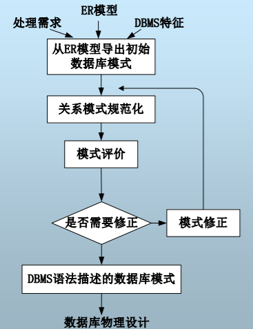

1. ER模型转换成关系数据库模式
2. 关系数据库模式的规范化
3. 模式评价
4. 模式修正
5. 最终产生一个优化的全局关系数据库模式
6. 子模式设计

#### 2、ER模型向关系模型转换

##### （1）基本ER模型转换到关系模型

**实体转换**

- 每个实体转换为一个关系模式，实体的属性为关系模式的属性，实体的标识成为关系模式的主码

**联系转换**

- 1:1：将任一端的实体的标识和联系属性加入另一实体所对应的关系模式中，两模式的主码保持不变
- 1:N：将1端实体的标识和联系属性加入N端实体所对应的关系模式中，两模式的主码不变

- M:N：新建一个关系模式，该模式的属性为两端实体的标识以及联系的属性，主码为两端关系模式的主码的组合

##### （2）扩展ER模型转换到关系模型

**弱实体转换**

- 每个强实体转换为一个关系模式，强实体的属性成为关系模式的属性，实体标识成为主码
- 每个弱实体转换为一个关系模式，并加入所依赖的强实体的标识，关系模式的主码为**弱实体的标识加上强实体**的标识

**子类转换**

- 父类实体和子类实体都各自转换为关系模式，并在子类关系模式中加入父类的主码，子类关系模式的主码设为**父类的**主码


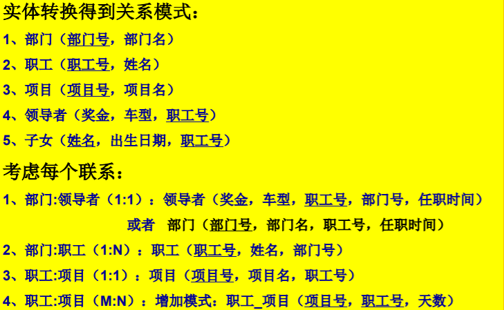

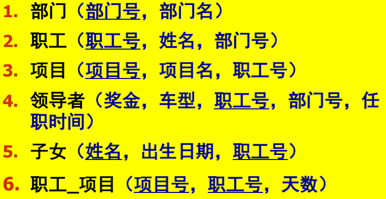

#### 3、关系数据库模式的规范化

##### （1）确定范式级别

根据数据依赖确定已有的范式级别

- 根据需求写出数据库模式中存在的所有函数依赖
- 消除冗余数据依赖，求出最小的依赖集
- 确定范式级别

根据实际应用的需要（处理需求）确定要达到的范式级别

- 时间效率和模式设计问题之间的权衡
  - 范式越高，模式设计问题越少，但连接运算越多，查询效率越低
  - 如果应用对数据只是查询，没有更新操作，则非BCNF范式也不会带来实际影响
  - 如果应用对数据更新操作较频繁，则要考虑高一级
  - 范式以避免数据不一致
- 实际应用中一般以3NF为最高范式

##### （2）规范化处理

确定了初始数据模式的范式，以及应用要达到的范式级别后

按照规范化处理过程，分解模式，达到目标范式

#### 4、模式评价

检查规范化后的数据库模式是否完全满足用户需求，并确定要修正的部分

- 功能评价：检查数据库模式是否支持用户所有的功能要求
  - 必须包含用户要存取的所有属性
  - 如果某个功能涉及多个模式，要保证无损连接性
- 性能评价：检查查询响应时间是否满足规定的需求。
  - 由于模式分解导致连接代价
  - 如果不满足，要重新考虑模式分解的适当性
  - 可采用模拟的方法评价性能

#### 5、模式修正

根据模式评价的结果，对已规范化的数据库模式进行修改

- 若功能不满足，则要增加关系模式或属性
- 若性能不满足，则要考虑属性冗余或降低范式
  - 合并：若多个模式具有相同的主码，而应用主要是查询，则可合并，减少连接开销
  - 分解：对模式进行必要的分解，以提高效率
    - 水平分解
    - 垂直分解

##### （1）水平分解


##### （2）垂直分解

- 把关系模式按属性集垂直分解为多个模式
- 在实际中，应用可能经常存取的只是关系的某几个列，可考虑将这些经常访问的列单独拿出组成一个关系模式
- 若一个关系中，某几个属性的值重复较多，并且值较大，可考虑将这些属性单独组成关系模式，以降低存储空间


#### 6、设计用户子模式（视图）

根据局部应用的需求，设计用户子模式


##### （1）设计用户子模式（视图）的考虑

使用更符合用户习惯的别名

- ER图集成时要消除命名冲突以保证关系和属性名的唯一，在子模式设计时可以重新定义这些名称，以符合用户习惯

给不同级别的用户定义不同的子模式，以保证系统安全性

- 产品(产品号，产品名，规格，单价，产品成本，产品合格
  率)
  - 为一般顾客建立子模式：产品1(产品号，产品名，规格，单价）
  - 为销售部门建立：产品2(产品号，名称，规格，单价，成本，合格率)

简化用户程序对系统的使用

- 可将某些复杂查询设计为子模式以方便使用

### 六、数据库物理设计

设计数据库的物理结构

- 为关系模式选择存取方法
- 设计数据库的存储结构

物理设计的考虑

- 查询时间效率
- 存储空间
- 维护代价

物理设计依赖于给定的计算机系统

#### 1、选择存取方法

存取方法：数据的存取路径

- 例如图书查询

存取方法的选择目的是加快数据存取的速度

- 索引存取方法
- 聚簇存取方法
- 散列存取方法

#### 2、设计数据库的存储结构

### 七、数据库实施

建立实际的数据库结构

- CREATE TABLE
- CREATE INDEX

初始数据装入

- 安全性设计和故障恢复设计

- 应用程序的编码和调试

### 八、运行和维护

试运行

- 根据初始数据对数据库系统进行联调
- 执行测试：功能、性能

维护

- 数据备份和恢复
- 数据库安全性控制和完整性控制
- 数据库性能的分析和改造
- 数据库的重组织

## 8 Developing Database Applications

### 一、数据库应用系统体系结构

#### 1、数据库应用的基本需求

操作界面服务：数据的输入与显示（如报表显示、图形显示）
商业服务：数据处理与检查（如商业规则的检查，如对金额的检查）
数据服务：数据储存与维护（如完整性检查）

#### 2、数据库应用系统体系结构


##### （1）以前端为主的两层式结构

传统的开发方法;后端服务器只提供数据服务;商业服务由前端工作站完成;开发和调试容易;当用户数增加时，网络数据传送负担加重


##### （2）以后端为主的两层式结构

后端服务器提供数据服务和商业服务; 借助存储过程和触发器来完成商业服务; 开发和调试受限制; 减少了网络数据传送


##### （3）三层式处理结构

商业服务独立运行（如ActiveX 服务器）
可以位于不同服务器，也可以和数据库服务器同一主机
可以分别减轻前后端的工作负荷
开发和调试相对复杂


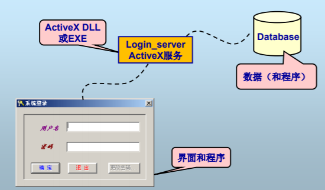

##### （4）三层Internet处理结构

三层式设计结构

将操作界面服务分割到浏览器和WEB服务器上 

商业服务仍然可有多种安排方式 

系统可以跨平台运行 

客户端管理容易


##### （5）多层Internet处理结构

多层式设计结构 

将商业服务放到应用服务器，实施负载均衡等功能 

WEB服务器负责操作界面服务 

系统独立性高 

可以跨平台运行 

客户端管理容易 

服务器端部署和管理较复杂


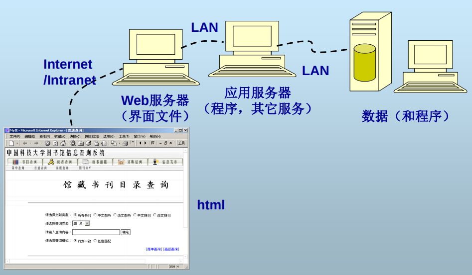

##### （6）混合结构

实际系统开发时可根据需求采取混合结构 

内部管理功能 

- C/S结构
- 保证访问的可控性和 安全性 

外部功能 

- B/S结构 
- N-Tier结构 
  - 如果访问负载较大 还需要邮件服务、FTP 服务等其它功能

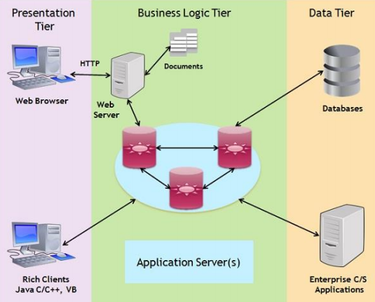

### 二、数据库应用系统分析与设计


### 三、数据访问编程

#### 1、数据库访问方法

早期的数据库访问方法ODBC

Java访问数据库的专用接口JDBC

- JDBC（Java DataBase Connectivity）是Java 与数据库的接口规范，JDBC定义了一个支持标准 SQL功能的通用低层的应用程序编程接口（API） 。底层通过SQL访问数据库。 
- JDBC的设计思想与ODBC类似，但JDBC是与 Java语言绑定的，所以不能用于其它编程语言。

目前流行的数据库访问模型ADO

- ActiveX Data Objects，即ActiveX数据对象。 

- ADO是微软新的通用数据存取框架。它包含了 ODBC、数据库访问对象（DAO）、远程数据对 象（RDO）及几乎所有其他数据存取方式的全部 功能。 

- 用户可以利用ADO连接SQL Server、Oracle及 其他的数据源。

- ADO通过OLE DB驱动访问 数据源，不仅支持SQL数据 库访问，也支持Excel、 Text等非结构化数据访问 

- 由于OLE DB能够以统一的 方式连接各种数据源，包括 ODBC数据源，因此ADO成 为一种与编程语言独立的数 据库访问模型 

- ADO.Net是工作在.Net Framework上的数据库访 问模型，功能与ADO类似

  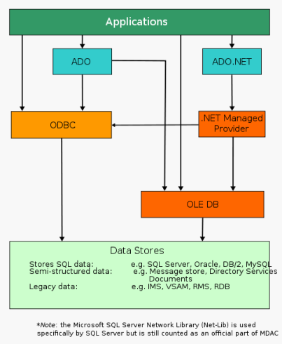

总体的数据库访问模型


#### 2、典型的数据库应用结构


#### 3、数据库基本操作

#### 4、数据库应用编程过程

数据库应用的功能往往以数据的管理为核心， 因此编程应以实现数据管理功能为主。基本的 过程包括 数据

- 管理界面设计 
  - 增、删、改、查界面设计，由于查询是数据库应用中最 常用的功能，因此界面往往以查询界面为主展开设计 
- 数据管理功能的编程实现 
  - SQL是应用与数据库的唯一接口 
  - 一般通过高层的编程接口如ADO实现数据库操作
- 数据访问的一般步骤 
  - 建立数据库连接 
  - 声明数据库编程接口对象 
  - 通过对象实现数据访问功能 
  - 释放对象 
  - 关闭连接

### 四、ADO数据库访问示例

ADO数据访问模型 

(CRUD)

增加记录（Create） 

查询记录（Read） 

删除记录（Update） 

修改记录（Delete）

#### 1、ADO数据访问模型

ADO通过对象和集合来实现数据库操作 

黄色框表示集合

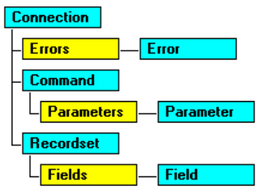

##### Connection对象

Connection 对象代表了打开的、与数据源的 连接。 

定义（以VB为例） `Dim cnn as New ADODB.Connection `

主要属性 `ConnectString, CursorLocation`

主要的方法 

- `Open，Close `
- `Execute` 可执行SQL语句 
- `BeginTrans，CommitTrans，RollbackTrans` 用于事务编程

```vb
Dim cnn as New ADODB.Connection
cnn.Connectstring= "Provider=OraOLEDB.Oracle; Data Source=ORCL; User ID=users;Password=abcd;"
cnn.CursorLocation=adUseClient
cnn.Open
```

##### Command对象

Command 对象定义了将对数据源执行的指 定命令。 

可使用 Command 对象查询数据库并返回 Recordset 对象中的记录 

执行某个存储过程

主要的属性

- ActiveConnection：所使用的Connection 
- CommandText：定义命令（例如，SQL 语句）的可执行文本。 

主要的方法 

- Execute 
- CreateParameter

```vb
Dim cmm as New ADODB.Command
Dim rst as New ADODB.Recordset
cmm.ActiveConnection=cnn
cmm.CommandText="select * from s where b='asas' "
Set rst=cmm.Execute()
```

调用存储过程samp，计算给定部门的员工的人数和平均工资

```vb
Dim cmm as New ADODB.Command
Set cmm.ActiveConnection= cnn 'cnn为数据库连接，在此假设其已建立
Cmm.CommandText="samp" '存储过程名
Cmm.CommandType=adCmdStoredProc '设为存储过程
'为存储过程调用添加参数
cmm.Parameters.Append cmm.CreateParameter("Return", adInteger, adParamReturnValue, 4, 0)
cmm.Parameters.Append cmm.CreateParameter("DeptName", adVarChar, adParamInput, 50, "")
cmm.Parameters.Append cmm.CreateParameter("EmpCount", adInteger, adParamOutput, 4, 0)
cmm.Parameters.Append cmm.CreateParameter("AvgSalary", adNumeric, adParamOutput, 8, 0)
'传递参数
Cmm.Parameters("DeptName")= txtDept.Text '假设输入的部门名在txtDept中
Cmm.Execute '执行
If cmm.Parameters("Return")= -20001 then
	Msgbox "部门不存在"
	Exit Sub
Elseif cmm.Parameters("Return")=-20002
	Msgbox "部门没有员工"
	Exit sub
End if
Msgbox "员工数＝ " & cmd.parameters("EmpCount")
Msgbox "员工平均工资＝ " & cmd.parameters("AvgSalary")
```

##### Connection和Command总结

Connection一般用于建立数据库连接 数据库应用的最终操作对象一般是记录集（ Recordset） 

Command一般可用于执行某个存储过程 对于“Select”、”Insert”等SQL语句，一般使用 Recordset对象来实现。 某些特殊情况下，比如要批量导入数据时可以考 虑用Command执行SQL

##### Recordset 对象

Recordset 对象表示的是来自基本表或命令 执行结果的记录全集。 数据库应用中最常使用的ADO对象。 可以完成针对记录的所有操作

Recordset对象的属性

- BOF和EOF 
- Source 表示所基于的基本表或SQL语句 
- CursorType 游标类型。一般使用adOpenKeyset（仅修改可见）或 adOpenDynamic（全部可见） 
- LockType 指示编辑过程中对记录使用的锁定类型，一般 adLockOptimistic，表示仅在Update时锁定 
- Recordcount 记录总数

Recordset的方法

- Close, Addnew, Update, Delete, Movefirst, MoveNext……  Requery

##### 操作数据库的一般过程

- 创建Connection(Open) 
- 打开Recordset(Open) 
- 使用Recordset的Addnew、Update、 Delete、Move等方法对数据进行增、删、改 
- 查询，修改Source然后再Open即可。

###### Open

- recordset.Open Source, ActiveConnection, CursorLocation, CursorType, LockType, Options 
- 基于已有的Connection的Open 
- rst.Open “Employees”, cnn, adUseClient, adOpenKeyset, adLockOptimistic, adCmdTable 
- 不使用已有的Connection直接打开Recordset 
- 将cnn换成Conenctstring的内容即可。

###### 记录的添加：AddNew

```plsql
Dim cnn as New ADODB.Connection
Cnn.Connectstring=...
Cnn.Cursorlocation=adUseClient
Cnn.Open
Dim rst as New ADODB.Recordset
rst.Open “Employees”, cnn, adUseClient, adOpenKeyset, adLockOptimistic, adCmdTable
rst.Addnew
rst.Fields(“Name”)=txtName.Text
......
rst.Update
rst.Close
```

打开数据库连接(Connection对象可以是局部对象,也可以是全局对象)
打开Recordset,一般是一个基本表
rst.Addnew
将值赋给字段
rst.Update
rst.Close

###### 记录的删除

根据输入的EmployeeID值(txtID)删除相应的记录

```plsql
Dim rst as New ADODB.Recordset
rst.Open “select * from Employees where EmployeeID=‘” &
txtID.text & “’”, cnn, adUseClient, adOpenKeyset, adLockOptimistic,
adCmdText
If Not(rst.EOF and rst.BOF) then
rst.delete
Else
Msgbox “记录不存在”
End if
rst.Close
```

使用rst.Open方法根据给出的删除条件创建一个记录集,该记录集包含了要删除的所有记录
检查记录集是否为空(因为一般一次只删除一条记录,因此要按主键去Open记录集)
rst.Delete
rst.Close

###### 记录的修改

设将EmployeeID值为‘100’的记录的Name修改为‘aaaa’,Salary修改为2000

```plsql
Dim rst as New ADODB.Recordset
rst.Open “select * from Employees where
EmployeeID=‘ 100’”, cnn, adUseClient,
adOpenKeyset, adLockOptimistic, adCmdText
rst.Fileds(“Name”)=“aaa”
rst.Fields(“Salary ”)=2000
rst.Update
rst.Close
```

使用Open定位要修改的记录(即创建最多只有一条记录的记录集)
将新值赋給字段
调用Update方法
Close记录集

###### 记录的查询

根据输入的EmployeeID查询记录,设txtID为输入的EmployeeID,设数据网格控件dtgData用于显示结果,并与ADO Data控件adcEmployee绑定

```plsql
Dim strSQL as string
strSQL=“select * from Employees where EmployeeID=‘” & txtID & “’”
adcEmployee.Recordsource=strSQL
adcEmployee.Refresh
If adcEmployee.Recordset.BOF and adcEmployee.Recordset.EOF then
Msgbox “无匹配记录”
End If
```


## 9 Transaction Management I: Intro

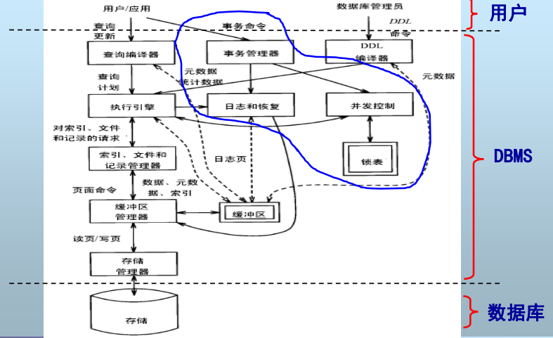

### 一、事务的状态及原语操作

事务(transaction) 一个**不可分割**的操作序列，其中的操作要么都做 ，要么都不做

#### 1、事务

事务的例子 

- 银行转帐：A帐户转帐到B帐户100元。该处理包 括了两个更新步骤 `A=A-100 B=B+100` 这两个操作是不可分的：要么都做，要么都不作

事务的ACID性质

- 原子性 Atomicity 事务是不可分的原子，其中的操作要么都做，要么都不 做 
- 一致性 Consistency 事务的执行保证数据库从一个一致状态转到另一个一致 状态 
- 隔离性 Isolation 多个事务一起执行时相互独立 
- 持久性 Durability 事务一旦成功提交，就在数据库永久保存

#### 2、事务的状态 [in logs]

Start T: Transaction T has started 

Commit T: T has finished successfully and all modifications are reflected to disks 

Abort  T: T has been terminated and all modifications have been canceled

#### 3、事务的原语操作

Input (x): disk block with x$\to$ memory 

Output (x): buffer block with x $\to$ disk 

Read (x,t): do input(x) if necessary t $\leftarrow$ value of x in buffer 

Write (x,t): do input(x) if necessary value of x in buffer $\leftarrow$ t


#### 4、事务例子


#### 5、SQL对事务的支持

SQL标准提供了三个语句，允许应用程序声明 事务和控制事务 

- Begin Transaction 
- Commit Transaction 
- Rollback Transaction 

Oracle 

- Commit或Commit Work 
- Rollback或Rollback Work 
- 没有Begin Transaction语句，一旦连接数据库 建立会话，就认为是一个事务的开始

#### 6、Oracle SQL Plus中的事务设置

```plsql
SQL> set autocommit on--设置为每次语句执行都自动Commit
SQL> set autocommit off
SQL> update student set age=age-1;
SQL> rollback; -- 取消前面的更新操作
SQL> update student set age=age-1;
SQL> commit; --提交，修改生效不能再回退
```

#### 7、存储过程中使用事务

```plsql
CREATE PROCEDURE Transfer (sender IN varchar2, receiver IN varchar2, amount IN number)
AS
	a Number:=0;
	exp Exception;
BEGIN
    Update account Set balance=balance-amount Where ID=sender;
    Select count(*) Into a From accounts where ID=receiver; -- 收款账号是否存在
    If a=0 then
    	raise exp; --生成一个异常
    Else
    	Update account Set balance=balance+amount where ID=receiver;
    End If
    commit;
EXCEPTION
	When exp Then
		rollback;
 		raise_application_error(-20001, '收款账号不存在');
END;
```

#### 8、ADO中使用事务编程

回顾：Connection对象主要的方法 

- Open，Close 
- Execute ‘可执行SQL语句 
- BeginTrans，CommitTrans，RollbackTrans ‘用于事务编程

```plsql
Dim cnn as New ADODB.Connection
Cnn.Connectstring=
"Provider=OraOLEDB.Oracle; Data
Source=ORCL; User ID=users;Password=abcd;"
Cnn.CursorLocation=adUseClient
Cnn.Open
```

```plsql
cnn.Open
On Error Goto RollbackAll
cnn.BeginTrans – 此连接下的所有操作现在开始都属于一个事务
Dim rst1, rst2 as New ADODB.Recordset --执行记录的增删改
rst1.Open "account", cnn, adUseClient, adOpenKeyset, adLockOptimistic, adCmdTable
rst1.AddNew --增加新记录
……
rst2.Open "summary", cnn, adUseClient, adOpenKeyset, adLockOptimistic, adCmdTable
…… --更新关联的summary表
-- 当发生任何预期错误时，RollbackTrans
If rst2.EOF and rst2.BOF Then
	Goto RollbackAll
End If
……
cnn.CommitTrans --成功到达事务尾部时，提交事务
cnn.Close
RollbackAll: -- Rollback事务的操作统一进行处理
cnn.RollbackTrans
cnn.Close
```

### 二、数据库的一致性和正确性

#### 1、Consistency

事务执行之前与之后一致，但是事务内部可以不保证一致性。

#### 2、Correctness

DB should reflect real world

## 10 Transaction Management II: Log & Recovery

### 三、数据库系统故障分析

#### 1、事务故障

发生在单个事务内部的故障 

- 可预期的事务故障: 即应用程序可以发现的故障，如转帐时余额不足。由应 用程序处理 
- 非预期的事务故障: 如运算溢出等，导致事务被异常中止。应用程序无法处 理此类故障，由系统进行处理

#### 2、介质故障

硬故障（Hard Crash），一般指磁盘损坏 导致磁盘数据丢失，破坏整个数据库

#### 3、系统故障

系统故障：软故障（Soft Crash），由于OS 、DBMS软件问题或断电等问题导致内存数据 丢失，但磁盘数据仍在,影响所有正在运行的事务，破坏事务状态，但不 破坏整个数据库

#### 4、数据库系统故障恢复策略

- 目的 恢复DB到最近的一致状态 
- 基本原则 冗余（Redundancy） 
- 实现方法 
  - 定期备份整个数据库 
  - 建立事务日志 (log) 
  - 通过备份和日志进行恢复


### 四、Undo日志

事务日志记录了所有**更新操作**的具体细节 

- Undo日志、Redo日志、Undo/Redo日志 

日志文件的登记严格按事务执行的**时间次序** 

Undo日志文件中的内容 

- 事务的开始标记（`Start T`） 
- 事务的结束标记(`Commit T`)或(`Abort T`) 
- 事务的更新操作记录，一般包括以下内容 
  - 执行操作的事务标识 
  - 操作对象 
  - 更新前值（插入为空）

#### 1、Undo日志规则

事务的每一个修改操作都生成一个日志记录（此时日志在Memory） 

在x被写到磁盘之前(使用output)，对应此修改的日志记录 必须已被写到磁盘上,使用flush log

当事务的所有修改结果都已写入磁盘后，将`Commit T` 日志记录写到磁盘上

#### 2、基于Undo日志的恢复

`T,x,v`记录修改前的旧值 

写入`Commit T`之前必须先将数据写入磁 盘 

恢复时忽略已提交事务，只撤销未提交事务 有`Commit T`的事务肯定已写回磁盘

找没有`commit T`或者有`Abort T`的事务，从尾部到头扫描，恢复旧值。

### 五、Redo日志

在x被写到磁盘之前，对应该修改的Redo日 志记录必须已被写到磁盘上 (WAL) 

在数据写回磁盘前先写`Commit T`日志记录，而undo日志是先写数据，再写`commit T`的log

此时恢复方式为，从头到尾，所有有`commit T`的，重做一次。

### 六、Undo/Redo日志

在x被写到磁盘之前，对应该修改的日志记录 必须已被写到磁盘上 (WAL) 

日志中的数据修改记录 `<T,x,v,w>- - v is the old value, w is the new value` 

可以立即更新，也可以延迟更新

#### 基于Undo/Redo日志的恢复

正向扫描日志，将`Commit`的事务放入 Redo列表中，将没有结束的事务放入Undo 列表 

反向扫描日志，对于`T,x,v,w`，若T在 Undo列表中，则 `Write(x,v); Output(x)` ，写旧值

正向扫描日志，对于`T,x,v,w`，若T在 Redo列表中，则 `Write(x,w)； Output(x)` ，写新值

对于Undo列表中的T，写入`abort T`

先undo,再redo

### 七、检查点(Checkpoint)

当系统故障发生时，必须扫描日志。需要搜索 整个日志来确定UNDO列表和REDO列表 搜索过程太耗时，因为日志文件增长很快 会导致最后产生的**REDO列表很大**，使恢复过程变 得很长

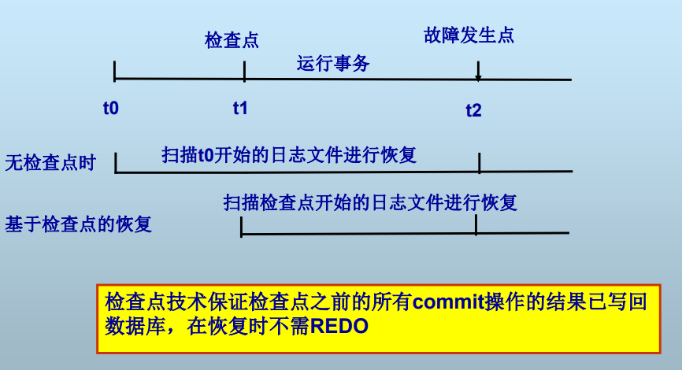


## 11 Transaction Management III: Concurrency Control

多个事务同时存取共享 的数据库时，如何保证 数据库的**一致性**？ 

### 一、并发操作和并发问题

并发操作 

- 在多用户DBS中，如果多个用户同时对同一数据进行操 作称为并发操作 
- 并发操作使多个事务之间可能产生相互干扰，破坏事务 的**隔离性**（Isolation） 
- DBMS的并发控制子系统负责协调并发事务的执行，保 证数据库的**一致性**，避免产生不正确的数据 

并发操作通常会引起三类问题 

- 丢失更新（Lost update） 
- 脏读（Dirty read / Uncommitted update） 
- 不一致分析 （Inconsistent analysis）

#### 1、丢失更新问题

应该为1000而不是1100

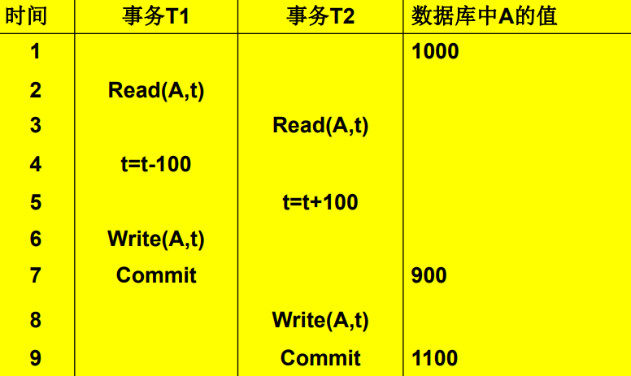

#### 2、脏读问题

脏数据：未提交并且随后又被撤销的数据称为脏数据


#### 3、不一致分析问题

事务读了过时的数据

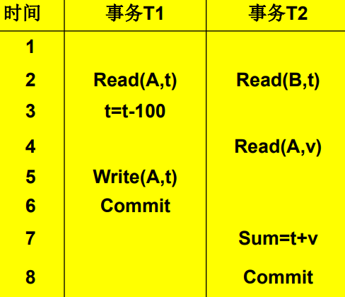

### 二、调度(Schedule)

#### 1、调度的定义

多个事务的并发执行存在多种调度方式, 调度中每个事务的读写操作保持原来顺序

#### 2、可串化调度 (Serializable Schedule)

串行调度: 各个事务之间没有任何操作交错执行,事务一个一个执行

如果一个调度的**结果**与某一**串行调度**执行的结果**等价**，则称该调度是可串化调度，否则是不可串 调度

#### 3、冲突可串性

冲突操作：涉及同一个数据库元素， 并且至少有一个是**写操作**

如果两个**连续**操作不冲突,则可以在调度中交换顺序

如果一个调度满足冲突可串性，则该调度是可串化调度

#### 4、优先图 (Precedence Graph)

优先图用于冲突可串性的判断.

优先图结构

- 结点 (Node):事务
- 有向边 (Arc): Ti ==> Tj ,满足 Ti < Tj: 存在Ti中的操作A1和Tj中的操作A2,满足
  - A1在A2前,并且
  - A1和A2是冲突操作

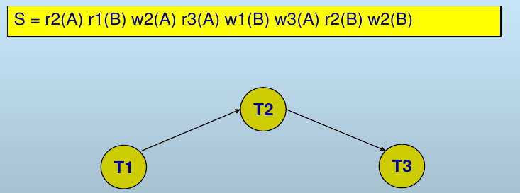

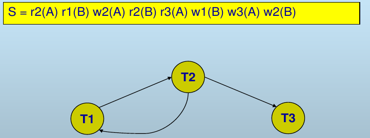

给定一个调度S,构造S的优先图P(S),若P(S)中**无环**,则S满足冲突可串性


### 三、锁与可串性实现

#### 1、锁简介

```
Two new actions:
	lock (exclusive):l[i](A)
	unlock: u[i](A)
```

#### 2、两阶段锁(2PL)

1. 事务在对任何数据进行读写之前， 首先要获得该数据上的锁 
2. 在释放一个锁之后，事务不再获 得任何锁


Unlock之前需要先把所有锁都申请到

两段式事务:遵守2PL协议的事务: 如果一个调度S中的所有事务都是两段式事务,则该调度是可串化调度


缺点：如果事务T只是读取X，也必须加锁，而且释 放锁之前其它事务无法对X操作，影响数据库的并发性 

解决方法： 引入不同的锁，满足不同的要求 S Lock， X Lock， Update Lock

#### 3、X Lock

Exclusive Locks（X锁，也称写锁）： 若事务T对数据R加X锁，那么其它事务 要等T释放X锁以后，才能获准对数据R进行封锁。只有获得R上的X锁的事务，才能对所封 锁的数据进行 **修改**。

X锁提供了对事务的写操作的正确控制策略，但如果事务是只读事务,则没必要加X锁

写——独占 读——共享

#### 4、S Lock

Share Locks（S锁，也称读锁） ：如果事务T对数据R加了S锁，则其它事 务对R的X锁请求不能成功，但对R的S锁请求 可以成功。这就保证了其它事务可以读取R但 不能修改R，直到事务T释放S锁。当事务获得 S锁后，如果要对数据R进行修改，则必须在 修改前执行Upgrade(R)操作，将S锁升级为 X锁。

**S/X-lock-based 2PL**

1. 事务在读取数据R前必须先获得S锁 
2. 事务在更新数据R前必须要获得X锁。如 果该事务已具有R上的S锁，则必须将S 锁升级为X锁 
3. 如果事务对锁的请求因为与其它事务已 具有的锁不相容而被拒绝，则事务进 入等待状态，直到其它事务释放锁。 
4. 一旦释放一个锁，就不再请求任何锁

#### 5、 Compatibility of locks


#### 6、Update Lock

出现死锁

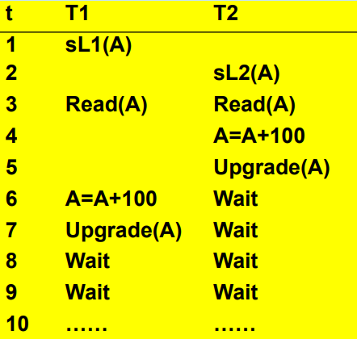

Update Lock

- 如果事务取得了数据R上的更新锁（U lock），则可以读R， 并且可以在以后升级为X锁 
- 单纯的S锁不能升级为X锁 
- 如果事务持有了R上的Update Lock，则其它事 务不能得到R上的S锁、X锁以及Update锁 
- 如果事务持有了R上的S Lock，则其它事务可以 获取R上的Update Lock


#### 8、Multi-Granularity Lock

Lock Granularity 指加锁的数据对象的大小 可以是整个关系、块、元组、整个索引、索引项 

锁粒度越细，并发度越高；锁粒度越粗，并发 度越低

多粒度锁:同时支持多种不同的锁粒度

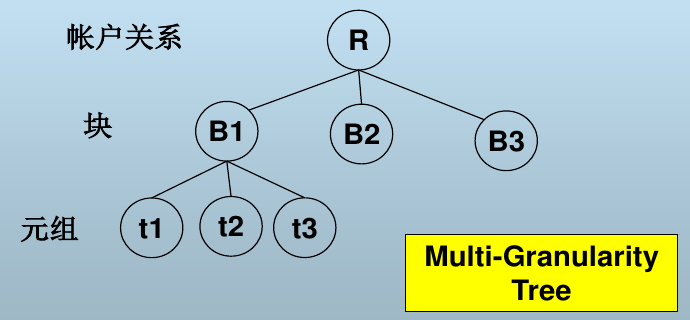

多粒度锁协议: 允许多粒度树中的每个结点被独立地加S锁或X锁,对某个结点加锁意味着其下层结点也被加了同类型的锁

为什么需要多粒度锁：Lock只能针对已存在的元组,对于开始时不存在后来被插入的元组无法Lock
Phantom tuple 幻像元组： 存在,却看不到物理实体


多粒度锁上的两种不同加锁方式

- 显式加锁:应事务的请求直接加到数据对象上的锁
- 隐式加锁:本身没有被显式加锁,但因为其**上层结**点加了锁而使数据对象被加锁

给一个结点显式加锁时必须考虑

- 该结点是否已有不相容锁存在

- **上层结点**是否已有不相容的的锁(上层结点导致的隐式 锁冲突)

-  所有**下层结点**中是否存在不相容的显式锁

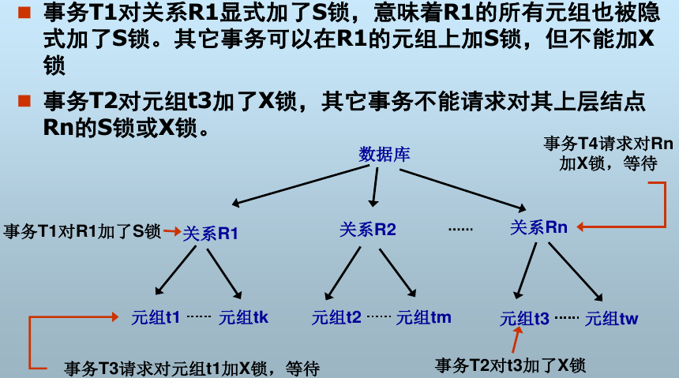

在对一个结点P请求锁时,必须判断该结点上是否存在不相容的锁

- 有可能是**P上的显式锁**

- 也有可能是P的**上层结点**导致的**隐式锁**

- 还有可能是P的**下层结点**中已存在的某个**显式锁**


理论上要**搜索**上面全部的可能情况,才能确定P上的锁请求能否成功 显然是低效的, 引入意向锁 (Intension Lock) 解决这一问题

#### 9、Intension Lock

- IS锁(Intent Share Lock,意向共享锁,意向读锁)
-  IX锁(Intent Exlusive Lock,意向排它锁,意向写锁)

如果对某个结点加IS(IX)锁,则说明事务要对该结点的**某个下层结点**加S (X)锁;

对任一结点P加S(X)锁,必须先对从**根结点到P的路径上的所有结点加IS(IX)锁**

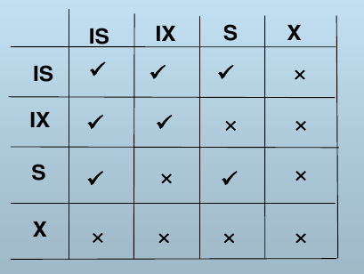

### 四、事务的隔离级别

并发控制机制可以解决并发问题。这使所有事 务得以在彼此完全隔离的环境中运行 

然而许多事务并不总是要求完全的隔离。如果 允许降低隔离级别，则可以提高并发性


Note 1:隔离级别是针对连接(会话)而设置的,不是针对一个事务
Note 2:不同隔离级别影响**读操作**。写操作必须完全隔离(不允许出现丢失更新问题)

未提交读(脏读) Read Uncommitted

- 允许读取当前数据页上的任何数据,不管数据是否已提交
- 事务不必等待任何锁,也不对读取的数据加锁

提交读 Read Committed

- 保证事务不会读取到其他未提交事务所修改的数据(可防止脏读)
- 事务必须在所访问数据上加S锁,数据一旦读出,就马上释放持有的S锁

 可重复读 Repeatable Read

- 保证事务在事务内部如果重复访问同一数据(记录集),数据不会发生改变。即,事务在访问数据时,其他事务不能修改正在访问的那部分数据
- 可重复读可以防止脏读和不可重复读取,但不能防止幻像
- 事务必须在所访问数据上加S锁,防止其他事务修改数据,而且S锁必须保持到事务结束

 可串行读 Serializable

- 保证事务调度是可串化的
- 事务在访问数据时,其他事务不能修改数据,也不能插入新元组
- 事务必须在所访问数据上加S锁,防止其他事务修改数据,而且S锁必须保持到事务结束
- 事务还必须锁住访问的整个表

### 五、死锁(deadlock)

#### 1、锁导致死锁

#### 2、死锁的两种处理策略

- 死锁检测 Deadlock Detecting: 检测到死锁,再解锁
- 死锁预防 Deadlock Prevention: 提前采取措施防止出现死锁

#### 3、Deadlock Detecting

- Timeout 超时
  If a transaction hasn‘t completed in x minutes, abort it

- Waiting graph 等待图

  Arcs: Ti ==> Tj, Ti必须等待Tj释放所持有的某个锁才能继续执行

#### 4、Deadlock Prevention

- 方法1: Priority Order (按封锁对象的某种优先顺序加锁)

  把要加锁的**数据库元素**按某种顺序排序, 事务只能按照元素顺序申请锁

-  方法2:Timestamp (使用**时间戳**)

  每个事务开始时赋予一个时间戳, 如果事务T被Rollback然后再Restart,T的时间戳不变
  Ti请求被Tj持有的锁,根据Ti和Tj的timestamp决定锁的授予


## 12 Database Security

### 一、数据库安全性控制概述

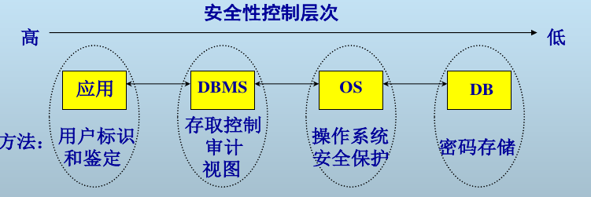

### 二、存取控制

 常用存取控制方法

- 自主存取控制(Discretionary Access Control,简称DAC), C1级, 灵活
- 强制存取控制(Mandatory Access Control,简称 MAC), B1级, 严格

#### 1、数据安全的级别

#### 2、自主存取控制(DAC)

同一用户对于不同的数据对象有不同的存取权限
不同的用户对同一对象也有不同的权限
用户还可将其拥有的存取权限自主地转授给其他用户

##### (1)存取权限

存取权限由两个要素组成: 数据对象, 操作类型

##### (2)关系数据库系统中的存取权限

SQL中的存取权限定义方法: `GRANT/REVOKE`

##### (3)授予权限

下面的示例给用户 Mary 和 John 授予多个语句权限。

```plsql
GRANT CREATE DATABASE, CREATE TABLE TO Mary,John
```

授予全部语句权限给用户Rose

```plsql
GRANT ALL to Rose
```

授予对象权限

```plsql
GRANT SELECT ON authors TO public
GRANT INSERT, UPDATE, DELETE ON authors TO Mary, John, Tom
```

##### (4)废除权限

- 废除以前授予的权限。
- 废除权限是删除已授予的权限,并不妨碍用户、组或角色从更高级别继承已授予的权限。因此,如果废除用户查看表的权限,不一定能防止用户查看该表,因为已将查看该表的权限授予了用户所属的角色。
- 角色是权限的一个集合,可以指派给用户或其它角色。这样只对角色进行权限设置便可以实现对多个用户权限的设置

下例废除已授予用户 Joe 的 CREATE TABLE 权限。它删除了允许 Joe 创建表的权限。不过,如果已将 CREATE TABLE 权限授予给了包含 Joe的任何角色,那么 Joe 仍可创建表。

```plsql
REVOKE CREATE TABLE FROM Joe
```

下例废除授予多个用户的多个对象权限。

```plsql
REVOKE Delete on student FROM Mary, John
```

##### (5)自主存取控制小结

- 定义存取权限: 用户
- 检查存取权限: DBMS
- 授权粒度: 数据对象粒度:数据库、表、属性列、行
- 优点: 能够通过授权机制有效地控制其他用户对敏感数据的存取
- 缺点
  - 可能存在数据的“无意泄露”:低级别用户访问到保密数据
    原因:这种机制仅仅通过对数据的存取权限来进行安全控制,而数据本身并无安全性标记
  - 解决:对系统控制下的所有主客体实施强制存取控制策略

##### (6)自主存取控制不能防止木马


#### 3、强制存取控制(MAC)

每一个数据对象被标以一定的密级
每一个用户也被授予某一个级别的许可
对于任意一个对象,只有具有合法许可的用户才可以存取

##### (1)主体和客体

在MAC中,DBMS所管理的全部实体被分为主体和客体两大类
主体是系统中的活动实体

- DBMS所管理的实际用户

- 代表用户的各进程

客体是系统中的被动实体,是受主体操纵的

- 文件
- 基本表
- 索引

对于主体和客体,DBMS为它们每个实例(值)指派一个敏感度标记(Label)

- 主体的敏感度标记称为存取级(Clearance Level)
- 客体的敏感度标记称为密级(Classification Level)

敏感度标记分成若干级别  例如:绝密(Top Secret)/ 机密(Secret)/ 可信(  Confidential)/ 公开(Public)

MAC机制就是通过对比主体的Label和客体的Label ,最终确定主体是否能够存取客体

##### (2)强制存取控制规则

- 仅当主体的存取级别大于或等于客体的密级时,该主体才能读取相应的客体;
- 仅当主体的存取级别等于客体的密级时,该主体才能写相应的客体。

##### (3)强制存取控制方法特点

MAC是对数据本身进行密级标记
无论数据如何复制,标记与数据是一个不可分的整体
只有符合密级标记要求的用户才可以操纵数据
从而提供了更高级别的安全性

##### (4)MAC 可以防止木马攻击


### 三、视图机制

视图机制把要保密的数据对无权存取这些数据的用户隐藏起来,
视图机制更主要的功能在于提供数据独立性,其安全保护功能不够精细,往往远不能达到应用系统的要求
实际中,视图机制与授权机制配合使用:首先用视图机制屏蔽掉一部分保密数据视图上面再进一步定义存取权限间接实现了用户自定义的安全控制


## 13 Database Integrity

### 一、数据库完整性概念

数据库完整性防止合法用户使用数据库时向数据库加入不符合语义的数据。防止错误的数据进入数据库。

正确性:数据的合法性。 如年龄由数字组成

有效性:数据是否在有效范围内。 如月份取1-12

相容性:指表示同一个事实的两个数据应该一致。如一个人的性别只有一个

#### 1、完整性控制功能

完整性控制机制应具有的三个功能

- 定义功能:提供定义完整性约束条件的机制
- 检查功能:检查用户发出的操作请求是否违背了约束条件。
  - 立即执行约束(一条语句执行完成后立即检查)
  - 延迟执行约束(整个事务执行完毕后再检查)
- 如果发现用户操作请求使数据违背了完整性约束条件,则采取一定的动作来保证数据的完整性。

#### 2、完整性规则定义

DBA向DBMS提出的一组完整性规则,来检查数据库中的数据是否满足语义约束,主要包括三部分:

- 触发条件:系统什么时候使用规则来检查数据
- 约束条件:系统检查用户发出的错误操作违背了什么完整性约束条件
- 违约响应:违约时要做的事情

完整性约束规则是由DBMS提供的语句来描述,存储在数据字典,但违约响应由系统来处理

一条完整性规则是一个五元组(D,O,A,C,P)

- D(Data):约束作用的数据对象
- O(Operation): 触发完整性检查的数据库操作。即当用户发出什么操作请求时需要检查该完整性规则,是立即检查还是延迟检查。
- A(Assertion): 数据对象要满足的断言或语义规则
- C(Condition): 受A作用的数据对象值的谓词
- P(Procedure):违反完整性规则时触发的过程


### 二、完整性约束分类

#### 1、按约束粒度分类

- 表级约束:若干元组间、关系上以及关系之间联系的约束;
- 列级约束:针对列的类型、取值范围、精度等而制定的约束条件。
- 元组级约束:元组中的字段组和字段间联系的约束;


#### 2、按约束对象的状态分类

- 静态约束:数据库每一确定状态时的数据对象所应满足的约束条件;
  例如:学生关系中年龄不能大于100
- 动态约束:数据库从一种状态转变为另一种状态时,新、旧值之间所应满足的约束条件例如调整工资时须满足: 现有工资 >原有工资+工龄*100

#### 3、按约束作用类型分类

- 域完整性:域完整性为列级和元组级完整性。它为列或列组指定一个有效的数据集,并确定该列是否允许为空
- 实体完整性:实体完整性为表级完整性,它要求表中所有的元组都应该有一个惟一的标识符,这个标识符就是平常所说的主码
- 参照完整性:参照完整性是表级完整性,它维护参照表中的外码与被参照表中候选码之间的相容关系。如果在被参照表中某一元组被外码参照,那么这一行既不能被删除,也不能更改


### 三、完整性实施途径

#### 1、约束


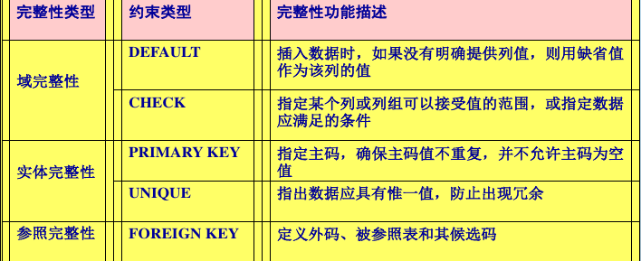

#### 2、触发器

#### 3、规则

#### 4、断言


## 14 Advanced Topics


