## 第一篇　并行计算硬件平台：并行计算机

### 1 并行计算与并行计算机结构模型

#### 并行计算机体系结构

##### 并行计算机结构模型


大型并行机系统：

- 单指令多数据流(Single-Instruction-Multiple-Data, SIMD)计算机
- 并行向量处理机(Parallel Vector Processor, PVP)
- 对称多处理机(Symmetric Multiprocessor, SMP)
- 大规模并行处理机(Massively Parallel Processor, MPP)
- 工作站机群(Cluster of Workstations, COW)
- 分布共享存储(Distributed Shared Memory, DSM)多处理机


##### 并行计算机访存模型


**UMA**（Uniform Memory Access）模型是均匀存储访问模型的简称。其特点是：
 物理存储器被所有处理器均匀共享；
 所有处理器访问任何存储字取相同的时间；
 每台处理器可带私有高速缓存；
 外围设备也可以一定形式共享。


**NUMA**(Nonuniform Memory Access)模型是非均匀存储访问模型的简称。特点是：
 被共享的存储器在物理上是分布在所有的处理器中的，其所有本地存储器的集合就组成了全局地址空间；
 处理器访问存储器的时间是不一样的；访问本地存储器LM或群内共享存储器CSM较快，而访问外地的存储器或全局共享存储器GSM较慢(此即非均匀存储访问名称的由来)；
 每台处理器照例可带私有高速缓存，外设也可以某种形式共享。


**CC-NUMA**（Coherent-Cache Nonuniform Memory Access）模型是高速缓存一致性非均匀存储访问模型的简称。其特点是：
 大多数使用基于目录的高速缓存一致性协议；
 保留SMP结构易于编程的优点，也改善常规SMP的可扩放性；
 CC-NUMA实际上是一个分布共享存储的DSM多处理机系统；
 它最显著的优点是程序员无需明确地在节点上分配数据，系统的硬件和软件开始时自动在各节点分配数据，在运行期间，高速缓存一致性硬件会自动地将数据迁移至要用到它的地方。


**NORMA**（No-Remote Memory Access）模型是非远程存储访问模型的简称。NORMA的特点是：
 所有存储器是私有的，仅能由其处理器访问；
 绝大数NORMA都不支持远程存储器的访问；


cache一致性问题


### 2 系统互连与基本通讯操作

####  2.1 并行计算机互连网络

##### 系统互连

局部总线、I/O总线、SAN和LAN


网络性能指标
 节点度（Node Degree）：射入或射出一个节点的边数。在单向网络中，入射和出射边之和称为节点度。
 网络直径（Network Diameter）： 网络中任何两个节点之间的最长距离，即最大路径数。
 对剖宽度（Bisection Width） ：对分网络各半所必须移去的最少边数
 对剖带宽（ Bisection Bandwidth）:每秒钟内，在最小的对剖平面上通过所有连线的最大信息位（或字节）数
 如果从任一节点观看网络都一样，则称网络为对称的（Symmetry）

##### 静态互连网络

- 一维线性阵列（1-D Linear Array）：
  - 并行机中最简单、最基本的互连方式，
  - 每个节点只与其左、右近邻相连，也叫二近邻连接，
  - N个节点用N-1条边串接之，内节点度为2，直径为N-1，对剖宽度为1
  - 当首、尾节点相连时可构成循环移位器，在拓扑结构上等同于环，环可以是单向的或双向的，其节点度恒为2，直径或为 （双向环）或为N-1（单向环），对剖宽度为$2\lfloor N / 2\rfloor $
- 二维网孔（2-D Mesh）：
  - 每个节点只与其上、下、左、右的近邻相连（边界节点除外），节点度为4，网络直径为$2(\sqrt{N}-1)$ ，对剖宽度为 $\sqrt{N}$
  - 在垂直方向上带环绕，水平方向呈蛇状，就变成Illiac网孔了，节点度恒为4，网络直径为 $\sqrt{N}-1$，而对剖宽度为$2\sqrt{N}$ 
  - 垂直和水平方向均带环绕，则变成了2-D环绕（2-D Torus），节点度恒为4，网络直径为$2\lfloor \sqrt{N}/2 \rfloor $ ，对剖宽度为$2\sqrt{N}$


- 二叉树：
  - 除了根、叶节点，每个内节点只与其父节点和两个子节点相连。	
  - 节点度为3，对剖宽度为1，而树的直径为$2(\lceil \log N \rceil -1)$ 
  - 如果尽量增大节点度数，则直径缩小为2，此时就变成了星形网络，其对剖宽度为 $\lfloor N/2 \rfloor$
  - 传统二叉树的主要问题是根易成为通信瓶颈。胖树节点间的通路自叶向根逐渐变宽。


- 超立方 ：
  - 一个n-立方由 个顶点组成，3-立方如图(a)所示；4-立方如图(b)所示，由两个3-立方的对应顶点连接而成。
  - n-立方的节点度为n，网络直径也是n ，而对剖宽度为$N/2$ 。
  - 如果将3-立方的每个顶点代之以一个环就构成了如图(d)所示的3-立方环，此时每个顶点的度为3，而不像超立方那样节点度为n。


- 嵌入

  - 将网络中的各节点映射到另一个网络中去

  - 用膨胀（Dilation）系数来描述嵌入的质量，它是指被嵌入网络中的一条链路在所要嵌入的网络中对应所需的最大链路数

  - 如果该系数为1，则称为完美嵌入。

  - 环网可完美嵌入到2-D环绕网中

  - 超立方网可完美嵌入到2－D环绕网中

    


##### 动态互连网络

- 总线：PCI、VME、Multibus、Sbus、MicroChannel 

  多处理机总线系统的主要问题包括总线仲裁、中断处理、协议转换、快速同步、高速缓存一致性协议、分事务、总线桥和层次总线扩展等

  

- 交叉开关（Crossbar）：

  - 单级交换网络，可为每个端口提供更高的带宽。象电话交换机一样，交叉点开关可由程序控制动态设置其处于“开”或“关”状态，而能提供所有（源、目的）对之间的动态连接。

  - 交叉开关一般有两种使用方式：一种是用于对称的多处理机或多计算机机群中的处理器间的通信；另一种是用于SMP服务器或向量超级计算机中处理器和存储器之间的存取。

    

- 单级交叉开关级联起来形成多级互连网络MIN（Multistage Interconnection Network）

  

##### 标准互连网络


#### 2.2 选路方法与开关技术

#### 2.3 单一信包一到一传输

#### 2.4 一到多播送

#### 2.5 多到多播送

### 3 典型并行计算系统介绍

讲得很很很简略

### 4 并行计算性能评测

#### 4.1 并行机的一些基本性能指标

CPU的某些基本性能指标


存储器性能


#### 4.2 加速比性能定律

##### Amdahl定律


##### Gustafson定律


##### Sun和Ni定律


**加速比讨论**

- 参考的加速经验公式： $p/\log p≤S≤P$
- 线性加速比：很少通信开销的矩阵相加、内积运算等
- $p/\log p$的加速比：分治类的应用问题
- 通信密集类的应用问题 ： $S = 1 / C (p)$ 这里$C(p)$是$p$个处理器的某一通信函数
- 超线性加速
- 绝对加速：最佳串行算法与并行算法
- 相对加速：同一算法在单机和并行机的运行时间

#### 4.3 可扩放性(Scalability)评测标准

##### 等效率度量标准


##### 等速度度量标准


##### 平均延迟度量标准


## 第二篇　并行计算理论基础：并行算法(上)并行算法设计

### 5 并行算法与并行计算模型

#### 5.1 并行算法的基础知识

##### 并行算法的定义和分类

- 数值计算和非数值计算
- 同步算法和异步算法
- 分布算法
- 确定算法和随机算法

##### 并行算法的表达

SPMD/MPMD, 并行循环，并行块，通信/同步

```pseudocode
# 算法若干步并行执行
for i=0 to n par-do
	...
endfor

#几个处理器同时执行相同操作
for all Pi, where 0<=i<=d do
	...
endfor
```

##### 并行算法的复杂性度量

- 串行算法的复杂性度量

  - 最坏情况下的复杂度(Worst-Case Complexity)
  - 期望复杂度(Expected Complexity)

- 并行算法的几个复杂性度量指标

  - 运行时间$t(n)$: 包含计算时间和通讯时间，分别用计算时间步和选路时间步作单位。n为问题实例的输入规模。

  - 处理器数$p(n)$

  - 并行算法成本c(n): c(n)=t(n)p(n)

  - 成本最优性：若c(n)等于在最坏情形下串行算法所需要的时间，则并行算法是成本最优的。

  - 总运算量W(n): 并行算法求解问题时所完成的总的操作步数。

    - Brent定理
      令W(n)是某并行算法A在运行时间T(n)内所执行的运算量，则A使用p台处理器可在t(n)=O(W(n)/p+T(n))时间内执行完毕。

      

##### 并行算法中的同步和通讯

同步语句示例: 共享存储多处理器上求和算法

```pseudocode
输入: A=(a[0],...,a[n-1]), 处理器个数p
输出: S=Sum(a[i])
begin
	S=0
	for all P[i] where 0<=i<=p-1
		L=0
		for j=i to n step p do
			L=L+a[j] //子和
		endfor
		lock(S)
			S=S+L
		unlock(S)
	endfor
end
```

通讯

- 共享存储多处理器使用：global read(X,Y)和global write(X,Y)
- 分布存储多计算机使用：send(X,i)和receive(Y,j)
- 通讯语句示例: 分布存储多计算机上矩阵向量乘算法


#### 5.2 并行计算模型

##### PRAM模型

Parallel Random Access Machine 并行随机存取机器

有一个集中的共享存储器和一个指令控制器，通过SM的R/W交换数据，隐式同步计算。

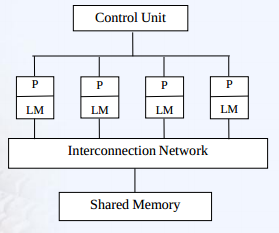

- 分类

  - (1) PRAM-CRCW并发读并发写
    - CPRAM-CRCW(Common PRAM-CRCW)：仅允许写入相同数据
    - PPRAM-CRCW(Priority PRAM-CRCW)：仅允许优先级最高的处理器写入
    - APRAM-CRCW(Arbitrary PRAM-CRCW)：允许任意处理器自由写入
  - (2) PRAM-CREW并发读互斥写
  - (3) PRAM-EREW互斥读互斥写

- 计算能力比较

  - PRAM-CRCW是最强的计算模型，PRAM-EREW可logp倍模拟PRAM-CREW和PRAM-CRCW
    $$
    T_{EREW}\ge T_{CREW}\ge T_{CRCW}\\
    T_{EREW}=O(T_{CREW}\cdot \log p)=O(T_{CRCW}\cdot \log p)
    $$


##### 异步APRAM模型

分相（Phase）PRAM或MIMD-SM

> 每个处理器有其局部存储器、局部时钟、局部程序；无全局时钟，各处理器异步执行；处理器通过SM进行通讯；处理器间依赖关系，需在并行程序中显式地加入**同步路障**。

指令类型
(1)全局读 (2)全局写 (3)局部操作 (4)同步

计算过程
由同步障分开的全局相组成

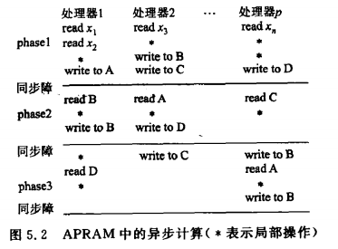

计算时间

设局部操作为单位时间；全局读/写平均时间为d，d随着处理器数目的增加而增加；同步路障时间为B=B(p)非降函数。满足关系
$$
2\le d\le B\le p 
$$

$$
B=B(p)=O(d\log p)\text{ or }O(d\log p/\log d)
$$

令$t_{ph}$为全局相内各处理器执行时间最长者，计算时间为
$$
T=\sum t_{ph}+B\times \text{同步障次数}
$$

##### BSP模型

Bulk Synchronous Parallel 

模型参数

- p：处理器数(带有存储器)
- l：同步障时间(Barrier synchronization time)
- g：带宽因子(time steps/packet)=1/bandwidth 

计算过程
由若干超级步组成，每个超级步计算模式为下图

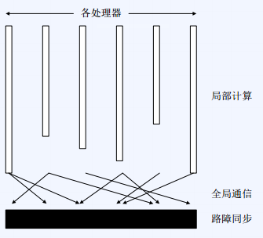

##### logP模型

模型参数

- L：network latency
- o：communication overhead
- g：gap=1/bandwidth
- P：#processors

注：L和g反映了通讯网络的容量


### 6 并行算法基本设计策略

#### 6.1 串行算法的直接并行化

##### 6.1.1 设计方法描述 

##### 6.1.2 快排序算法的并行化

SISD的快排

```pseudocode
输入：无序序列（Aq……Ar）
输出：有序序列（Aq……Ar）
Procedure Quicrsort(A，q，r);
Begin
	if q<r then
 	(1) x=Aq
 	(2) s=q
 	(3) for i=q+1 to r do
 			if Ai≤x then
 				s=s+1
 				swap(As,Ai)
 			end if
 		endfor
 	(4) swap(Aq，As)
 	(5) Quicksort(A，q，s)
 	(6) Quicksort(A，s+1，r)
 	end if
end
```

PRAM-CRCW上快排序算法 

- 构造一棵二叉排序树，其中主元是根 
- 小于等于主元的元素处于左子树，大于主元的元素处于右子树 
- 其左、右子树分别也为二叉排序树

 ```pascal
//input: A[1,...,n],n processors
//output:root,LC[1,...,n],RC[1,...,n]共享变量，构成树
//f[1,...,n]可为私有变量
for each processor i par-do
    root=i //竞争写，仅能写入一个
    f[i]=root //当前根，所有的f[i]都被写入了
    LC[i]=RC[i]=n+1

repeat for each processor i!=root par-do
	if (A[i]<A[f[i]] || (A[i]==A[f[i]]&&i<f[i]))
		LC[f[i]]=i //竞争写，作为左孩子
		if i==LC[f[i]]　//当前i已经在树中
			exit
		else
			f[i]=LC[f[i]]　//没有竞争上，那么就用新的根来判断
	else
		RC[f[i]]=i　//竞争写，作为右孩子
		if i== RC[f[i]]　//当前i已经在树中
			exit
		else
			f[i]=RC[f[i]]　//没有竞争上，那么就用新的根来判断
 ```

每次迭代，在$\Theta(1)$内构造一级树，树高为$\Theta(\log n)$, 从而时间为$O(\log n)$(PPT)　$\Theta(\log n)$ (课本)

#### 6.2 从问题描述开始设计并行算法 

##### 6.2.1 设计方法描述 

##### 6.2.2 有向环k着色算法的并行化

K着色问题: 环着色，相邻节点颜色不同

设有向环G=(V,E)，G的k着色问题：构造映射c: V$\to${0,1,2,…,k-1}，使得如果 <i,j>∈E，则c[i]≠c[j]

3着色**串行算法** 从一顶点开始，依次给顶点交替用两种颜色着色，如果 顶点数为奇数则需要第3种颜色。 注：该串行算法难以并行化。这时需要将顶点划分为若 干类，每类指派相同颜色，最后再将分类数减为3

基本并行k着色算法 算法: SIMD-EREW模型

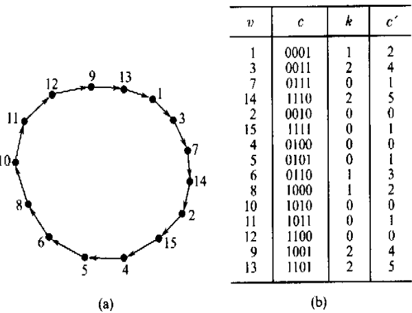

```pascal
//input c[i] 1-n着色
//output c_[i]
for i=0 to n par-do
	k是c[i],c[i的后继]最低的不同二进制位
	c_[i]=2*k+c[i]_k

//压缩到3着色
//每个颜色5的处理器选一个与前驱后继不冲突的最小颜色
//...    4 ...
```

#### 6.3 借用已有算法求解新问题 

##### 6.3.1 设计方法描述 

##### 6.3.2 利用矩阵乘法求所有点对间最短路径


SIMD-CC 上的并行算法


### 7 并行算法常用设计技术

#### 7.1 划分设计技术 

##### 7.1.1 均匀划分技术 

划分方法: $n$个元素$A[1..n]$分成$p$组，每组$A[(i-1)n/p+1..in/p]$，$i=1~p$

示例：MIMD-SM模型上的PSRS排序

(1)均匀划分：将$n$个元素$A[1..n]$均匀划分成$p$段，每个$p_i$ 处理 $A[(i-1)n/p+1..in/p]$ 

(2)局部排序：$p_i$ 调用串行排序算法对$A[(i-1)n/p+1..in/p]$排序 

(3)选取样本：$p_i$ 从其有序子序列$A[(i-1)n/p+1..in/p]$中选取$p$个样本元素 

(4)样本排序：用一台处理器对$p^2$个样本元素进行串行排序 

(5)选择主元：用一台处理器从排好序的样本序列中选取$p-1$个主元，并 播送给其他$p_i$ 

(6)主元划分：$p_i$ 按主元将有序段$A[(i-1)n/p+1..in/p]$划分成$p$段 

(7)全局交换：各处理器将其有序段按段号交换到对应的处理器中 

(8)归并排序：各处理器对接收到的元素进行**归并排序**

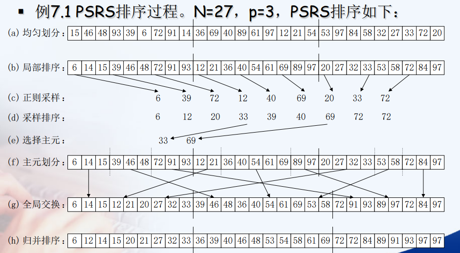


##### 7.1.2 方根划分技术 

划分方法 $n$个元素$A[1..n]$分成$A[(i-1)\sqrt{n}+1 .. i\sqrt{n}]$，$i=1\to \sqrt n$ 

//有序组$A[1..p]、B[1..q]$, (假设$p\le q$), 处理器数$k=\lfloor \sqrt{pq}\rfloor$


##### 7.1.3 对数划分技术

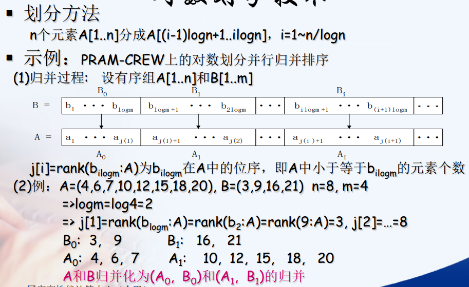


##### 7.1.4 功能划分技术 

未讲，略

#### 7.2 分治设计技术 

未讲，略

7.2.1 并行分治设计步骤 

7.2.2 双调归并网络

#### 7.3 平衡树设计技术 

##### 7.3.1 设计思想 

设计思想 以树的叶结点为输入，中间结点为处理结点， 由叶向根或由根向叶逐层进行并行处理。

##### 7.3.2 求最大值 

SIMD-TC(SM)上求最大值算法

```pseudocode
for k=m-1 to 0 do
	for j=2^k to 2^{k+1}-1 par-do
		A[j]=max{A[2j], A[2j+1]}
```

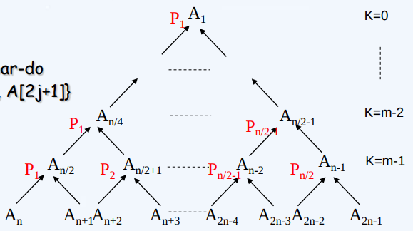

时间分析$ t(n)=m×O(1)=O(\log n);\  p(n)=n/2$

##### 7.3.3 计算前缀和

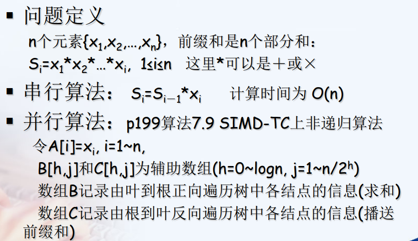


```pseudocode
begin
 (1)for j=1 to n par-do //初始化
    	B[0,j]=A[j]
    end if
 (2)for h=1 to logn do //正向遍历
        for j=1 to n/2h par-do
        	B[h,j]=B[h-1,2j-1]*B[h-1,2j]
        end for
    end for
 (3)for h=logn to 0 do //反向遍历
        for j=1 to n/2h par-do
        (i) if j=even then //该结点为其父结点的右儿子
        		C[h,j]=C[h+1,j/2]
            end if
       (ii) if j=1 then //该结点为最左结点
  	 	    	C[h,1]=B[h,1]
            end if
      (iii) if j=odd>1 then //该结点为其父结点的左儿子
  	        	C[h,j]=C[h+1,(j-1)/2]*B[h,j]
            end if
        end for
    end for
end
```

(1) $O(1)$ (2) $O(\log n)$ (3) $O(\log n)$ 

==> $t(n)=O(\log n) , p(n)=n , c(n)=O(n\log n)$


#### 7.4 倍增设计技术

##### 7.4.1 设计思想 

又称指针跳跃(pointer jumping)技术，特别适合于 处理链表或有向树之类的数据结构； 

当递归调用时，所要处理数据之间的距离逐步加倍， 经过k步后即可完成距离为2k的所有数据的计算。

##### 7.4.2 表序问题 

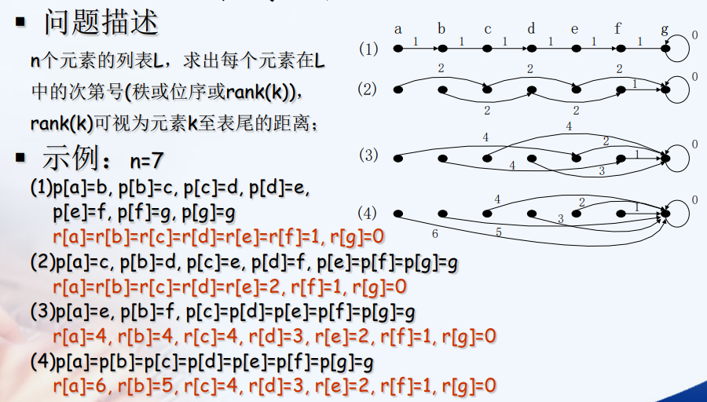

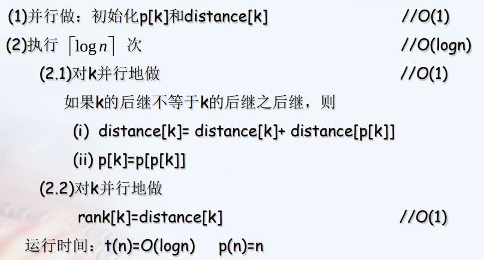


##### 7.4.3 求森林的根

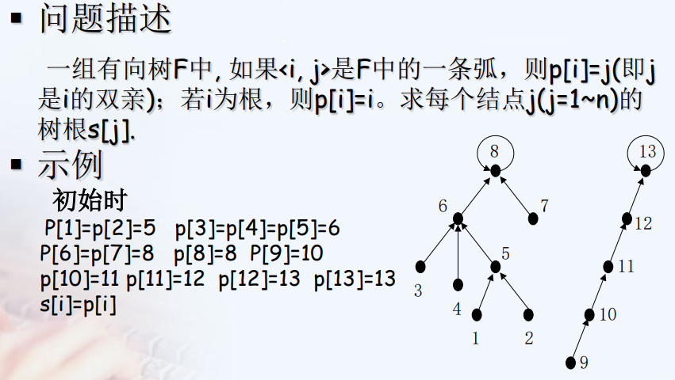

#### 7.5 流水线设计技术

##### 7.5.1 设计思想 

设计思想 

- 将算法流程划分成p个前后衔接的任务片断，每个 任务片断的输出作为下一个任务片断的输入； 
- 所有任务片断按同样的速率产生出结果。 

评注 

- 流水线技术是一种广泛应用在并行处理中的技术； 
- 脉动算法(Systolic algorithm)是其中一种流水线技 术；

##### 7.5.2 5-point DFT的计算 


##### 7.5.3 多线程软件流水


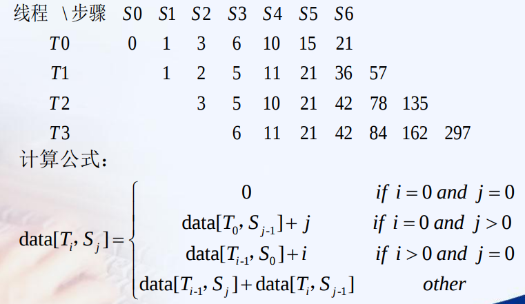


### 8 并行算法一般设计过程

#### 8.1 PCAM设计方法学

设计并行算法的四个阶段 

- 划分(Partitioning) 分解成小的任务，开拓并发性
- 通讯(Communication) 确定诸任务间的数据交换，检测划分的合理性
- 组合(Agglomeration) 依据任务的局部性，组合成更大的任务
- 映射(Mapping)　将每个任务分配到处理器上，提高算法的性能。 

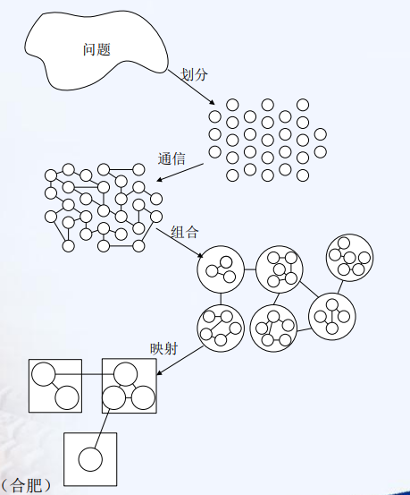

#### 8.2 划分 

##### 8.2.1 方法描述 

##### 8.2.2 域分解 

划分的对象是数据，可以是算法的输入 数据、中间处理数据和输出数据； 

将数据分解成大致相等的小数据片； 

划分时考虑数据上的相应操作； 

如果一个任务需要别的任务中的数据， 则会产生任务间的通讯；

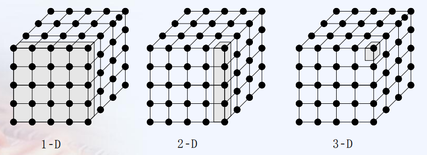

##### 8.2.3 功能分解 


##### 8.2.4 划分判据

#### 8.3 通讯 

##### 8.3.1 方法描述 

##### 8.3.2 四种通讯模式 

###### 局部/全局通讯

 局部通讯


全局通讯

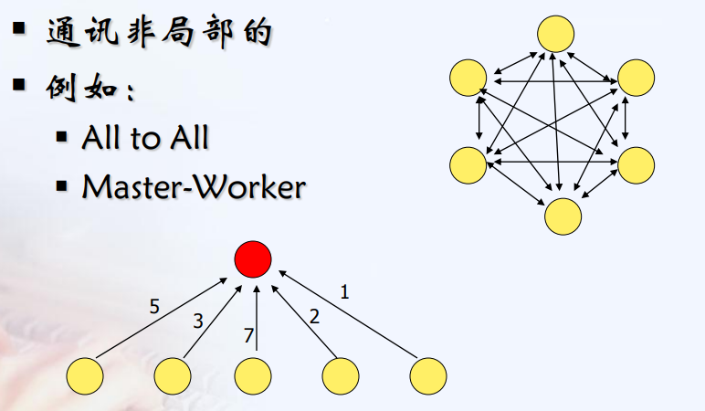

###### 结构化/非结构化通讯 

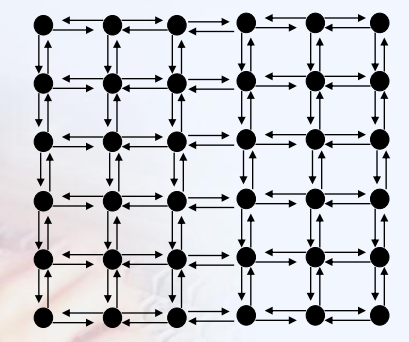

###### 静态/动态通讯 


###### 同步/异步通讯


##### 8.3.3 通讯判据

#### 8.4 组合 

##### 8.4.1 方法描述 

##### 8.4.2 表面-容积效应 

##### 8.4.3 重复计算 

##### 8.4.4 组合判据

#### 8.5 映射 

#### 8.6 小结

## 第二篇　并行计算理论基础：并行算法(下)并行数值计算

### 9 稠密矩阵运算

#### 9.1 矩阵的划分 

##### 9.1.1 带状划分 

##### 9.1.2 棋盘划分 

#### 9.2 矩阵转置 

#### 9.3 矩阵-向量乘法 

#### 9.4 矩阵乘法

### 10 线性方程组得求解

### 11 快速傅里叶变换

### 12 数值计算基本支撑技术

## 第三篇　并行计算软件支撑：并行编程

### 13 并行程序设计基础

#### 13.1 并行程序设计概述

##### 1 并行程序设计难的原因

- 技术先行,缺乏理论指导
- 程序的语法/语义复杂, 需要用户自已处理
  - 任务/数据的划分/分配
  - 数据交换
  - 同步和互斥
  - 性能平衡
- 并行语言缺乏代可扩展和异构可扩展, 程序移植困难, 重写代码难度太大
- 环境和工具缺乏较长的生长期, 缺乏代可扩展和异构可扩展

##### 2 并行语言的构造方法

```cpp
//串行代码段
for (i= 0; i<N; i++ ) A[i]=b[i]*b[i+1];
for (i= 0; i<N; i++) c[i]=A[i]+A[i+1];

//(a) 使用库例程构造并行程序
id=my_process_id();
p=number_of_processes();
for ( i= id; i<N; i=i+p) A[i]=b[i]*b[i+1];
barrier();
for (i= id; i<N; i=i+p) c[i]=A[i]+A[i+1];
//例子: MPI, PVM, Pthreads

//(b) 扩展串行语言
my_process_id,number_of_processes(), and barrier()
A(0:N-1)=b(0:N-1)*b(1:N)
c=A(0:N-1)+A(1:N)
//例子: Fortran 90
    
//(c) 加编译注释构造并行程序的方法 
#pragma parallel
#pragma shared(A,b,c)
#pragma local(i) 
{
# pragma pfor iterate(i=0;N;1)
for (i=0;i<N;i++) A[i]=b[i]*b[i+1];
# pragma synchronize
# pragma pfor iterate (i=0; N; 1)
for (i=0;i<N;i++)c[i]=A[i]+A[i+1];
}
//例子：OpenMP
```


##### 3 并行性问题 

###### 3.1 进程的同构性

- SIMD: 所有进程在同一时间执行相同的指令
- MIMD:各个进程在同一时间可以执行不同的指令
  - SPMD: 各个进程是同构的，多个进程对不同的数据执行相同的代码(一般是数据并行的同义语)常对应并行循环，数据并行结构，单代码
  - MPMD:各个进程是异构的， 多个进程执行不同的代码（一般是任务并行，或功能并行，或控制并行的同义语）常对应并行块，多代码
  - 要为有1000个处理器的计算机编写一个完全异构的并行程序是很困难的

**并行块**

```cpp
parbegin S1 S2 S3 …….Sn parend
```

S1 S2 S3 …….Sn可以是不同的代码
**并行循环**: 当并行块中所有进程共享相同代码时

```cpp
parbegin S1 S2 S3 …….Sn parend
```

S1 S2 S3 …….Sn是相同代码
简化为

```cpp
parfor (i=1; i<=n, i++) S(i)
```

**SPMD程序的构造方法**


**MPMD程序的构造方法**


###### 3.2 静态和动态并行性

程序的结构: 由它的组成部分构成程序的方法

- 静态并行性: 程序的结构以及进程的个数在运行之前(如编译时, 连接时或加载时)就可确定, 就认为该程序具有静态并行性. 

  ```cpp
  parbegin P, Q, R parend
  //其中P,Q,R是静态的
  ```

- 动态并行性: 否则就认为该程序具有动态并行性. 即意味着进程要在运行时创建和终止

  ```cpp
  while (C>0) begin
  	fork (foo(C));
  	C:=boo(C);
  end
  ```

开发动态并行性的一般方法: Fork/Join

> Fork: 派生一个子进程
>
> Join: 强制父进程等待子进程

```pseudocode
Process A:
begin 
	Z:=1
	fork(B);
	T:=foo(3);
end

Process B:
begin 
	fork(C);
	X:=foo(Z);
	join(C);
	output(X+Y);
end

Process C:
begin 
	Y:=foo(Z);
end
```

###### 3.3 进程编组

目的:支持进程间的交互,常把需要交互的进程调度在同一组中一个进程组成员由：组标识符+ 成员序号 唯一确定.

###### 3.4 划分与分配

- 原则: 使系统大部分时间忙于计算, 而不是闲置或忙于交互; 同时不牺牲并行性(度).
- 划分: 切割数据和工作负载
- 分配：将划分好的数据和工作负载映射到计算结点(处理器)上
- 分配方式

		显式分配: 由用户指定数据和负载如何加载
	隐式分配：由编译器和运行时支持系统决定

- 并行度(Degree of Parallelism, DOP):同时执行的分进程数. 

- 并行粒度(Granularity): 两次并行或交互操作之间所执行的计算负载.

  - 指令级并行
  - 块级并行
  - 进程级并行
  - 任务级并行

- 并行度与并行粒度大小互为倒数: 增大粒度会减小并行度. 增加并行度会增加系统(同步)开销

  

  

##### 4 交互/通信问题 

交互：进程间的相互影响

###### 4.1 交互的类型

- 通信：两个或多个进程间传送数的操作
  - 通信方式：
    - 共享变量
    - 父进程传给子进程(参数传递方式)
    - 消息传递

- 同步：导致进程间相互等待或继续执行的操作

  - 同步方式: 
    - 原子同步
    - 控制同步(路障,临界区) 
    - 数据同步(锁,条件临界区,监控程序,事件)

  ```cpp
  //原子同步
  parfor (i:=1; i<n; i++) {
  	atomic{x:=x+1; y:=y-1}
  }
  
  //路障同步
  parfor(i:=1; i<n; i++){
  	P[i]
  	barrier
  	Q[i]
  }
  
  //临界区
  parfor(i:=1; i<n; i++){
  	critical{x:=x+1; y:=y+1}
  }
  
  //数据同步(信号量同步)
  parfor(i:=1; i<n; i++){
  	lock(S); 
  	x:=x+1; 
  	y:=y-1; 
  	unlock(S)
  }
  ```

- 聚集(aggregation)：用一串超步将各分进程计算所得的部分结果合并为一个完整的结果, 每个超步包含一个短的计算和一个简单的通信或/和同步.

  - 聚集方式:
    - 归约
    - 扫描


##### 5 五种并行编程风范

#### 13.2 进程和线程

#### 13.3 同步和通信

#### 13.4 单核多线程与多核多线程

#### 13.5 影响多线程性能的常见问题

#### 13.6 并行程序设计模型

### 14 共享存储系统并行编程

编程模型的作用

- 规定程序的执行模型
  - SPMD, SMP 等。
- 如何表达并行性
  - DOACROSS, FORALL, PARALLEL, INDEPENDENT
- 如何表达同步
  - Lock, Barrier, Semaphore, Condition Variables
- 如何获得运行时的环境变量
  - threadid, num of processes

#### 14.1 ANSI X3H5共享存储模型

X3H5模型中并行语句规定


X3H5:并行性构造之例

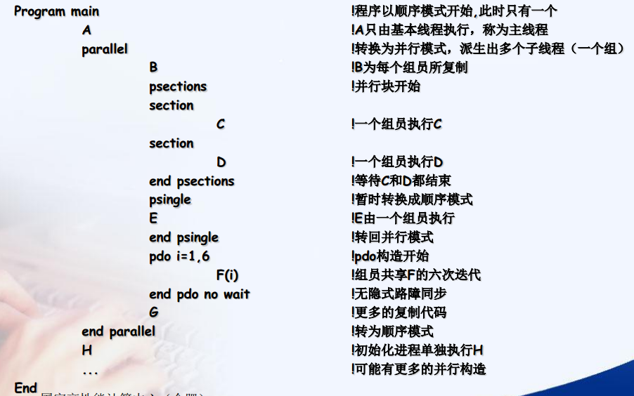


#### 14.2 POSIX 线程模型


#### 14.3 OpenMP模型

##### OpenMP概述

OpenMP应用编程接口API是在共享存储体系结构上的一个编程模型

OpenMP体系结构


- 什么是OpenMP
  - 应用编程接口API（Application Programming Interface ）；
  - 由三个基本API部分（编译指令、运行部分和环境变量）构成； 
  - 是C/C++ 和Fortan等的应用编程接口；
  - 已经被大多数计算机硬件和软件厂家所标准化。
- OpenMP不包含的性质
  - 不是建立在分布式存储系统上的；
  - 不是在所有的环境下都是一样的；
  - 不是能保证让多数共享存储器均能有效的利用

##### OpenMP编程风络

- OpenMP并行编程模型 
  - 基于线程的并行编程模型(Programming Model)；
  - OpenMP使用Fork-Join并行执行模型

  

```cpp
#include <omp.h> 
main (){
    int var1, var2, var3;
    /*Serial code*/
    ...
    /*Beginning of parallel section. Fork a team of threads*/
    /*Specify variable scoping */
        
    #pragma omp parallel private(var1, var2) shared(var3) 
    {
        /*Parallel section executed by all threads*/ 
        ...
        /*All threads join master thread and disband*/
    } 
    /*Resume serial code */ 
   	...
} 
```

```cpp
#include<omp.h>
#include<stdio.h>

int main(int argc, char* argv[])
{
    int nthreads, tid;
    int nprocs;
    char buf[32];
    /* Fork a team of threads */
    
    #pragma omp parallel private(nthreads, tid)
    {
        /* Obtain and print thread id */
        tid = omp_get_thread_num();
        printf("Hello World from OMP thread %d\n", tid);
        /* Only master thread does this */
        if (tid==0) {
        	nthreads = omp_get_num_threads();
        	printf("Number of threads %d\n", nthreads);
        }
    }
    return 0;
}
```

```cpp
#include<stdio.h
#include<time.h>
#include<omp.h>

void test()
{ 
     int a=0;
     clock_t t1=clock();
     for ( int i=0; i<100000000; i++ )
     { a=i+1; } 
     clock_t t2=clock();
     printf("Test Time=%d\n", t2-t1);
}

int main(int argc, char *argv[])
{ 
     clock_t t1=clock();
     
    #pragma omp parallel for
     for ( int j=0; j<2; j++)
     { test(); }
     
     clock_t t2=clock();
     printf("Test Time=%d\n", t2-t1);
     test();
     return;
}
```

##### OpenMP编程简介

###### 编译制导

语句格式


作用域

- 静态扩展
  - 文本代码在一个编译制导语句之后，被封装到一个结构块中。
- 孤立语句
  - 一个OpenMP的编译制导语句不依赖于其它的语句 。
- 动态扩展
  - 包括静态范围和孤立语句

静态范围: for语句出现在一个封闭的并行域中

```cpp
#pragma omp parallel
{
	 ...
     #pragma omp for
     for(...){
     ...
     sub1();
     ...
     }
     ...
     sub2();
     ...
}
```

孤立语句
critical和sections语句出现在封闭的并行域之外

```cpp
void sub1()
{
     ...
     #pragma omp critical
   	 ...
}
void sub2()
{
    ...
    #pragma omp sections
    ...
}
```

###### 共享任务结构

共享任务结构将它所包含的代码划分给线程组的各成员来执行。

- 并行for循环；
- 并行sections；
- 串行执行。


###### for编译制导语句

 for语句指定紧随它的循环语句必须由线程组并行执行

语句格式

```cpp
#pragma omp for [clause[[,]clause]…] newline
[clause]=
    Schedule(type [,chunk]) 
    ordered
    private (list)
    firstprivate (list)
    lastprivate (list)
    shared (list)
    reduction (operator: list)
    nowait
```

```cpp
#include<stdio.h>
#include<omp.h>

int main(){
    int j=0;
    #pragma omp parallel
    {
        #pragma omp for
        for (j=0; j<4; j++)
        { 
            printf("j=%d, ThreadId=%d\n", omp_get_thread_num());
        }
    }
}

//运行结果：
j=1, ThreadId=1
j=3, ThreadId=3
j=2, ThreadId=2
j=0, ThreadId=0
```

- schedule子句描述如何将循环的迭代划分给线程组中的线程；
- 如果没有指定chunk大小，迭代会尽可能的平均分配给每个线程；
- type为static，循环被分成大小为 chunk的块，静态分配给线程；
- type为dynamic，循环被动态划分为大小为chunk的块，动态分配给线程；
- type为guided，采用启发式调度，每次分配给线程迭代次数不同，开始比较大，以后逐渐减小；
- type为runtime，允许在运行时确定调度类型。

###### Sections编译制导语句

sections编译制导语句指定内部的代码被划分给线程组中的各线程；
不同的section由不同的线程执行；
Section语句格式：

```cpp
#pragma omp sections [ clause[[,]clause]…] newline 
{ 
    [#pragma omp section newline]
    ...
    [#pragma omp section newline]
    ...
}

clause=
    private (list) 
    firstprivate (list)
    lastprivate (list)
    reduction (operator: list)
    nowait
```

```cpp
#include <omp.h>
#include<stdio.h>
#define N 1000
int main (){
    int i;
    float a[N], b[N], c[N];

    /* Some initializations */
    for (i=0; i < N; i++) 
        a[i] = b[i] = i * 1.0;
    
    #pragma omp parallel shared(a,b,c) private(i) 
    { 
        #pragma omp sections nowait 
        { 
            #pragma omp section 
            for (i=0; i < N/2; i++) 
                c[i] = a[i] + b[i]; 

            #pragma omp section 
            for (i=N/2; i < N; i++) 
                c[i] = a[i] + b[i]; 
        } /* end of sections */ 
    } /* end of parallel section */
} 
```

###### single编译制导语句

single编译制导语句指定内部代码只有线程组中的一个线程执行；
线程组中没有执行single语句的线程会一直等待代码块的结束，使用nowait子句除外；
语句格式

```cpp
#pragma omp single [clause[[,]clause]…] newline
clause=
	private(list)
	firstprivate(list)
	nowait
```

###### 组合的并行共享任务结构

###### parallel for编译制导语句

Parallel for编译制导语句表明一个并行域包含一个独立的for语句；

语句格式

```cpp
#pragma omp parallel for [clause…] newline
clause=
	if (scalar_logical_expression)
	default (shared | none)
	schedule (type [,chunk])
	shared (list)
	private (list)
	firstprivate (list)
	lastprivate (list)
	reduction (operator: list)
	copyin (list) 
```

```cpp
#include <omp.h>
#define N 1000
#define CHUNKSIZE 100
int main () {
    int i, chunk;
    float a[N], b[N], c[N];
    /* Some initializations */
    for (i=0; i < N; i++) 
    	a[i] = b[i] = i * 1.0;
    
    chunk = CHUNKSIZE;
    
    #pragma omp parallel for shared(a,b,c,chunk) private(i) schedule(static,chunk) 
    for (i=0; i < n; i++) 
    	c[i] = a[i] + b[i];
} 
```

###### parallel sections编译制导语句

parallel sections编译制导语句表明一个并行域包含单独的一个sections语句；

语句格式

```cpp
#pragma omp parallel sections [clause…] newline
clause=
	default (shared | none)
	shared (list)
	private (list)
	firstprivate (list)
	lastprivate (list)
	reduction (operator: list)
	copyin (list)
	ordered 
```

###### **同步结构**

###### master 制导语句

master制导语句指定代码段只有主线程执行；
语句格式

```cpp
#pragma omp master newline 
```

###### critical制导语句

critical制导语句表明域中的代码一次只能执行一个线程；
其他线程被阻塞在临界区；
语句格式

```cpp
#pragma omp critical [name] newline 
```

```cpp
#include <omp.h>
main()
{
    int x;
    x = 0;
    #pragma omp parallel shared(x) 
     { 
         #pragma omp critical 
         x = x + 1; 
    } /* end of parallel section */
} 
```

###### barrier制导语句

barrier制导语句用来同步一个线程组中所有的线程；
先到达的线程在此阻塞，等待其他线程；
barrier语句最小代码必须是一个结构化的块；
语句格式

```cpp
#pragma omp barrier newline
```

barrier正确与错误使用比较

错误

```cpp
if (x == 0)
	#pragma omp barrier
```

正确

```cpp
if (x == 0)
{
	#pragma omp barrier
}
```

###### atomic制导语句

atomic制导语句指定特定的存储单元将被原子更新；
语句格式

```cpp
#pragma omp atomic newline
```

```cpp
int i, nVar=0;
#pragma omp parallel for shared(nVar)
for (i=0; i<1000; i++)
{
    #pragma omp atomic
     nVar+=1;
}
```

###### flush制导语句

flush制导语句用以标识一个同步点，用以确保所有的线程看到一致的存储器视图；

语句格式

```cpp
#pragma omp flush (list) newline
```

flush将在下面几种情形下隐含运行，nowait子句除外

```cpp
barrier
critical:进入与退出部分
ordered:进入与退出部分
parallel:退出部分
for:退出部分
sections:退出部分
single:退出部分
```

###### ordered制导语句

ordered制导语句指出其所包含循环的执行；
任何时候只能有一个线程执行被ordered所限定部分；
只能出现在for或者parallel for语句的动态范围中；
语句格式：

```cpp
#pragma omp ordered newline
```

```cpp
#pragma omp parallel for ordered schdule(static, 2)
for (i=0; i<10; i++)
     #pragma omp ordered
     printf("i=%ld\n", i);
```

###### threadprivate编译制导语句

threadprivate语句使一个全局文件作用域的变量在并行域内变成每个线程私有；
每个线程对该变量复制一份私有拷贝；
语句格式:

```cpp
#pragma omp threadprivate (list) newline
```

```cpp
//复制全局变量为各自线程私有
int counter=0;
#pragma omp threadprivate(counter) 
int increment_counter() 
{
     counter++;
     return(counter++);
} 
//复制静态变量为各自线程私有
int increment_counter() 
{
     static int counter=0;
     #pragma omp threadprivate(counter) 
     counter++;
     return(counter++);
}
```

###### 数据域属性子句

###### private子句

private子句表示它列出的变量对于每个线程是局部的。
语句格式：

```cpp
private(list)
```

private和threadprivate区别。


```cpp
int global=111;
#pragma omp threadprivate(global)
int main()
{
     global=222;
     #pragma omp parallel copyin(global) 
     {
         printf("Thread number %d global=%d\n",omp_get_thread_num(),global);
         global=omp_get_thread_num()+10; 
     }
     printf("global=%d\n",global);
     printf("parallel again\n");
    
     #pragma omp parallel
     printf("Thread number %d global=%d\n",omp_get_thread_num(),global);
     printf("global=%d\n",global);
     return 0;
}

//运行结果：
Thread number 0 global=222
Thread number 3 global=222
Thread number 1 global=222
Thread number 2 global=222
global=10
parallel again
Thread number 0 global=10
Thread number 3 global=13
Thread number 1 global=11
Thread number 2 global=12
global=10
```

```cpp
#include <omp.h> 
int alpha[10], beta[10], i;
#pragma omp threadprivate(alpha) 
int main () 
{
    /* First parallel region */
    #pragma omp parallel private(i,beta) 
    for (i=0; i < 10; i++) 
    	alpha[i] = beta[i] = i;
    /* Second parallel region */
    #pragma omp parallel 
    printf("alpha[3]= %d and beta[3]=%d\n",alpha[3],beta[3]);
}
```

###### shared子句

shared子句表示它所列出的变量被线程组中所有的线程共享；
所有线程都能对它进行读写访问；
语句格式：
`shared (list) `

###### default子句

default子句让用户自行规定在一个并行域的静态范围中所定义变量的shared和private缺省性质；
语句格式：
`default (shared | none) `

###### firstprivate子句

firstprivate子句是private子句的配合操作；
对变量做原子初始化；
语句格式：
`firstprivate (list)`

######  lastprivate子句

lastprivate子句是private子句的配合操作；
将变量从最后的循环迭代或段复制给原始的变量；
语句格式：
`lastprivate (list)`

######  copyin子句

copyin子句用来为线程组中所有线程的threadprivate变量赋相同的值；
主线程该变量的值作为初始值；
语句格式：
`copyin(list)`

###### reduction子句

reduction子句使用指定的操作对其列表中出现的变量进行归约；
初始时，每个线程都保留一份私有拷贝；
在结构尾部根据指定的操作对线程中的相应变量进行归约，并更新该变量的全局值；
语句格式：

`reduction (operator: list) `

```cpp
#include <omp.h>
int main () 
{
    int i, n, chunk;
    float a[100], b[100], result;
    /* Some initializations */
    n = 100;
    chunk = 10;
    result = 0.0;
    for (i=0; i < n; i++) 
    { 
        a[i] = i * 1.0; 
        b[i] = i * 2.0; 
    }
    #pragma omp parallel for default(shared) private(i)\
    schedule(static,chunk) reduction(+:result) 
    for (i=0; i < n; i++) 
    	result = result + (a[i] * b[i]);
    printf("Final result= %f\n",result);
} 
```


##### 运行库例程与环境变量

- 运行库例程
  - OpenMP标准定义了一个应用编程接口来调用库中的多种函数；
  - 对于C/C++，在程序开头需要引用文件“omp.h” 。
- 环境变量
  - OMP_SCHEDULE：只能用到for,parallel for中。它的值就是处理器中循环的次数；
  - OMP_NUM_THREADS：定义执行中最大的线程数；
  - OMP_DYNAMIC：通过设定变量值TRUE或FALSE,来确定是否动态设定并行域执行的线程数；
  - OMP_NESTED：确定是否可以并行嵌套。

##### OpenMP计算实例

###### 使用并行域并行化的程序

```cpp
#include <omp.h>
#include<iostream>
using namespace std;
static long num_steps = 100000;
double step;
#define NUM_THREADS 2

int main ()
{ 
    int i;
    double x, pi, sum[NUM_THREADS];
    step = 1.0/(double) num_steps;
    omp_set_num_threads(NUM_THREADS);
    #pragma omp parallel
    {
        double x;
        int id;
        id = omp_get_thread_num();
        for (i=id, sum[id]=0.0;i< num_steps; i=i+NUM_THREADS){
            x = (i+0.5)*step;
            sum[id] += 4.0/(1.0+x*x);
        }
    }
    for(i=0, pi=0.0;i<NUM_THREADS;i++) 
        pi += sum[i] * step;
    cout<<pi<<endl;
}
```


###### 使用共享任务结构并行化的程序

```cpp
#include <omp.h>
#include<iostream>
using namespace std;
static long num_steps = 100000;
double step;
#define NUM_THREADS 2
int main ()
{
    int i;
    double x, pi, sum[NUM_THREADS];
    step = 1.0/(double) num_steps;
    omp_set_num_threads(NUM_THREADS);
    #pragma omp parallel
    {
        double x;
        int id;
        id = omp_get_thread_num();
        sum[id] = 0;
        #pragma omp for
        for (i=0;i< num_steps; i++){
            x = (i+0.5)*step;
            sum[id] += 4.0/(1.0+x*x);
        }
    }
    for(i=0, pi=0.0;i<NUM_THREADS;i++) pi += sum[i] * step;
    cout<<pi<<endl;
} 
```


###### 使用private子句和critical部分并行化的程序

```cpp
#include <omp.h>
#include<iostream>
using namespace std;
static long num_steps = 100000;
double step;
#define NUM_THREADS 2
int main ()
{
    int i;
    double x, sum, pi=0.0;
    step = 1.0/(double) num_steps;
    omp_set_num_threads(NUM_THREADS);
    #pragma omp parallel private (x, sum)
    {
        int id = omp_get_thread_num();

        for (i=id,sum=0.0;i< num_steps;i=i+NUM_THREADS){
            x = (i+0.5)*step;
            sum += 4.0/(1.0+x*x);
        }
        #pragma omp critical
        pi += sum*step;
    }
    
    cout<<pi<<endl;
}
```

###### 使用并行归约得出的并行程序

```cpp
#include <omp.h>
#include<iostream>
using namespace std;

static long num_steps = 100000;
double step;
#define NUM_THREADS 2
int main ()
{ 
    int i;
    double x, pi, sum = 0.0;
    step = 1.0/(double) num_steps;
    omp_set_num_threads(NUM_THREADS);
    #pragma omp parallel for reduction(+:sum) private(x)
    for (i=0;i<num_steps; i++){
        x = (i+0.5)*step;
        sum = sum + 4.0/(1.0+x*x);
    }
    pi = step * sum;

    cout<<pi<<endl;
} 
```

#### OpenMP的优点与缺点

- 优点 
  - 提供了一个可用的编程标准； 
  - 可移植性, 简单, 可扩展性； 
  - 灵活支持多线程, 具有负载平衡的潜在能力； 
  - 持Orphan Scope, 使程序更具有模块化。 
- 缺点 
  - 只适用于硬件共享存储型的机器； 
  - 动态可变的线程数使得支持起来困难。

### 15 分布存储系统并行编程

#### 15.1 基于消息传递的编程 

##### 1 消息传递库 

MPI PVM

##### 2 消息传递方式


#### 15.2 MPI并行编程

```
mpiCC for c++ //g++
mpicc for c //gcc
```

##### 1 六个基本函数组成的MPI子集 

```cpp
#include "mpi.h" /*MPI头函数，提供了MPI函数和数据类型定义*/

int main( int argc, char** argv )
{
	int rank, size, tag=1;
	int senddata,recvdata;
	MPI_Status status;
	MPI_Init(&argc, &argv); /*MPI的初始化函数*/
	MPI_Comm_rank(MPI_COMM_WORLD, &rank); /*该进程编号*/
	MPI_Comm_size(MPI_COMM_WORLD, &size); /*总进程数目*/
    if (rank==0){
		senddata=9999;
		MPI_Send(&senddata, 1, MPI_INT, 1, tag,MPI_COMM_WORLD); /*发送数据到进程1*/
	}
	if (rank==1)
		MPI_Recv(&recvdata, 1, MPI_INT, 0, tag, MPI_COMM_WORLD,&status);
    /*从进程0接收数据*/
	
    MPI_Finalize(); /*MPI的结束函数*/
	return (0);
}
```

MPI初始化：通过MPI_Init函数进入MPI环境并完成 所有的初始化工作。 

```cpp
int MPI_Init( int *argc, char * * * argv )
```

MPI结束：通过MPI_Finalize函数从MPI环境中退出

```cpp
int MPI_Finalize(void)
```

获取进程的**编号**：调用MPI_Comm_rank函数获得当前 进程在指定通信域中的**编号**，将自身与其他程序区分。

```cpp
int MPI_Comm_rank(MPI_Comm comm, int *rank)
```

获取指定通信域的**进程数**：调用MPI_Comm_size函数 获取指定通信域的进程个数，确定自身完成任务比例。

```cpp
int MPI_Comm_size(MPI_Comm comm, int *size)
```

消息发送：MPI_Send函数用于发送一个消息到目标进程。

```cpp
int MPI_Send(void *buf, int count, MPI_Datatype dataytpe, int dest, int tag, MPI_Comm comm) 
```

消息接受:MPI_Recv函数用于从指定进程接收一个消 息

```cpp
int MPI_Recv(void *buf, int count, MPI_Datatype datatyepe,int source, int tag, MPI_Comm comm, MPI_Status *status)
```

编译和运行

```bash
#用以下并行C编译器mpcc来编译
mpicc –o myprog.c myprog
#将可执行程序myprog加载到n个节点上
mpirun –np n myprog
```

MPI进程是重型的单线进程. 它们拥有不同的地址空间. 因此, 一个进程**不能直接**访问另一个进程地址空间的中的变量. 进程间的**通信用消息传递**来实现

##### 2 MPI消息 

一个消息好比一封信;

- 消息的内容即信的内容，在MPI中称为消息缓冲 (Message Buffer);

  三元组<起始地址，数据个数，数 据类型>

- 消息的接收/发送者即信的地址，在MPI中称为消息信封(Message Envelop)

  三元组<源/目标进程，消息标签，通信域>


###### 数据类型

MPI的消息类型分为两种：预定义类型和派生数据类型 (Derived Data Type)

- 预定义数据类型:MPI支持异构计算(Heterogeneous Computing)，它指在不同计算机系统上运行程序，每 台计算可能有不同生产厂商，不同操作系统。 

  MPI通过提供预定义数据类型来解决异构计算中的互操作性问 题，建立它与具体语言的对应关系。 

- 派生数据类型：MPI引入派生数据类型来定义由数据类 型不同且地址空间不连续的数据项组成的消息。

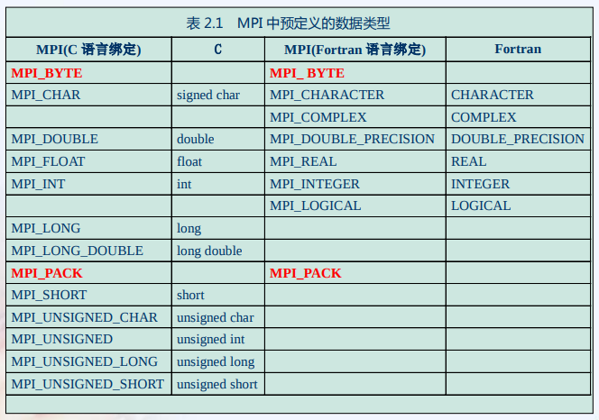

MPI提供了两个附加类型:`MPI_BYTE`和`MPI_PACK`。 

- `MPI_BYTE`表示一个字节，所有的计算系统中一个字节都代表8个二进制位。 
- `MPI_PACK`预定义数据类型被用来实现传输地址空间 不连续的数据项 。

```cpp
double A[100];
//MPI_Pack_size函数来决定用于存放50个MPI_DOUBLE数据项的临时缓冲区的大小
MPI_Pack_size (50,MPI_DOUBLE,comm,&BufferSize);

//调用malloc函数为这个临时缓冲区分配内存
TempBuffer = malloc(BufferSize);
j = sizeof(MPI_DOUBLE);
Position = 0;

//for循环中将数组A的50个偶序数元素打包成一个消息并存放在临时缓冲区
for (i=0;i<50;i++)
	MPI_Pack(A+2*i*j,1,MPI_DOUBLE,TempBuffer,BufferSize,&Position,comm);
MPI_Send(TempBuffer,Position,MPI_PACKED,destination,tag,comm);
```

消息打包，然后发送

```cpp
MPI_Pack(buf, count, dtype,
 //以上为待打包消息描述
 packbuf, packsize, packpos,
 //以上为打包缓冲区描述
 communicator)
```

消息接收，然后拆包

```cpp
MPI_Unpack(packbuf, packsize, packpos,
 //以上为拆包缓冲区描述
 buf, count, dtype,
 // 以上为拆包消息描述
 communicatior)
```

**派生数据类型**可以用类型图来描述，这是一种通用的类型描述方 法，它是一系列二元组<基类型，偏移>的集合，可以表示成如下 格式：

```cpp
{<基类型0,偏移0>，···，<基类型n-1,偏移n-1>}
```

在派生数据类型中，基类型可以是任何MPI预定义数据类型，也 可以是其它的派生数据类型，即支持数据类型的嵌套定义。

如图，阴影部分是基类型所占用的空间，其它空间可以是特意留 下的，也可以是为了方便数据对齐


MPI提供了全面而强大的构造函数(Constructor Function)来定义 派生数据类型。


```cpp
double A[100];
//首先声明一个类型为MPI_Data_type的变量EvenElements 
MPI_Datatype EvenElements;
···
//调用构造函数MPI_Type_vector(count, blocklength, stride,oldtype, &newtype)
//来定义派生数据类型
//该newtype由count个数据块组成,而每个数据块由blocklength个oldtype类型的连续数据项组成。
//参数stride定义了两个连续数据块的起始位置之间的oldtype类型元素的个数。因此，两个块之间的间隔可以由(stride-blocklength)来表示
MPI_Type_vector(50, 1, 2, MPI_DOUBLE, &EvenElements);
MPI_Type_commit(&EvenElements);
//新的派生数据类型必须先调用函数MPI_Type_commit获得MPI系统的确认后才能调用MPI_Send进行消息发送
MPI_Send(A, 1, EvenElements, destination, ···);
```

`MPI_Type_vector(50,1,2,MPI_DOUBLE,&EvenElements)`函数 调用产生了派生数据类型EvenElements，它由50个块组成，每个 块包含一个双精度数，后跟一个(2－1)MPI_DOUBLE(8字节)的间 隔，接在后面的是下一块。上面的发送语句获取数组A的所有序号 为偶数的元素并加以传递。


下图10×10整数矩阵的所 有偶序号的行:

```cpp
MPI_Type_vector(
	5,//count
    10,//blockLength
    20,//stride
    MPI_INT,//oldType
    &newtype
)
```


```cpp
MPI_Type_struct(
 	count, //成员数
 	array_of_blocklengths, //成员块长度数组
 	array_of_displacements,//成员偏移数组
	array_of_types, //成员类型数组
 	newtype // 新类型
) 
```


###### 消息标签

为什么需要消息标签？ 

- 当发送者连续发送两个相同类型消息给同一个接收者，如果没有 消息标签，接收者将无法区分这两个消息
- 添加标签使得服 务进程可以对两 个不同的用户进 程分别处理，提 高灵活性

###### 通信域

通信域(Communicator)包括**进程组**(Process Group)和 **通信上下文**(Communication Context)等内容，用于描 述通信进程间的通信关系。

通信域分为**组内通信域**和**组间通信域**，分别用来实现 MPI的组内通信(Intra-communication)和组间通信 (Inter-communication)

进程组是进程的有限、有序集。 

- 有限意味着，在一个进程组中，进程的个数n是有限的，这里 的n称为进程组大小(Group Size)。 
- 有序意味着，进程的编号是按0，1，…，n-1排列的

一个进程用它在一个通信域(组)中的编号进行标识。组 的大小和进程编号可以通过调用以下的MPI函数获得

```cpp
MPI_Comm_size(communicator, &group_size)
MPI_Comm_rank(communicator, &my_rank) 
```

通信上下文：安全的区别不同的通信以免相互干扰;通信上下文不是显式的对象，只是作为通信域的一部分出现

进程组和通信上下文结合形成了通信域 ;`MPI_COMM_WORLD`是所有进程的集合

MPI提供丰富的函数用于管理通信域


```cpp
MPI_Comm MyWorld, SplitWorld;
int my_rank,group_size, Color, Key;
MPI_Init(&argc, &argv);
//MPI_Comm_dup(MPI_COMM_WORLD,&MyWorld)创建了一个新的通信域MyWorld，它包含了与原通信域MPI_COMM_WORLD相同的进程组，但具有不同的通信上下文。
MPI_Comm_dup(MPI_COMM_WORLD,&MyWorld);
MPI_Comm_rank(MyWorld,&my_rank);
MPI_Comm_size(MyWorld,&group_size);
Color=my_rank%3;
Key=my_rank/3;
//MPI_Comm_split(MyWorld,Color,Key,&SplitWorld)函数调用则在通信域MyWorld的基础上产生了几个分割的子通信域。原通信域MyWorld中的进程按照不同的Color值处在不同的分割通信域中，每个进程在不同分割通信域中的进程编号则由Key值来标识。
MPI_Comm_split(MyWorld,Color,Key,&SplitWorld);
```


组间通信域是一种特殊的通信域，该通信域包括了两个 进程组，分属于两个进程组的进程之间通过组间通信域 实现通信。 一般把调用进程所在的进程组称为本地进程组，而把另 外一个称为远程进程组


###### 消息状态

消息状态(MPI_Status类型)存放接收消息的状态信息， 包括: 

- 消息的源进程标识－－MPI_SOURCE 
- 消息标签－－MPI_TAG 
- 错误状态－－MPI_ERROR 
- 其他－－包括数据项个数等，但多为系统保留的。

是消息接收函数MPI_Recv的最后一个参数。 当一个接收者从不同进程接收不同大小和不同标签的消 息时，消息的状态信息非常有用。

假设多个客户进程发送消息给服务进程请求服务，通过 消息标签来标识客户进程，从而服务进程采取不同的服 务

```cpp
while (true){
	MPI_Recv(received_request,100,MPI_BYTE,MPI_Any_source,MPI_Any_tag,comm,&Status);
	switch (Status.MPI_Tag) {
		case tag_0: perform service type0;
		case tag_1: perform service type1;
		case tag_2: perform service type2;
	}
}
```

##### 3 点对点通信 

MPI的点对点通信(‘Point-to-Point Communication )同 时提供了阻塞和非阻塞两种**通信机制** ，同时也支持多 种通信模式。不同通信模式和不同通信机制的结合，便产生了非常丰 富的点对点通信函数。

划分依据：

- (1)发送(接收)的数据是否缓存； 
- (2)发送(接收)调用正确返回的时间点； 
- (3)执行发送操作与接收调用启动的次序；
- (4)发送(接收)正确返回，其发送(接收)缓冲区是否可以覆盖(引用)； 
- (5)发送数据是否到达接收缓冲区。

###### 通信模式

**阻塞**和**非阻塞**通信机制的主要区别在于返回后的**资源可 用性**

阻塞通信返回的条件： 

- 通信操作已经完成，表示消息已经发送或接收。 
- 调用的缓冲区可用。若是发送操作，则该缓冲区可以被其它的 操作更新；若是接收操作，该缓冲区的数据已经完整，可以被 正确引用。

通信模式(Communication Mode)指的是缓冲管理，以 及发送方和接收方之间的同步方式。

共有下面四种通信模式 

- 标准(standard)通信模式 
- 缓冲(buffered)通信模式 
- 同步(synchronous)通信模式 
- 就绪(ready)通信模式

**标准通信模式**：是否对发送的数据进行缓冲由MPI的实 现来决定，而不是由用户程序来控制。发送可以是同步 的或缓冲的，取决于实现。 

- 如果缓存数据，发送操作执行与接收操作是否启动无关。 数据缓存完毕，发送操作就可正确返回。 

- 如果不缓存数据，只有当接收操作启动时且发送数据完 全到达接收缓冲区后，发送操作才能返回。非阻塞发送 可提前返回，但应有系统缓冲区支持。

  

**缓冲通信模式**：缓冲通信模式的发送不管接收操作是 否已经启动都可以执行。 

- 需要用户程序对通信缓冲区进行控制：事先申请一块足 够大的缓冲区，通过MPI_Buffer_attch实现，通过 MPI_Buffer_detach来回收申请的缓冲区。 

- 分阻塞和非阻塞，缓冲区使用方式同阻塞和非阻塞机制 的规定。注意MPI的发送和接收缓冲区与系统缓冲区的 区别。

  

**同步通信模式**：只有相应的接收过程已经启动，发送 过程才正确返回。开始时不依赖接收操作是否启动。 

- 同步发送返回时，表示发送缓冲区中的数据已经全部被 系统缓冲区缓存，并且已经开始发送。 

- 阻塞同步发送返回后，发送缓冲区可以被释放或者重新 使用。

  

**就绪通信模式**：只有在接收进程相应的接收操作已经 开始时才能进行发送。 

- 当发送操作启动而相应的接收还没有启动，发送操作 将出错。就绪通信模式的特殊之处就是接收操作必须 先于发送操作启动。 

- 也分阻塞和非阻塞，缓冲区使用方式同阻塞和非阻塞 机制的规定。

  

MPI的**发送操作**支持四种通信模式，它们与阻塞属性一 起产生了MPI中的8种发送操作。 而MPI的**接收操作**只有两种：阻塞接收和非阻塞接收。 非阻塞通信返回后并不意味着通信操作的完成，MPI还 提供了对非阻塞通信完成的检测，主要的有两种： MPI_Wait函数和MPI_Test函数。


在阻塞通信的情况下，通信还没有结束的时候，处理器只能等待， 浪费了计算资源。 

一种常见的技术就是设法使计算与通信重叠，非阻塞通信可以用 来实现这一目的。 

例：一条三进程的流水线，一个进程连续地从左边的进程接收一 个输入数据流，计算一个新的值，然后将它发送给右边的进程。


```cpp
while (Not_Done){
	MPI_Irevc(NextX, ... );
	MPI_Isend(PreviousY, ... );
	CurrentY=Q(CurrentX);
}
```

非阻塞通信中，双缓冲是一种常用的方法。 我们需要为X和Y各自准备两个单独的缓冲，当接收进程向缓冲 中放下一个X时，计算进程可能从另一个缓冲中读当前的X。 我们需要确信缓冲中的数据在缓冲被更新之前使用 。 

```cpp
while (Not_Done){
	if (X==Xbuf0) {
        X=Xbuf1; Y=Ybuf1; Xin=Xbuf0; Yout=Ybuf0;
    }
	else {
        X=Xbuf0; Y=Ybuf0; Xin=Xbuf1; Yout=Ybuf1;
    }
	MPI_Irevc(Xin,..., recv_handle);
	MPI_Isend(Yout,..., send_handle);
	Y=Q(X); /* 重叠计算*/
	MPI_Wait(recv_handle,recv_status);
	MPI_Wait(send_handle,send_status);
}
```


`send_handle`和`revc_handle`分别用于检查发送接收是否完成。 

检查发送接收通过调用`MPI_Wait(Handle, Status)`来实现，它直到Handle指示的发送或接收操作已经完成才返回。 

另一个函数`MPI_Test(Handle, Flag, Status)`只测试由Handle指 示的发送或接收操作是否完成，如果完成，就对Flag赋值True， 这个函数不像`MPI_Wait`，它不会被阻塞。

Send-Recv

给一个进程发送消息，从另一个进程接收消息； 

特别适用于在进程链（环）中进行“移位”操作，而避 免在通讯为阻塞方式时出现死锁。

```cpp
MPI_Sendrecv(
 sendbuf, sendcount, sendtype, dest, sendtag,
 //以上为消息发送的描述
 recvbuf, recvcount, recvtype, source, recvtag,
 // 以上为消息接收的描述
 comm, status) 
```

##### 4 群集通信 

群集通信(Collective Communications)是一个进程组中 的所有进程都参加的全局通信操作。

群集通信一般实现三个功能：通信、聚集和同步。 

- 通信功能主要完成组内数据的传输 
- 聚集功能在通信的基础上对给定的数据完成一定的操作 
- 同步功能实现组内所有进程在执行进度上取得一致

群集通信，按照通信方向的不同，又可以分为三种：一 对多通信，多对一通信和多对多通信。 

- 一对多通信：一个进程向其它所有的进程发送消息， 这个负责发送消息的进程叫做Root进程。 
- 多对一通信：一个进程负责从其它所有的进程接收消 息，这个接收的进程也叫做Root进程。 
- 多对多通信：每一个进程都向其它所有的进程发送或 者接收消息。


**广播**是一对多通信的典型例子，其调用格式如下：

```cpp
MPI_Bcast(Address, Count, Datatype, Root, Comm)
```


广播的特点 

- 标号为Root的进程发送相同的消息给通信域Comm中的 所有进程。 
- 消息的内容如同点对点通信一样由三元组标识。 
- 对Root进程来说，这个三元组既定义了发送缓冲也定义 了接收缓冲。对其它进程来说，这个三元组只定义了接 收缓冲

**收集**是多对一通信的典型例子，其调用格式下

```cpp
MPI_Gather(SendAddress, SendCount, SendDatatype,RecvAddress, RecvCount, RecvDatatype, Root, Comm)
```


收集的特点 

- 在收集操作中，Root进程从进程域Comm的所有进程(包 括它自已)接收消息。 
- 这n个消息按照进程的标识rank排序进行拼接，然后存放 在Root进程的接收缓冲中。 
- 接收缓冲由三元组标识，发送缓冲由三元组标识，所有非Root进程忽略 接收缓冲。

**散播**也是一个一对多操作，其调用格式如下:

```cpp
MPI_Scatter(SendAddress, SendCount, SendDatatype,RecvAddress, RecvCount, RecvDatatype, Root, Comm)
```


散播的特点 

- Scatter执行与Gather相反的操作。 
- Root进程给所有进程(包括它自已)发送一个不同的消息， 这n (n为进程域comm包括的进程个数)个消息在Root进 程的发送缓冲区中按进程标识的顺序有序地存放。 
- 每个接收缓冲由三元组标识，所有的非Root进程忽略发送缓冲。 对Root进程，发送缓冲由三元组标识。

**全局收集**多对多通信的典型例子，其调用格式如下：

```cpp
MPI_Allgather(SendAddress, SendCount, SendDatatype,RecvAddress, RecvCount, RecvDatatype, Comm)
```

**Allgather**操作相当于每个进程都作为ROOT进程执行了一次 Gather调用，即每一个进程都按照Gather的方式收集来自所 有进程(包括自己)的数据。


**全局交换**也是一个多对多操作，其调用格式如下:

```cpp
MPI_Alltoall(SendAddress, SendCount, SendDatatype,RecvAddress, RecvCount, RecvDatatype, Comm)
```


全局交换的特点 

- 在全局交换中，每个进程发送一个消息给所有进程(包括 它自已)。 
- 这n (n为进程域comm包括的进程个数)个消息在它的发送 缓冲中以进程标识的顺序有序地存放。从另一个角度来 看这个通信，每个进程都从所有进程接收一个消息，这n 个消息以标号的顺序被连接起来，存放在接收缓冲中。 
- 全局交换等价于每个进程作为Root进程执行了一次散播 操作。

**同步**功能用来协调各个进程之间的进度和步伐 。目前 MPI的实现中支持一个同步操作，即路障同步 (Barrier)。

```
MPI_Barrier(Comm)
```

在路障同步操作MPI_Barrier(Comm)中，通信域Comm中的所 有进程相互同步。 

在该操作调用返回后，可以保证组内所有的进程都已经执行完 了调用之前的所有操作，可以开始该调用后的操作。

群集通信的**聚合**功能使得MPI进行通信的同时完成一定 的计算。

MPI聚合的功能分三步实现(前面介绍了两步)

- 首先是通信的功能，即消息根据要求发送到目标进程，目标进 程也已经收到了各自需要的消息； 
- 然后是对消息的处理，即执行计算功能； 
- 最后把处理结果放入指定的接收缓冲区

MPI提供了两种类型的聚合操作: **归约**和**扫描**

**归约 **

```cpp
MPI_Reduce(SendAddress, RecvAddress, Count,Datatype, Op, Root, Comm)
```

归约的特点 

- 归约操作对每个进程的发送缓冲区(SendAddress)中的数据按 给定的操作进行运算，并将最终结果存放在Root进程的接收缓 冲区(RecvAddress)中。 
- 参与计算操作的数据项的数据类型在Datatype域中定义，归 约操作由Op域定义。 
- 归约操作可以是MPI预定义的,也可以是用户自定义的。 
- 归约操作允许每个进程贡献向量值，而不只是标量值，向量的 长度由Count定义。

```
MPI_Reduce: root＝0，Op＝MPI_SUM
MPI_Allreduce: Op＝MPI_SUM
```

归约前的发送缓冲区


```cpp
MPI_Reduce: root＝P0，Op＝MPI_SUM
```

归约后的接收缓冲区


```
MPI_Allreduce: Op＝MPI_SUM
```

归约后的接收缓冲区


MPI预定义的归约操作

| 操作     | 含义   | 操作       | 含义              |
| -------- | ------ | ---------- | ----------------- |
| MPI_MAX  | 最大值 | MPI_LOR    | 逻辑或            |
| MPI_MIN  | 最小值 | MPI_BOR    | 按位或            |
| MPI_SUM  | 求和   | MPI_LXOR   | 逻辑异或          |
| MPI_PROD | 求积   | MPI_BXOR   | 按位异或          |
| MPI_LAND | 逻辑与 | MPI_MAXLOC | 最大值且相应位 置 |
| MPI_BAND | 按位与 | MPI_MINLOC | 最小值且相应位 置 |

用户自定义的归约操作

```cpp
int MPI_Op_create(
 //用户自定义归约函数
 MPI_User_function *function,
 // if (commute==true) Op是可交换且可结合
 // else 按进程号升序进行Op操作
 int commute,
 MPI_Op *op
) 
```

用户自定义的归约操作函数须有如下形式

```cpp
typedef void MPI_User_function(
 void *invec,
 void *inoutvec,
 int *len, //从MPI_Reduce调用中传入的count
 MPI_Datatype *datatype);
//函数语义如下：
for(i=0;i<*len;i++) {
 *inoutvec = *invec USER_OP *inoutvec;
 inoutvec++; invec++;
}
```

用户自定义归约示例： （1）复数乘法

```cpp
typedef struct {
 double real,imag;
} Complex;
/* the user-defined function */
void myProd( Complex *in, Complex *inout, int *len,
MPI_Datatype *dptr )
{ int i;
 Complex c;
 for (i=0; i< *len; ++i) {
 c.real = inout->real*in->real - inout->imag*in->imag;
 c.imag = inout->real*in->imag + inout->imag*in->real;
 *inout = c;
 in++; inout++;
}
```

```cpp
/* explain to MPI how type Complex is defined */
MPI_Type_contiguous( 2, MPI_DOUBLE, &ctype );
MPI_Type_commit( &ctype );
/* create the complex-product user-op */
MPI_Op_create( myProd,1, &myOp );
MPI_Reduce( a, answer, LEN, ctype, myOp, 0,
MPI_COMM_WORLD );
```

用户自定义归约示例： （2）矩阵“乘法”

```cpp
(c[i][j] == a[i][j]*b[i][j])
void myProd( double *in, double *inout, int *len, MPI_Datatype
*dptr )
{
 int i,j;
 for (i=0; i< *len; ++i)
 for(j=0;j< *len; ++j) {
 *inout = (*inout) * (*in);
 in++; inout++;
 }
}
```

```cpp
MPI_Type_contiguous( LEN*LEN, MPI_DOUBLE,
&ctype );
MPI_Type_commit( &ctype );

/* create the sum of matrix user-op */
MPI_Op_create( myProd,1, &myOp );
MPI_Reduce( a, answer, 1, ctype, myOp, 0,
MPI_COMM_WORLD );
```

**扫描**的调用格式如下

```cpp
MPI_scan(SendAddress, RecvAddress, Count, Datatype,Op, Comm)
```

扫描的特点 

- 可以把扫描操作看作是一种特殊的归约，即每一个进程都对排 在它前面的进程进行归约操作。 
- MPI_SCAN调用的结果是，对于每一个进程i，它对进程 0,1,…,i的发送缓冲区的数据进行了指定的归约操作。 
- 扫描操作也允许每个进程贡献向量值，而不只是标量值。向量 的长度由Count定义。

```
MPI_scan：Op＝MPI_SUM
```

扫描前发送缓冲区


扫描后接收缓冲区：


所有的MPI群集通信操作都具有如下的特点:

- 通信域中的所有进程必须调用群集通信函数。如果只有通信域中的一 部分成员调用了群集通信函数而其它没有调用，则是错误的。 
- 除MPI_Barrier以外，每个群集通信函数使用类似于点对点通信中的 标准、阻塞的通信模式。也就是说，一个进程一旦结束了它所参与的 群集操作就从群集函数中返回，但是并不保证其它进程执行该群集函 数已经完成。 
- 一个群集通信操作是不是同步操作取决于实现。MPI要求用户负责保 证他的代码无论实现是否同步都必须是正确的。 
- 所有参与群集操作的进程中，Count和Datatype必须是兼容的。 
- 群集通信中的消息没有消息标签参数，消息信封由通信域和源/目标 定义。例如在MPI_Bcast中，消息的源是Root进程，而目标是所有 进程(包括Root)。

##### 5 MPI扩展 


##### 6 计算Pi的MPI程序 

```cpp
#include <stdio.h>
#include <mpi.h>
#include <math.h>
long n, /*number of slices */
 i; /* slice counter */
double sum, /* running sum */
 pi, /* approximate value of pi */
 mypi,
 x, /* independent var. */
 h; /* base of slice */
int group_size,my_rank;
main(argc,argv)
int argc;
char* argv[];
{ int group_size,my_rank;
MPI_Status status;
MPI_Init(&argc,&argv);
MPI_Comm_rank( MPI_COMM_WORLD, &my_rank);
MPI_Comm_size( MPI_COMM_WORLD, &group_size);
n=2000;
/* Broadcast n to all other nodes */
MPI_Bcast(&n,1,MPI_LONG,0,MPI_COMM_WORLD);
h = 1.0/(double) n;
sum = 0.0;
for (i = my_rank+1; i <= n; i += group_size) {
x = h*(i-0.5);
sum = sum +4.0/(1.0+x*x);
}
mypi = h*sum;
/*Global sum */
MPI_Reduce(&mypi,&pi,1,MPI_DOUBLE,MPI_SUM,0,MPI_COMM_W
ORLD);
if(my_rank==0) { /* Node 0 handles output */
printf("pi is approximately : %.16lf\n",pi);
}
MPI_Finalize();
}
```

后面的都没讲

### 16 并行程序设计环境和工具

### S1 CUDA编程和GPU

#### Ⅰ. Introduction to GPU 

##### 1  GPU的发展 

图形处理器(GPU, Graphics Process Unit)

通用计算的GPU(General-Purpose Computing on GPU，GPGPU

##### 2 CPU和GPU比较 

GPU是一种特殊的多核处理器

CPU：更多资源用于缓存和逻辑控制 

GPU：更多资源用于计算，适用于高并行性、 大规模数据密集型、可预测的计算模式。

##### 3 GPU的应用和资源

#### Ⅱ. GPU Architecture 

##### 1 已有的两类GPU结构 

- 基于流处理器阵列的主流GPU结构：具有更高的聚合计算性能
- 基于通用计算核心的GPU结构：在 可编程性上具有更大的优势

##### 2 存储器层次结构 


##### 3 线程组织结构 

##### 4 同步

#### Ⅲ. CUDA Programming 

##### 1 CUDA软件架构


三个部分 

- 开发库（CUDA Library）， 目前包括两个标准的 数学运算库CUFFT和CUBLAS 
- 运行时环境（CUDA Runtime），提供开发接口和 运行时组件，包括基本数据类型的定义和各类计算、 内存管理、设备访问和执行调度等函数 
- 驱动（CUDA Driver），提供了GPU的设备抽象级 的访问接口，使得同一个CUDA应用可以正确的运 行在所有支持CUDA的不同硬件上

##### 2 CUDA编程语言 

CUDA编程语言主要以C语言为主，增加了若 干定义和指令

###### 函数限定符

函数类型限定符需要指定函数的执行位置（主机或设备） 和函数调用者（通过主机或通过设备） 

在设备上执行的函数受到一些限制，如函数参数的数目 固定，无法声明静态变量，不支持递归调用等等 

用` _global_ `限定符定义的函数是从**主机上调用设备函 数**的唯一方式，其调用是异步的 ，即立即返回

| 函数限定符   | 在何处执行 | 从何处调用 | 特性                   |
| ------------ | ---------- | ---------- | ---------------------- |
| ` _device_ ` | 设备       | 设备       | 函数的地址无法获取     |
| ` _global_ ` | 设备       | 主机       | 返回类型必须为空       |
| ` _host_`    | 主机       | 主机       | 等同于不使用任何限定符 |

###### 变量限定符

`_shared_ `限定符声明的变量只有在线程同步执行之 后，才能保证共享变量对其他线程的正确性。 

不带限定符的变量通常位于寄存器中。若寄存器不足， 则置于本地存储器中

| 限定符        | 位于何处   | 可以访问的线程        | 主机访问         |
| ------------- | ---------- | --------------------- | ---------------- |
| ` _device_ `  | 全局存储器 | 线程网格内的 所有线程 | 通过运行时库访问 |
| ` _constant_` | 固定存储器 | 线程网格内的 所有线程 | 通过运行时库访问 |
| ` _shared_ `  | 共享存储器 | 线程块内的 所有线程   | 不可从主机访问   |

主机能访问哪里的变量


###### 内置的向量类型

内置的向量类型都是结构体 

用(u)+基本数据类型+数字1-4组成 

​	例如char2、uint3、ulong4等等。 

特殊类型dim3，基本等同于uint3，区别只在 于在定义dim3变量时，未指定的分量都自动初 始化为1

 一般用于定义线程块和线程网格的大小。

###### 常用的内置变量

| 内置变量  | 类型  | 含义                     |
| --------- | ----- | ------------------------ |
| gridDim   | dim3  | 线程网格的维度           |
| blockDim  | dim3  | 线程块的维度             |
| blockIdx  | uint3 | 线程网格内块的索引       |
| threadIdx | uint3 | 线程块内线程的索引       |
| warpSize  | int   | 一个warp块内包含的线程数 |

##### 3 内核函数 

内核函数是特殊的一种函数，是从主机调用设备代码 唯一的接口，相当于显卡环境中的主函数 

内核函数的参数被通过共享存储器传递，从而造成可 用的共享存储器空间减少（一般减少100字节以内） 

内核函数使用`__global__`函数限定符声明，返回值为 空

```cpp
__global__ void KernelDemo(float* a, float* b, float* c)
{
 int i = threadIdx.x;
 c[i] = a[i] + b[i];
}
```

调用内核函数需要使用`KernelName<<<>>>()`的方式 

` <<<>>>`内的参数用于指定执行内核函数的配置，包 括线程网格，线程块的维度，以及需求的共享内存大 小，例如`<<<DimGrid, DimBlock, MemSize>>>`

`DimGrid`（`dim3`类型），用于指定网格的两个维度，第三维 被忽略 

`DimBlock` （`dim3`类型） ，指定线程块的三个维度 

`MemSize` （ `size_t`类型），指定为此内核调用需要动态分 配的共享存储器大小 

若当前硬件无法满足用户指定的配置，则内核函数不 会被执行，直接返回错误信息

```cpp
__global__ void KernelDemo(float* a, float* b, float* c) // 内核定义
{
 int i = threadIdx.x;
 c[i] = a[i] + b[i];
}
int main() //主函数
{
 dim3 dimGrid(1, 1, 1);
 dim3 dimBlock(100, 1, 1);
 KernelDemo <<< dimGrid, dimBlock,1024>>>(a,b,c); // 调用内核
} 
```

##### 4 运行时API 

###### 设备管理 

`cudaGetDeviceCount()`： 获得可用GPU设备的数目 

`cudaGetDeviceProperties()`： 得到相关的硬件属性 

使用`cudaSetDevice()`： 选择本次计算使用的设备 

默认使用第一个可用的GPU设备，即device 0 

###### 内存管理 

`cudaMalloc()`： 分配线性存储空间 

`cudaFree()`： 释放分配的空间 

`cudaMemcpy()`：内存拷贝 

`cudaMallocPitch()`：分配二维数组空间并自动对齐 

`cudaMemcpyToSymbol()`：将主机上的一块数据复制到GPU 上的固定存储器

###### 内存拷贝`cudaMemcpy()`

由于主机内存和设备内存是完全不同的两个内存空间， 因此必须严格指定数据所在的位置。 

四种不同的传输方式 

- 主机到主机（HostToHost） 
- 主机到设备（HostToDevice） 
- 设备到主机（DeviceToHost） 
- 设备到设备（DeviceToDevice） 

其中主机到设备和设备到主机的传输需要经过主板上 的PCI-E总线接口，一般带宽在1～2GB/s左右。而设 备到设备的带宽可达40GB/s以上

###### 计时函数

CUDA自带一个精确的计时函数

```cpp
unsigned int timer = 0;
 CUT_SAFE_CALL(cutCreateTimer(&timer)); //定义计时器
 cudaThreadSynchronize();
 CUT_SAFE_CALL(cutStartTimer(timer)); //计时器启动
 CudaKernel<<<dimGrid, dimBlock, memsize>>>(); //GPU计算
 cudaThreadSynchronize(); //等待计算完成
 CUT_SAFE_CALL(cutStopTimer(timer) ); //计时器停止
float timecost=cutGetAverageTimerValue(timer); //获得计时结果
printf("CUDA time %.3fms\n",timecost);
```

##### 5 CUDA程序结构 

###### 5.1 CUDA程序结构

Integrated host+device app C program 

- Serial or modestly parallel parts in host C code 
- Highly parallel parts in device SPMD kernel C code


###### 5.2 CUDA程序的生命周期

```
CUDA程序的生命周期：
1. 主机代码执行
2. 传输数据到GPU
3. GPU执行
4. 传输数据回CPU
5. 继续主机代码执行
6. 结束
如果有多个内核函数，需要重复2～4步
```

###### 5.3 一个典型的CUDA程序

```cpp
Main(){ //主函数
	float *Md;
	cudaMalloc((void**)&Md, size); //在GPU上分配空间
	//从CPU复制数据到GPU
	cudaMemcpy(Md, M, size, cudaMemcpyHostToDevice);
	//调用内核函数
	kernel<<<dimGrid, dimBlock>>> (arguments);
	//从GPU将结果复制回CPU
	CopyFromDeviceMatrix(M, Md);
	FreeDeviceMatrix(Md);//释放GPU上分配的空间
}
```

##### 6 CUDA程序的编译、链接、调试

#### IⅤ. Example: Matrix Multiplication

##### 1. 串行的矩阵乘法在CPU上的实现 

```cpp
void MatrixMulOnHost(float* M, float* N, float* P,int Width){
    for (int i = 0; i < Width; ++i)
        for (int j = 0; j < Width; ++j){
            double sum = 0;
            for (int k = 0; k < Width; ++k){
                double a = M[i * width + k];
                double b = N[k * width + j];
                sum += a * b;
            }
            P[i * Width + j] = sum;
        }
}
```

矩阵P = M * N 大小为 WIDTH x WIDTH 

在没有采用分片优化算法的情况下： 

- 一个线程计算P矩阵中的一个元素 
- M和N需要从全局存储器载入WIDTH次

##### 2. 并行的矩阵乘法在GPU上的实现 

###### 2.1 没有使用shared memory的实现 

```cpp
void MatrixMulOnDevice(float* M, float* N, float* P, int Width)
{
     int size = Width * Width * sizeof(float);
     float *Md, *Nd, *Pd;

     //设置调用内核函数时的线程数目
     dim3 dimBlock(Width, Width);
     dim3 dimGrid(1, 1);

     //在设备存储器上给M和N矩阵分配空间，并将数据复制到设备存储器中
     cudaMalloc(&Md, size);
     cudaMemcpy(Md, M, size, cudaMemcpyHostToDevice);
     cudaMalloc(&Nd, size);
     cudaMemcpy(Nd, N, size, cudaMemcpyHostToDevice);
     //在设备存储器上给P矩阵分配空间
     cudaMalloc(&Pd, size);
    
    //内核函数调用，将在后续部分说明
    //只使用了一个线程块(dimGrid(1,1))，此线程块中有Width*Width个线程
    MatrixMulKernel<<<dimGrid, dimBlock>>>(Md, Nd, Pd，Width);
    // 从设备中读取P矩阵的数据
    cudaMemcpy(P, Pd, size, cudaMemcpyDeviceToHost);
    // 释放设备存储器中的空间
    cudaFree(Md); cudaFree(Nd); cudaFree (Pd);
    }
```

```cpp
// 矩阵乘法的内核函数——每个线程都要执行的代码
__global__ void MatrixMulKernel(float* Md, float* Nd, float*Pd, int Width)
{
     // 2维的线程ID号
     int tx = threadIdx.x;
     int ty = threadIdx.y;
     // Pvalue用来保存被每个线程计算完成后的矩阵的元素
     float Pvalue = 0;//sum
        //每个线程计算一个元素
     for (int k = 0; k < Width; ++k)
     {
         float Melement = Md[ty * Width + k];
         float Nelement = Nd[k * Width + tx];
         Pvalue += Melement * Nelement;
     }
     // 将计算结果写入设备存储器中
     Pd[ty * Width + tx] = Pvalue;
}
```

**本方法讨论和存在问题**


一个线程块中的每个线程计算Pd中的一个元素。 

每个线程： 

- 载入矩阵Md中的一行； 
- 载入矩阵Nd中的一列； 
- 为每对Md和Nd元素执行了 一次乘法和加法。 

缺点： 

- 计算和片外存储器存访问比 例接近1：1，受存储器延迟 影响很大； 
- 矩阵的大小受到线程块所能 容纳最大线程数（512个线 程）的限制。

**可处理任意大小矩阵的方法**

让每个线程块计算结果矩阵中的一个大小为 $(\text{TILE_WIDTH})^2$的子矩阵； 

每个线程块中有$ (\text{TILE_WIDTH})^2$ 个线程。 

总共有$(\text{WIDTH}/\text{TILE_WIDTH})^2$ 个线程块；

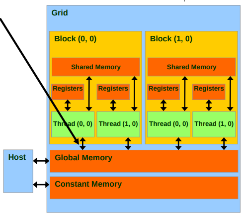

###### 2.2 使用了shared memory的实现

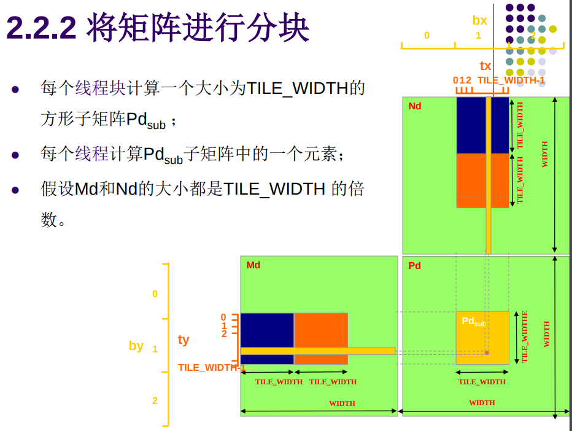

每个线程块内应该有较多的线程； 

```cpp
//每个线程块有TILE_WIDTH2个线程
dim3 dimBlock(TILE_WIDTH, TILE_WIDTH);
//有(Width/TILE_WIDTH)2个线程块
dim3 dimGrid(Width/TILE_WIDTH, Width/TILE_WIDTH);
//调用内核函数
MatrixMulKernel<<<dimGrid, dimBlock>>>(Md, Nd, Pd，Width);
```

```cpp
__global__ void MatrixMulKernel(float* Md, float* Nd, float* Pd, int Width)
{
    //获得线程块号
    int bx = blockIdx.x;
    int by = blockIdx.y;
    //获得块内的线程号
    int tx = threadIdx.x;
    int ty = threadIdx.y;
    //Pvalue：线程计算完成后的子矩阵元素——自动变量
    float Pvalue = 0;
    //循环，遍历M和N的所有子矩阵
    for (int m = 0; m < Width/TILE_WIDTH; ++m) {
        // 获取指向当前矩阵M子矩阵的指针Msub
        Float* Mdsub = GetSubMatrix(Md, m, by, Width);
        //获取指向当前矩阵N的子矩阵的指针Nsub
        Float* Ndsub = GetSubMatrix(Nd, bx, m, Width);
        //共享存储器空间声明
        __shared__float Mds[TILE_WIDTH][TILE_WIDTH];
        __shared__float Nds[TILE_WIDTH][TILE_WIDTH];
        // 每个线程载入M的子矩阵的一个元素
        Mds[ty][tx] = GetMatrixElement(Mdsub, tx, ty);
        //每个线程载入N的子矩阵的一个元素
        Nds[ty][tx] = GetMatrixElement(Ndsub, tx, ty);
        //同步，在计算之前，确保子矩阵所有的元素都已载入共享存储器中
        __syncthreads();
        //每个线程计算线程块内子矩阵中的一个元素
        for (int k = 0; k < TILE_WIDTH; ++k)
         	Pvalue += Mds[ty][k] * Nds[k][tx];
        //同步，确保重新载入新的M和N子矩阵数据前，上述计算操作已全部完成
        __syncthreads();
    }
    // 获取指向矩阵P的子矩阵的指针
    Matrix Psub = GetSubMatrix(P, bx, by);
    //向全局存储器写入线程块计算后的结果子矩阵
    //每个线程写入一个元素
    SetMatrixElement(Psub, tx, ty, Pvalue);
}
```

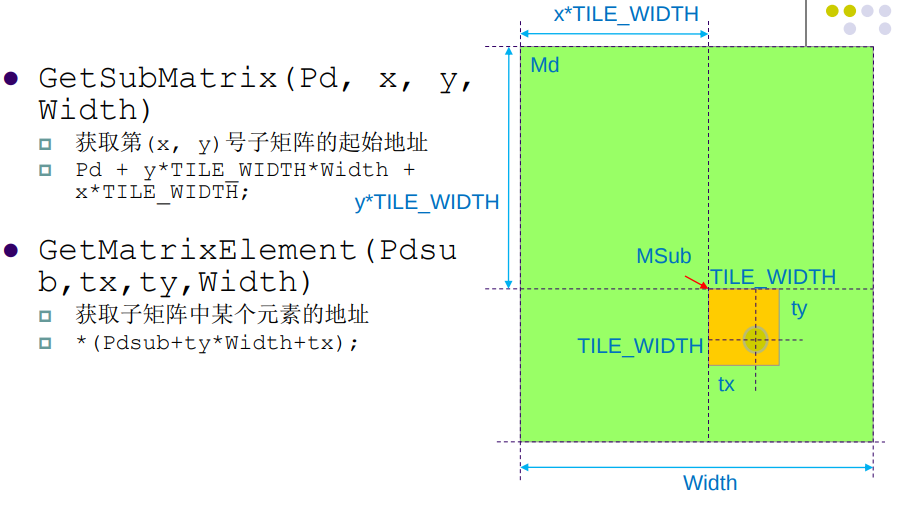

#### V. Performance and Optimization

##### 1. Global Memory Access 

采用coalesced memory access； 使用shared memory达到coalesced memory access和block内threads共享访问；

案例见PPT

##### 2. Shared Memory Access 

##### 3. Memory Latency Hiding 

##### 4. Algorithm Optimization for the GPU


