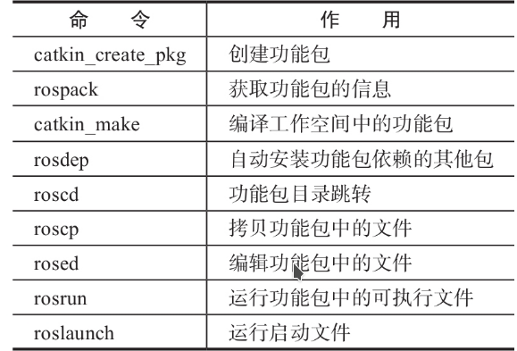

## 安装virtual box

[manjaro中安装virtualbox](https://wiki.manjaro.org/index.php?title=VirtualBox)

查看版本

```bash
uname -r
```

安装相应版本

```bash
sudo pacman -S virtualbox
```

将VirtualBox Module安装进内核，可以用重启实现，也可以用下面的命令

```bash
sudo vboxreload
```

然后从[该网站](https://www.oracle.com/technetwork/server-storage/virtualbox/downloads/index.html)下载Extension

然后在虚拟机的Preference里面添加Extension

安装好的Ubuntu可以通过更改Displays=>Resolution来扩大屏幕

需要从Devices目录中下载Guest Additions, 才能实现粘贴板功能。

## [安装ROS](http://wiki.ros.org/cn/kinetic/Installation/Ubuntu)

使用ubuntu 16.04

主要参考的有, [ROS wiki](wiki.ros.org/cn), 《ROS机器人开发实践》

**添加 sources.list**

设置你的电脑可以从 packages.ros.org 接收软件.

```bash
sudo sh -c '. /etc/lsb-release && echo "deb http://mirrors.ustc.edu.cn/ros/ubuntu/ $DISTRIB_CODENAME main" > /etc/apt/sources.list.d/ros-latest.list'
```

**添加 keys**

```bash
sudo apt-key adv --keyserver hkp://ha.pool.sks-keyservers.net:80 --recv-key 421C365BD9FF1F717815A3895523BAEEB01FA116
```

**确保你的Debian软件包索引是最新的：**

```bash
sudo apt-get update
```

**桌面完整版**: (推荐) : 包含ROS、[rqt](http://wiki.ros.org/rqt)、[rviz](http://wiki.ros.org/rviz)、机器人通用库、2D/3D 模拟器、导航以及2D/3D感知

```bash
sudo apt-get install ros-kinetic-desktop-full
```

**初始化 rosdep**

在开始使用ROS之前你还需要初始化`rosdep`。`rosdep`可以方便在你需要编译某些源码的时候为其安装一些系统依赖，同时也是某些ROS核心功能组件所必需用到的工具。

```bash
sudo rosdep init
rosdep update
```

**环境配置**

如果每次打开一个新的终端时ROS环境变量都能够自动配置好（即添加到bash会话中），那将会方便很多：

```bash
echo "source /opt/ros/kinetic/setup.bash" >> ~/.bashrc
source ~/.bashrc
```

**构建工厂依赖**

到目前为止，你已经安装了运行核心ROS包所需的内容。为了创建和管理自己的ROS工作区，有各种各样的工具和需求分别分布。例如：[rosinstall](http://wiki.ros.org/rosinstall)是一个经常使用的命令行工具，它使你能够轻松地从一个命令下载许多ROS包的源树。

要安装这个工具和其他构建ROS包的依赖项，请运行:

```bash
sudo apt-get install python-rosinstall python-rosinstall-generator python-wstool build-essential
```

## 创建ROS工作空间

下面我们开始创建一个[catkin 工作空间](http://wiki.ros.org/catkin/workspaces)：

```bash
mkdir -p ~/catkin_ws/src
cd ~/catkin_ws/src
```

即使这个工作空间是空的（在'src'目录中没有任何软件包，只有一个`CMakeLists.txt`链接文件），你依然可以编译它：

```bash
cd ~/catkin_ws/
catkin_make
```

[catkin_make](http://wiki.ros.org/catkin/commands/catkin_make)命令在[catkin 工作空间](http://wiki.ros.org/catkin/workspaces)中是一个非常方便的工具。如果你查看一下当前目录应该能看到'build'和'devel'这两个文件夹。在'devel'文件夹里面你可以看到几个setup.*sh文件。`source`这些文件中的任何一个都可以将当前工作空间设置在ROS工作环境的最顶层，想了解更多请参考[catkin](http://wiki.ros.org/catkin)文档。接下来首先`source`一下新生成的setup.*sh文件：

```bash
$ source devel/setup.bash
```

要想保证工作空间已配置正确需确保`ROS_PACKAGE_PATH`环境变量包含你的工作空间目录，采用以下命令查看：

```bash
echo $ROS_PACKAGE_PATH
/home/<youruser>/catkin_ws/src:/opt/ros/indigo/share:/opt/ros/indigo/stacks
```

## [安装tensorflow](https://www.tensorflow.org/install/pip?lang=python2)

```bash
pip install --upgrade pip
sudo pip install --upgrade tensorflow
```

出现错误

```bash
Cannot uninstall 'enum34'. It is a distutils installed project and thus we cannot accurately determi
```

可以[这样](https://blog.csdn.net/guangguyu/article/details/81360746)解决

```bash
sudo pip install --ignore-installed enum34
```

## 摄像头

需要virtualbox的Devices勾选相应的Webcams(前面需要安装Extension)

usb-cam 功能包

```bash
sudo apt install ros-kinetic-usb-cam
```

启动测试为

```bash
roslaunch usb_cam usb_cam-test.launch
```

如果出现错误，可能需要修改`/opt/ros/kinetic/share/usb_cam/launch/usb_cam-test.launch`

改`pixel_format`为`yuyv`或者`mjpeg`


书本源码

```bash
git clone https://github.com/huchunxu/ros_exploring.git
```

将源码中的`tensorflow_mnist`复制到`~/catkin_ws/src`目录下，然后在`~/catkin_ws`进行`catkin_make` 

注意[需要把执行的文件添加权限](https://answers.ros.org/question/50206/cannot-launch-node/)`chmod +x ./*`, 否则出现如下错误(最好把全部的文件都执行相应的权限)。

````
cannot launch node of type ....
````

依次执行

```bash
roscore
roslaunch usb_cam usb_cam-test.launch #摄像头
roslaunch tensorflow_mnist ros_tensorflow_mnist.launch #数据处理
rostopic echo /result #结果输出
```

## [安装PyTorch](https://pytorch.org/get-started/locally/)

```bash
sudo pip install torch torchvision
```


RL in ROS

只有配置环境的一些记录，所以就没有做成PPT == >概要性的介绍，下周再做。

装ROS(Ubuntu 16.04, 使用Virtualbox 就会产生一些奇怪的Bug耗费了比较长的时间)：学ROS 《ROS机器人开发实战》ROS wiki

装tensorflow

ROS使用摄像头，然后手写字体识别

Next: 

1. 使用RLGraph/RLlib/OpenAI Gym/Keras-rl
2. PyTorch等其他的深度学习库
3. 模拟场景/更多的前沿


列一些问题；目标不明确。


```
- tar:
    local-name: opencv3
    uri: https://github.com/ros-gbp/opencv3-release/archive/release/kinetic/opencv3/3.3.1-5.tar.gz
    version: opencv3-release-release-kinetic-opencv3-3.3.1-5
```





