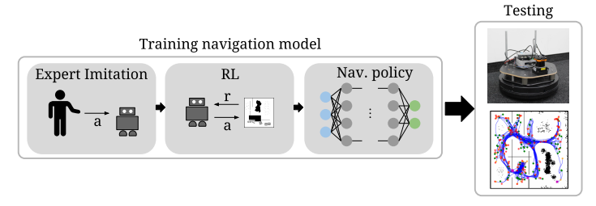
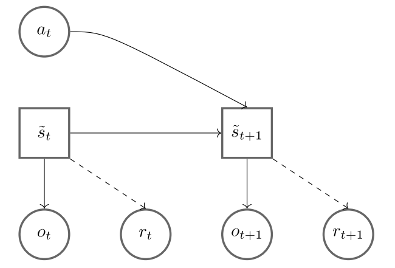
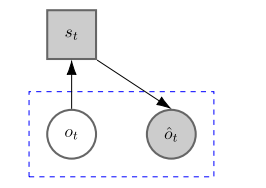
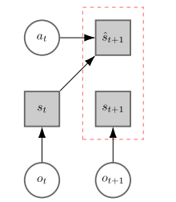
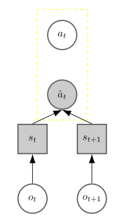
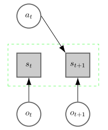

### Original Ideas

#### Problem

Task-Based Navigation and Obstacles Avoidance. ~~not pure Navigation~~

#### Features

- Map-less

- Autonomous navigation and task completion

- Task definition by imitating

#### Approach

***combine one or two new techniques***

1. **Data Generating ** 

   Use classic methods(SLAM, ROS move_base) to generate data in static env(without dynamic obstacles) [with random settings].

   - Dynamic obstacles will be handled by RL
   - Random settings: Avoid overfitting to some specific env 
     - Random static wall layout

2. **Initialized by Imitating** 

   Imitation Learning(IL) to pre-train SRL(State Representation Learning) and RL(Constrained Policy Optimization (CPO)) 

   - Imitation: task define & accelerate training process by reduce random exploration iterations
   - SRL: reduce search space
   - CPO: avoid collision
   - NN Structure: 1D CNN

3. **Training Process ** 

   Train SRL and RL in dynamic env [with random settings] by trial and error exploration combined with reward signals. 

   - Dynamic obstacle avoidance with RL
   - Random settings: Avoid overfitting to some specific env 
     - Random static wall layout
     - Random dynamic obstacles

4. **Optimal Reward & Structure Search**

   - AutoRL
     - automates the search for RL reward and neural network architecture

#### Related work

##### Reinforced Imitation

###### Resources

[github](<https://github.com/ethz-asl/rl-navigation>) implement this [paper](<https://arxiv.org/abs/1805.07095>): *Reinforced Imitation: Sample Efficient Deep Reinforcement Learning for Map-less Navigation by Leveraging Prior Demonstrations* 

###### Background

- Autonomous navigation in environments where global knowledge of the map is available is nowadays well understood
- Given only local perception of the robot and a relative target position, robust map-less navigation strategies are required

###### Motivation

- Main purpose: map-less navigation skills based solely on local information available to the robot through its sensors 

  Given the sensor measurements $\mathbf{y}$ and a relative target position $\mathbf{g}$ ,we want to find a policy $\pi_\theta$ parametrized by $\theta$ which maps the inputs to suitable control commands, $\mathbf{u}$ (translational and rotational velocity), i.e
  $$
  \mathbf{u}=\pi_\theta (\mathbf{y},\mathbf{g})
  $$

- RL: sample complexity

  - sample inefficiency and missing safety during training

- IL: distribution mismatch

  - sample efficient and can achieve accurate imitation of the expert demonstrations
  - overfit to the environment and situations presented at training time

- intension

  does not intend to show that we can outperform a global graph-based planner in known environments, where graph based solutions are fast and can achieve optimal behavior. The goal of our experiments is to investigate the limits of motion planning with local information only

###### Methods

combines supervised IL based on expert demonstrations to pre-train the navigation policy with subsequent RL (Constrained Policy Optimization (CPO) )

- Training navigation model

  

- generate expert demonstrations in simulation: global planner

  similar to [paper](<https://arxiv.org/abs/1609.07910>) *From Perception to Decision: A Data-driven Approach to End-to-end Motion Planning for Autonomous Ground Robots*

  [**ROS move_base**](<http://wiki.ros.org/move_base>)

- Neural network model for $\pi_\theta$

  

  - inputs: 2D laser range findings and a relative target position in polar coordinates w.r.t. the local robot coordinate frame.

    fully connected layers instead of CNN: CNN tends to overfit to the shapes of the obstacles presented during training.

  - min pooling: compress the full range of 1080 measurements into 36 values
    $$
    \mathbf{y}_{p,i}=\min\left(\mathbf{y}_{i\cdot k},\cdots,\mathbf{y}_{(i+1)\cdot k-1}	\right)
    $$
    $i$ value index; $k$ kernel size for 1D pooling, k=30

    assure safety; simplify models

  - normalize to interval [-1,1]
    $$
    2\left(1-\frac{\min(\mathbf{y}_{p,i},r_{\text{max}})}{r_{\text{max}}}	\right)-1
    $$
    $r_{\text{max}}$: maximum laser range

- CPO

  -  If it is too low, the agent may decide to experience unsafe states for short amounts of time as this will not severely impact the overall performance

  - Conversely, if the cost is too high, the agent may avoid exploring entire portions of the state space to avoid the risk of experiencing unsafe states

  - $$
    C: \mathcal{S}\times \mathcal{A}\to \mathbb{R}	\\
    J_C(\theta)=\mathbb{E}\left[\sum_{t=0}^T \gamma^t\cdot C(s_t,\pi_\theta(s_t))	\right]\\
    \theta^*=\arg \max J(\theta),s.t. J_C(\theta)\le \alpha
    $$

    

  - output stochastic policy

    - a 2D Gaussian distribution having the de-normalized values of the output of the neural network as mean
    - a 2D standard deviation which is a separate learn-able parameter

##### CPO

###### Resources

[github](<https://github.com/jachiam/cpo>) implement constrained policy optimization([CPO](<https://arxiv.org/abs/1705.10528>))

###### Features

- Incorporate constraints during training

##### SRL

###### Resources

- SRL ToolBox
  - [github](<https://github.com/araffin/robotics-rl-srl>) implementation and [docs](<https://s-rl-toolbox.readthedocs.io/en/latest/>)
  - [Paper 1](<https://arxiv.org/abs/1809.09369>)*S-RL Toolbox: Environments, Datasets and Evaluation Metrics for State Representation Learning*
  - [Paper 2](<https://arxiv.org/abs/1901.08651>) *Decoupling feature extraction from policy learning: assessing benefits of state representation learning in goal based robotics*
- SRL for control overview
  - [Paper](<https://www.sciencedirect.com/science/article/pii/S0893608018302053>) *State representation learning for control: An overview*

###### Features

- State representation learning aims at learning compact representations from raw observations in robotics and control applications. 

- encode essential information (for a given task) while discarding irrelevant aspects of the original data.

- General model
  $$
  o_t \xrightarrow[SRL]{\phi}s_t\xrightarrow[RL]{\pi}a_t
  $$
  

  

  circles are observable; squares are the latent state variables.

###### Approaches

- **Reconstructing the observation**

  minimize the reconstruction error between the original observation and its predicted reconstructions
  $$
  s_t=\phi(o_t;\theta_\phi)	\\
  \hat{o}_t=\phi^{-1}(s_t;\theta_{\phi^{-1}})
  $$
  $\theta_\phi$ : parameters for encoder

  $\theta_{\phi^{-1}}$: parameters for decoder

  

  This approach does not take advantage of the robotic context because it ignores the possible actions, therefore it is often associated with different objectives (e.g. forward model), and provides a performance baseline.

  Auto-encoders tend to reconstruct everything (that is salient enough in the observation),
  including static objects and irrelevant features for the task (distractors)

- Learning a **forward model**

  predicts $s_{t+1}$ from $o_t$ or $s_t$ and $a_t$
  $$
  s_t=\phi(o_t;\theta_\phi)	\\
  \hat{s}_{t+1}=f(s_t,a_t;\theta_{fwd})
  $$
  

  forward and inverse models focus on the dynamics, usually encoding the position of the controlled robot in the representation, but not a goal that is not controlled by the actions

- Learning an **inverse model**

  predicts $a_t$ given observations $o_t$ and $o_{t+1}$ or states $s_t$ and $s_{t+1}$
  $$
  s_t=\phi(o_t;\theta_\phi)	\\
  s_{t+1}=\phi(o_{t+1};\theta_\phi)	\\
  \hat{a}_t=g(s_t,s_{t+1};\theta_{inv})
  $$
  compute the error between $a_t$ and $\hat{a}_t$

  

- Using **prior knowledge** to constrain the state space

  using specific constraints or prior knowledge about the functioning, dynamics or physics of the world (besides the constraints of forward and inverse models) such as the temporal continuity or the causality principles that generally reflect the interaction of the agent with objects or in the environment
  $$
  Loss=\mathcal{L}(s_{1:n};\theta_{\phi}|c)
  $$
  

  

- combination

  - VAE with a recurrent forward model

    [paper](<https://arxiv.org/abs/1803.10122>) *World Models*

    

##### AutoRL

GPU intensive

[Google AI Blog Navigation via AutoRL](<https://ai.googleblog.com/2019/02/long-range-robotic-navigation-via.html>)

[paper 1](<https://ieeexplore.ieee.org/document/8643443>) *Learning Navigation Behaviors End-to-End With AutoRL*

#### Features

- train local planner agents to perform basic navigation behaviors, traversing short distances safely without collisions with moving obstacles.
- The local planners take noisy sensor observations, such as a 1D lidar that provides distances to obstacles, and output linear and angular velocities for robot control
- train the local planner in simulation with AutoRL, a method that automates the search for RL reward and neural network architecture
- Paper 1
  - 2 phases
    - reward search;fixed network
    - neural network architecture search; fixed reward
  - trained in simulation with only static obstacles, they can also handle moving objects effectively

#### Contributions

1. Combine IL, SRL, RL together in task-based navigation
2. Pre-Training in static env and Re-Training in dynamic env
3. Use AutoRL to define rewards in staged-goals

**Other ideas**

Inverse RL 

hierarchical RL

Navigation: A* algorithms

#### Experiments

Multiple Approaches Comparation

- with/without Imitation Learning
- with/without SRL
- pure RL

#### Ref 

- [github RL navigation](<https://github.com/ethz-asl/rl-navigation>)

- [S-RL Toolbox’s documentation](<https://s-rl-toolbox.readthedocs.io/en/latest/>)

- [Google AI Navigation via AutoRL](<https://ai.googleblog.com/2019/02/long-range-robotic-navigation-via.html>)

#### Others

- [Lab for Autonomous and Intelligent Robotics ](<https://www.lair.hmc.edu/>)

