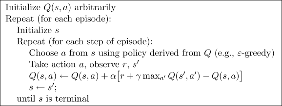

## ROS仿真环境下的DeepRL

> 应用案例二：强化学习应用，在ROS上构建二维机器人导航仿真平台，让机器人自主决定移动的线速度和角速度。网络结构考虑激光以及定位信息。
>

ROS环境的构建请查看Env.md, 本实验的环境为

>Oracle VM VirtualBox VM Selector v6.0.4
>
>2G Memory/2 Cores
>
>Ubuntu 16.04
>
>ROS Kinetic

### Installation

仿真环境的配置

如果安装的桌面完整版，就不需要另外安装了，否则

```bash
sudo apt install ros-kinetic-gazebo-ros-pkgs ros-kinetic-gazebo-ros-control
```

需要将模型文件下载安装在`~/.gazebo/models`可以直接从此下载

> https://bitbucket.org/osrf/gazebo_models/downloads/

但是速度极慢，所以我找了另外了，存在了睿客网上

> 分享地址：http://rec.ustc.edu.cn/share/d43237f0-47e3-11e9-9d16-297b0c4468af
> 分享密码：0709

在`~/.gazebo`解压`tar -zxvf models.tar.gz`

需要安装tensorflow(见Env.md)以及Keras

```bash
sudo pip install keras
```

实验的Demo代码下载与编译

```bash
cd ~/catkin_ws/src/
git clone https://github.com/ROBOTIS-GIT/turtlebot3_msgs.git
git clone https://github.com/ROBOTIS-GIT/turtlebot3.git
git clone https://github.com/ROBOTIS-GIT/turtlebot3_simulations
git clone https://github.com/ROBOTIS-GIT/turtlebot3_machine_learning
cd ~/catkin_ws && catkin_make
```

### Set Parameters

本地资源有限，修改`turtlebot3/turtlebot3_description/urdf/turtlebot3_burger.gazebo.xacro`中的

```xml
<xacro:arg name="laser_visual" default="false"/>   # 如果想看到激光扫描线,设置成 `true`
```

以及

```xml
<scan>
  <horizontal>
    <samples>360</samples>            # 修改成24
    <resolution>1</resolution>
    <min_angle>0.0</min_angle>
    <max_angle>6.28319</max_angle>
  </horizontal>
</scan>
```

### Training

源码范例中提供了turtlebot3_stage_1～turtlebot3_stage_4共4个环境，分别是无障碍、静态障碍、动态障碍、混合障碍环境。

参考资料使用的是stage1, 但是1,2,3看起来都比较简单的环境。

我先选择了stage4，但是训练了一个小时，一个goal都没找到。

所以后来选择Stage2, 只有静态障碍物。


```bash
roscore

#启动turtlebot3 gazebo环境等节点
export TURTLEBOT3_MODEL=burger
roslaunch turtlebot3_gazebo turtlebot3_stage_4.launch

#启动DQN算法等节点
roslaunch turtlebot3_dqn turtlebot3_dqn_stage_4.launch

#启动数据图形显示节点
roslaunch turtlebot3_dqn result_graph.launch
```

<<<<<<< HEAD
=======


### Results


>>>>>>> bbd8b5d474463e75324a0426ffab5665a5334d01

### Analysis

Q-Learning



DQN


### Results

1. 简单静态障碍环境下，使用DQN，训练5个小时情况下，结果依然很差。

### Discussion

1. 改进NN结构

   使用Keras搭建的(Tensorflow作为backend), 现在的是3层Dense. 没有ConvNet(输入不是图片而是State，也就是激光扫描得到的信息).

2. 使用DQN变体
   - Double DQN
   - Prioritized Experience Replay (DQN)
   - Dueling DQN
3. 使用其他算法
4. 是否一定需要RL框架？需要添加ROS的消息传递机制，很多东西耦合比较紧
5. 环境需要多复杂的？静态动态，范围，可观察的信息。

### Ref

[ROS开发笔记（8）——Turtlebot3 Gazebo仿真环境下深度强化学习DQN（Deep Q-Learning）开发环境构建](https://blog.csdn.net/wsc820508/article/details/82221978)

[ROS开发笔记（9）——ROS 深度强化学习应用之keras版本dqn代码分析](https://blog.csdn.net/wsc820508/article/details/82355833)

[ROS开发笔记（10）——ROS 深度强化学习dqn应用之tensorflow版本(double dqn/dueling dqn/prioritized replay dqn)](https://blog.csdn.net/wsc820508/article/details/82695870)

[TurtleBot3-Machine Learning](http://emanual.robotis.com/docs/en/platform/turtlebot3/machine_learning/#installation)

[VirtualBox 网络](https://blog.csdn.net/yxc135/article/details/8458939)

[DQN](https://medium.com/@jonathan_hui/rl-dqn-deep-q-network-e207751f7ae4)

[Double DQN](https://morvanzhou.github.io/tutorials/machine-learning/reinforcement-learning/4-5-double_DQN/)

[Prioritized Experience Replay (DQN)](https://morvanzhou.github.io/tutorials/machine-learning/reinforcement-learning/4-6-prioritized-replay/)

[Dueling DQN](https://morvanzhou.github.io/tutorials/machine-learning/reinforcement-learning/4-7-dueling-DQN/)


